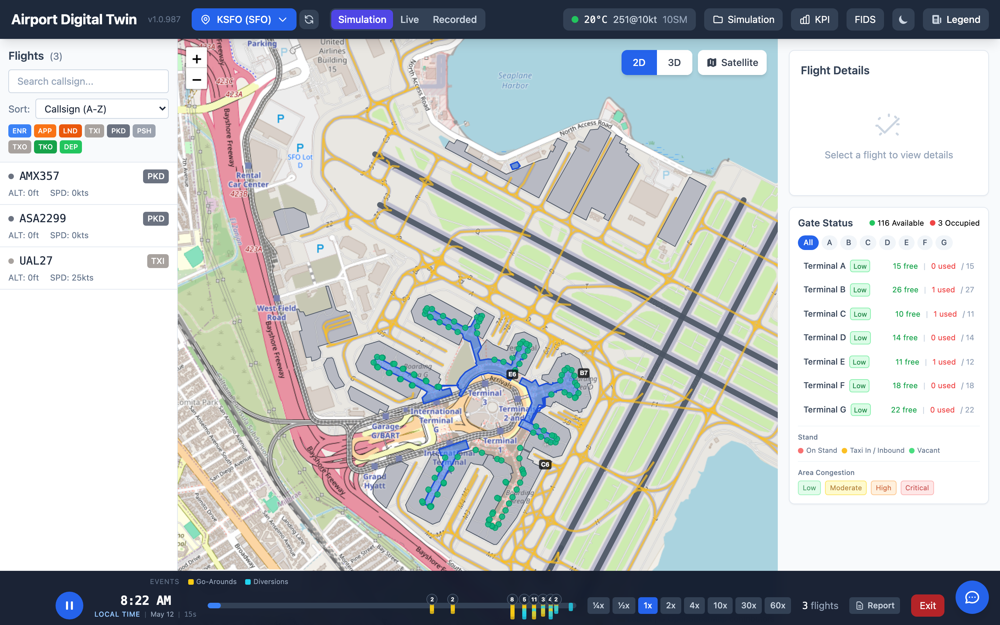
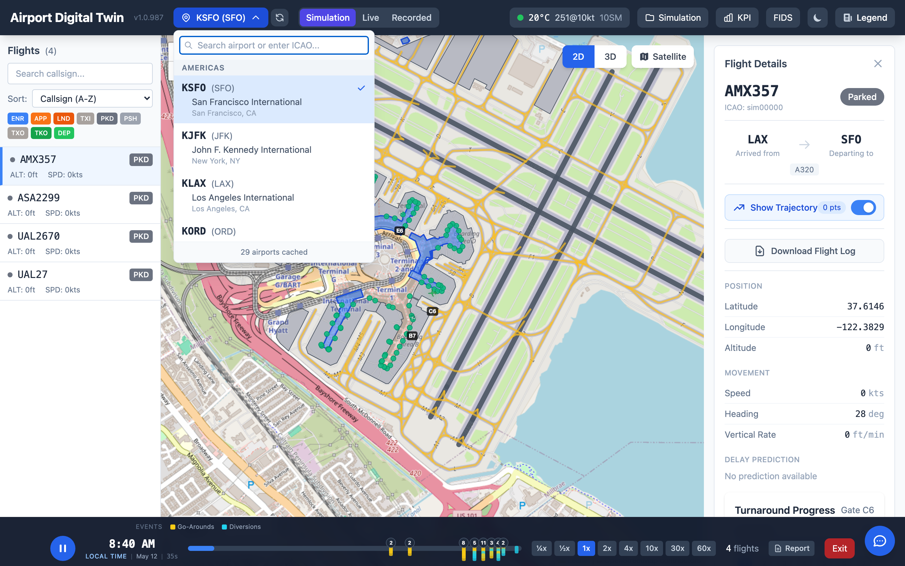
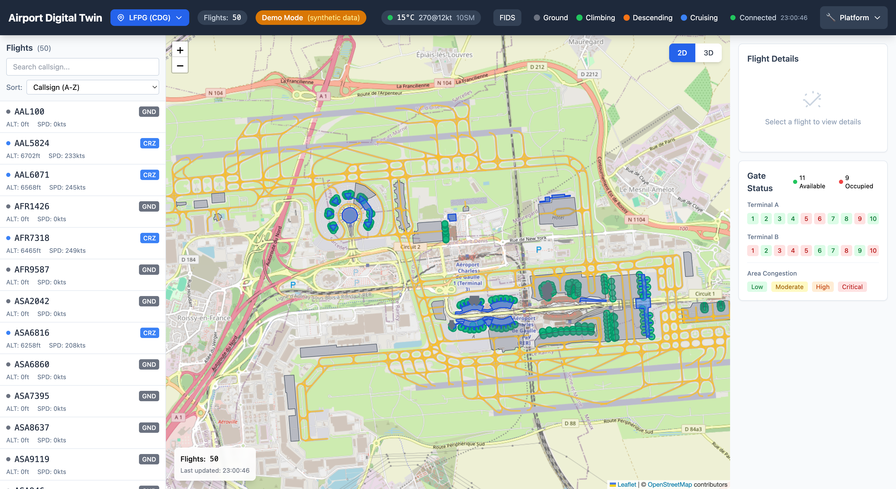

# Airport Digital Twin

A real-time airport operations visualization platform built on the Databricks stack, featuring interactive 2D/3D flight tracking, ML-powered predictions, and multi-airport support with OpenStreetMap integration.



## Key Features

- **Real-time flight tracking** with 50+ simultaneous flights in 2D (Leaflet) and 3D (Three.js) views
- **Multi-airport support** — 12 preset airports worldwide + any ICAO code, with automatic OSM data loading
- **ML-powered predictions** for flight delays, gate assignments, and congestion levels
- **Flight Information Display System (FIDS)** with arrivals/departures tabs
- **Live weather** via METAR/TAF data (temperature, wind, visibility, flight category)
- **Platform integration** with Lakeview dashboards, Genie NL queries, Unity Catalog, MLflow, and Data Lineage
- **Industry-standard data format support** (AIXM, OSM, IFC, AIDM, FAA NASR)

## Multi-Airport Support

Switch between 12 preset airports or enter any ICAO code worldwide. Each airport automatically loads real infrastructure data from OpenStreetMap — terminals, gates, taxiways, and aprons.



**Preset airports**: SFO, JFK, LAX, ORD, ATL, LHR, CDG, AUH, DXB, HND, HKG, SIN


*Charles de Gaulle (Paris) loaded with OSM terminal and gate data*

## Industry-Standard Data Formats

| Format | Full Name | Description |
|--------|-----------|-------------|
| **AIXM** | Aeronautical Information Exchange Model | ICAO/Eurocontrol standard for aeronautical data exchange |
| **OSM** | OpenStreetMap | Community-sourced airport infrastructure via Overpass API |
| **IFC** | Industry Foundation Classes | BIM standard for 3D terminal building models |
| **AIDM** | Airport Information Data Model | Eurocontrol standard for airport operational data |
| **FAA NASR** | FAA National Airspace System Resources | US FAA runway and facility database |

## Architecture Overview

```
┌──────────────────────────────────────────────────────────────┐
│                    Airport Digital Twin                        │
├──────────────────────────────────────────────────────────────┤
│                                                                │
│  Frontend (React + TypeScript)                                 │
│  ├── Leaflet 2D Map with OSM overlay                          │
│  ├── Three.js 3D visualization with GLTF aircraft models      │
│  ├── FIDS modal, Weather widget, Gate status panel            │
│  └── Tailwind CSS styling                                     │
│                                                                │
│  Backend (FastAPI + Python)                                    │
│  ├── REST API for flights, airport config, weather, FIDS      │
│  ├── ML models (delay prediction, gate recommendation)        │
│  ├── OSM/AIXM/IFC/AIDM/FAA data importers                    │
│  └── Synthetic data generator (fallback)                      │
│                                                                │
│  Databricks Platform                                           │
│  ├── Unity Catalog — governed Delta tables                    │
│  ├── Lakebase — sub-10ms PostgreSQL serving                   │
│  ├── DLT Pipeline — Bronze → Silver → Gold                    │
│  ├── MLflow — experiment tracking                             │
│  └── Lakeview — dashboards & Genie NL queries                 │
│                                                                │
└──────────────────────────────────────────────────────────────┘
```

## Quick Start

### Local Development

```bash
./dev.sh  # Starts backend (FastAPI) + frontend (React), opens http://localhost:3000
```

### Deploy to Databricks

```bash
cd app/frontend && npm run build
databricks bundle deploy --target dev
databricks apps deploy airport-digital-twin-dev \
  --source-code-path /Workspace/Users/<user>/.bundle/airport-digital-twin/dev/files \
  --profile <your-profile>
```

### Run Tests

```bash
uv run pytest tests/ -v          # Backend tests
cd app/frontend && npm test -- --run  # Frontend tests
```

## Documentation

| Document | Description |
|----------|-------------|
| [User Guide](docs/USER_GUIDE.md) | Complete user guide with all UI features, admin guide, and ML models |
| [Airport Data Import](docs/AIRPORT_DATA_IMPORT.md) | How AIXM, OSM, IFC, AIDM, and FAA data formats are imported |
| [ML Models](docs/ML_MODELS.md) | Delay prediction, gate recommendation, and congestion models |
| [Data Dictionary](docs/DATA_DICTIONARY.md) | Schema definitions for all tables |
| [Pipeline](docs/PIPELINE.md) | DLT pipeline architecture (Bronze/Silver/Gold) |
| [Synthetic Data Generation](docs/SYNTHETIC_DATA_GENERATION.md) | How demo/fallback data is generated |
| [Aircraft Separation](docs/AIRCRAFT_SEPARATION.md) | Flight separation logic |
| [Delta Sharing](docs/DELTA_SHARING.md) | Cross-organization data sharing setup |
| [Security Audit](docs/SECURITY_AUDIT.md) | Security review and findings |
| [Development Philosophy](docs/DEVELOPMENT_PHILOSOPHY.md) | Design principles and architecture decisions |
| [V2 Roadmap](docs/ROADMAP_V2.md) | Feature roadmap for V2 |
| [V2 Implementation Report](docs/V2_IMPLEMENTATION_REPORT.md) | V2 implementation summary |
| [Data Sources & KPIs](docs/AIRPORT_DATA_SOURCES_AND_KPIS.md) | Open aviation data catalog and operational KPI reference |

## Tech Stack

**Frontend**: React, TypeScript, Three.js, React Three Fiber, Leaflet, Tailwind CSS, Vite

**Backend**: Python, FastAPI, UV

**Data Platform**: Databricks (Unity Catalog, Lakebase, DLT, MLflow, Lakeview, Genie)

**Data Formats**: AIXM, OpenStreetMap (Overpass API), IFC (IfcOpenShell), AIDM, FAA NASR
