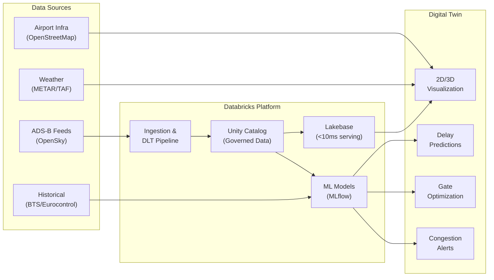
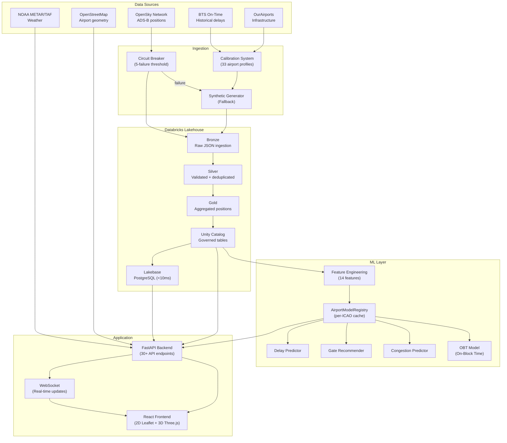
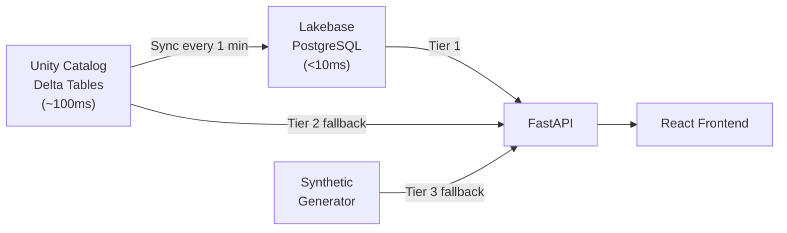
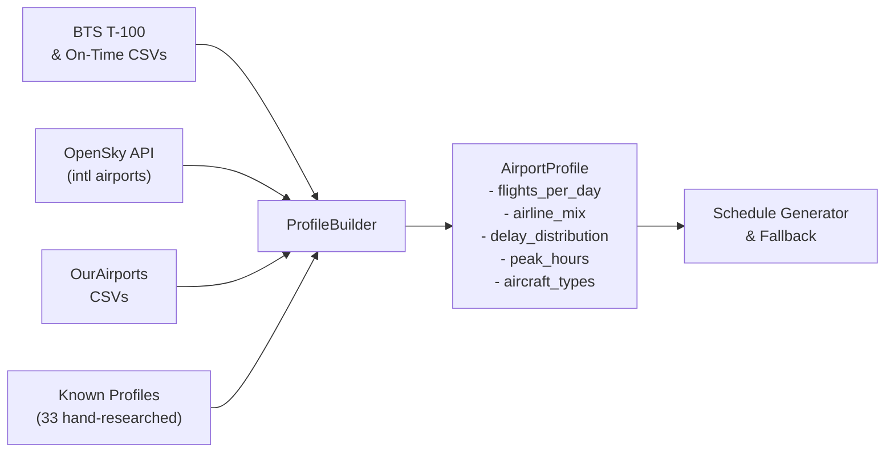
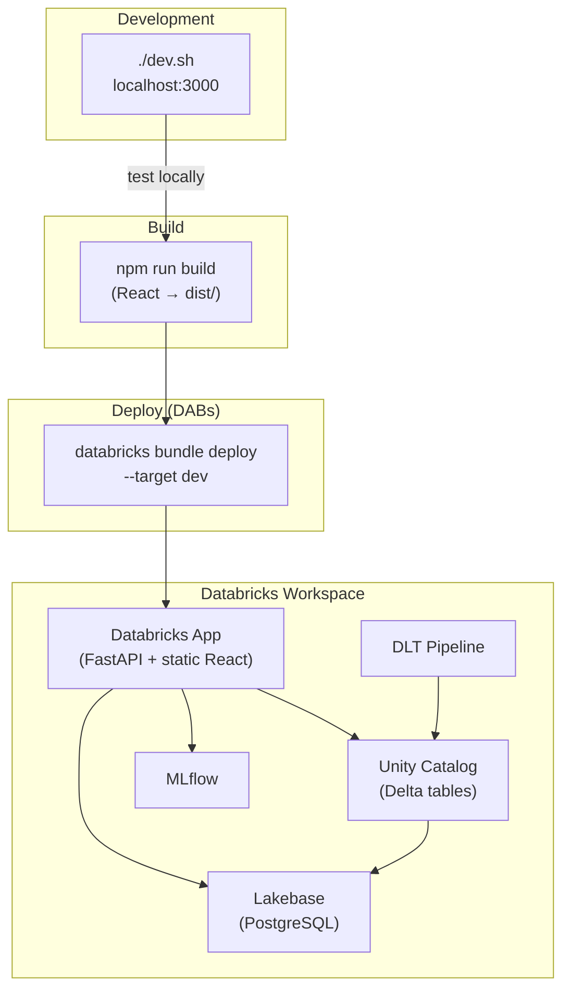

# Airport Digital Twin

> A real-time airport operations visualization platform built on Databricks — interactive 2D/3D flight tracking, ML-powered predictions, and multi-airport support with OpenStreetMap integration.


**Live Demo**: [airport-digital-twin-dev](https://airport-digital-twin-dev-7474645572615955.aws.databricksapps.com)

---

## What It Does

The Airport Digital Twin brings airport operations to life in a browser. Track 50+ flights in real time across 2D maps and immersive 3D views, switch between 12+ airports worldwide, see ML-driven delay predictions and gate recommendations, and monitor congestion — all powered by Databricks.

### At a Glance

| Capability | Details |
|---|---|
| **Real-time tracking** | 50+ simultaneous flights with 2D (Leaflet) and 3D (Three.js) views |
| **Multi-airport** | 12 presets (SFO, JFK, LAX, ORD, ATL, LHR, CDG, AUH, DXB, HND, HKG, SIN) + any ICAO code |
| **ML predictions** | Delay forecasting, gate recommendations, congestion alerts |
| **Live weather** | METAR/TAF — temperature, wind, visibility, flight category |
| **FIDS** | Arrivals & departures board, just like a real terminal |
| **Platform integration** | Lakeview dashboards, Genie NL queries, Unity Catalog, MLflow, Data Lineage |
| **Data formats** | AIXM, OSM, IFC, AIDM, FAA NASR, MSFS BGL |
| **Calibration** | 33 real-world airport profiles from BTS, OpenSky, and OurAirports data |

---

## Who Is This For?

This platform serves different roles with different levels of depth. Jump to the section that matches you:

| Role | Section | What You'll Find |
|---|---|---|
| Airport Executives & Strategists | [Strategic Overview](#-for-airport-executives--strategists) | KPIs, value proposition, decision support |
| Operational Staff | [Operations Guide](#-for-operational-staff) | Daily usage, dashboards, real-time monitoring |
| IT / Data Scientists | [Technical Deep Dive](#-for-it--data-scientists) | ML models, data architecture, calibration pipeline |
| IT Operations | [Infrastructure Guide](#-for-it-operations) | Deployment, monitoring, infrastructure |

---

## For Airport Executives & Strategists

### The Challenge

Airport operators manage thousands of flights daily across interconnected systems — runways, gates, baggage, ground equipment — with cascading delays that cost the US aviation industry **$33 billion annually** (FAA). Traditional monitoring is fragmented: one screen for flights, another for gates, another for weather. Decision-makers lack a unified, real-time view.

### The Solution

The Airport Digital Twin provides a **single-pane-of-glass** for airport operations, combining live flight tracking, predictive analytics, and infrastructure visualization into one interactive platform.



### Key Performance Indicators

The platform tracks and visualizes the KPIs that matter most to airport leadership:

| KPI | What It Measures | How the Twin Helps |
|---|---|---|
| **On-Time Performance** | % flights departing/arriving within 15 min of schedule | Real-time delay predictions with cause attribution |
| **Gate Utilization** | % of gates occupied vs. available | Live gate status board with ML-optimized assignments |
| **Runway Throughput** | Operations per hour per runway | Congestion heatmap with capacity threshold alerts |
| **Taxi Time** | Minutes from gate to runway (and back) | Origin-aware trajectory visualization |
| **Turnaround Efficiency** | Total ground time per aircraft | Turnaround timeline with phase breakdown |
| **Baggage Processing** | Bags handled per hour, mishandled rate | Bronze/Silver/Gold pipeline tracking bag events |
| **Passenger Experience** | Walking distance, connection times | Gate recommendations minimize passenger transit |

### Decision Support Scenarios

1. **"Should we open a new gate area?"** — Visualize congestion patterns across terminals, see which areas hit CRITICAL levels during peak hours, simulate different gate configurations.

2. **"Which runway configuration handles weather best?"** — Overlay METAR conditions with flight phase data to see how wind shifts affect approach patterns and throughput.

3. **"Where are delays propagating from?"** — Origin-aware trajectories show which inbound routes carry the most delay, enabling proactive ground handling adjustments.

### Value Proposition

| Before | After |
|---|---|
| Fragmented screens per system | Unified 2D/3D operational view |
| Reactive delay management | Predictive delay alerts with cause attribution |
| Manual gate assignment | ML-optimized gate recommendations |
| No cross-airport visibility | Multi-airport switching with real infrastructure data |
| Static reports, hours old | Real-time data refreshed every minute |

---

## For Operational Staff

### Your Daily Command Center

The Airport Digital Twin is designed to be your go-to screen for situational awareness. Here's how to use it day to day.


*The main dashboard: flight list (left), map view (center), flight details and gate status (right)*

### Quick Start: 5 Things You Can Do Right Now

**1. Find any flight instantly**
Type a callsign in the search box (top-left). Typing "UAL" instantly filters to all United flights. Click any flight to see its full details.


**2. Check the arrivals/departures board**
Click **FIDS** in the header bar to open the Flight Information Display — the same board format you see in terminals, with real-time status (On Time, Delayed, Boarding, Landed).


**3. See gate availability at a glance**
The Gate Status panel (bottom-right) shows each terminal's gates color-coded green (available) or red (occupied), plus area congestion levels.

**4. Switch to any airport worldwide**
Click the airport button (e.g., "KSFO") to open the selector. Choose from 12 presets or type any ICAO code (e.g., LFPG for Paris CDG).


*Paris CDG loaded with real terminal, gate, taxiway, and apron data from OpenStreetMap*

**5. Get an immersive 3D view**
Click **3D** above the map to switch to the Three.js 3D visualization. See aircraft at actual altitude with realistic 3D models, terminal buildings extruded from real footprints.


### Understanding the Dashboard

| Area | What It Shows | Key Actions |
|---|---|---|
| **Header bar** | Active airport, flight count, data source, weather, connection status | Switch airports, open FIDS, check weather, access Platform links |
| **Flight list** (left) | All active flights with phase, altitude, speed | Search, sort, click to select |
| **Map view** (center) | 2D or 3D visualization with OSM airport overlay | Zoom, pan, toggle 2D/3D, click flights |
| **Flight details** (right) | Selected flight's position, movement, ML predictions | View delay prediction, gate recommendations, show trajectory |
| **Gate status** (right) | Terminal gate occupancy + area congestion | Monitor gate availability |

### Flight Phase Color Codes

| Color | Phase | Meaning |
|---|---|---|
| Yellow | Ground | Aircraft on taxiway or at gate |
| Green | Climbing | Departed, gaining altitude |
| Red | Descending | On approach, losing altitude |
| Blue | Cruising | At cruise altitude, en route |

### Weather Monitoring

Click the weather badge in the header to see METAR conditions:
- **Temperature**, **wind** (direction + speed), **visibility**
- **Flight category**: VFR (good), MVFR (marginal), IFR (low visibility), LIFR (very low)

### ML Predictions (Per Flight)

When you select a flight, the details panel shows:
- **Expected Delay**: Predicted minutes late, with confidence %
- **Delay Category**: On Time / Slight / Moderate / Severe
- **Gate Recommendations**: Top 3 gates ranked by score with reasons (availability, terminal match, proximity, taxi time)

### Platform Integration

Click **Platform** in the header to jump to Databricks tools:


| Link | Use Case |
|---|---|
| **Flight Dashboard** | Lakeview dashboard with aggregated KPIs and trends |
| **Ask Genie** | Query flight data in plain English — "Show me all delayed flights from JFK" |
| **Data Lineage** | See where every data point comes from |
| **ML Experiments** | Monitor model performance in MLflow |
| **Unity Catalog** | Browse all tables and schemas |

### Keyboard Shortcuts

| Key | Action |
|---|---|
| `2` | Switch to 2D map |
| `3` | Switch to 3D view |
| `Esc` | Deselect flight |
| `/` | Focus search box |
| `Up` / `Down` | Navigate flight list |
| `Enter` | Select highlighted flight |

---

## For IT / Data Scientists

### Architecture



### Data Pipeline (DLT — Bronze/Silver/Gold)

| Layer | Table | Module | Key Transformations |
|---|---|---|---|
| **Bronze** | `flights_bronze` | `src/pipelines/bronze.py` | Auto Loader JSON ingestion, add `_ingested_at` metadata |
| **Silver** | `flights_silver` | `src/pipelines/silver.py` | Explode state vectors, data quality expectations, deduplicate on `icao24 + position_time` |
| **Gold** | `flight_status_gold` | `src/pipelines/gold.py` | Aggregate latest position per aircraft, compute `flight_phase` |
| **Bronze** | `baggage_bronze` | `src/pipelines/baggage_bronze.py` | Raw baggage events |
| **Silver** | `baggage_silver` | `src/pipelines/baggage_silver.py` | Validated baggage chain |
| **Gold** | `baggage_gold` | `src/pipelines/baggage_gold.py` | Aggregated baggage metrics |

Data quality enforced at Silver layer:
```sql
-- Expectations (rows failing are dropped)
valid_position:  latitude IS NOT NULL AND longitude IS NOT NULL
valid_icao24:    icao24 IS NOT NULL AND LENGTH(icao24) = 6
valid_altitude:  baro_altitude >= 0 OR baro_altitude IS NULL
```

### Serving Architecture (Two-Tier)



The backend cascades through data sources automatically:
1. **Lakebase** (PostgreSQL) — <10ms latency, primary for real-time serving
2. **Unity Catalog** (Delta tables via SQL Warehouse) — ~100ms, analytics fallback
3. **Synthetic generator** — <5ms, demo fallback when no live data

### ML Models

| Model | Module | Type | Input | Output |
|---|---|---|---|---|
| **Delay Prediction** | `src/ml/delay_model.py` | Rule-based heuristic | 14-feature vector (time, altitude, velocity, heading) | `delay_minutes`, `confidence`, `category` |
| **Gate Recommendation** | `src/ml/gate_model.py` | Scoring optimization | Flight + gate status | Top-K gates with `score`, `reasons`, `taxi_time` |
| **Congestion Prediction** | `src/ml/congestion_model.py` | Capacity threshold | All flight positions | Area congestion `level`, `wait_minutes` |
| **On-Block Time** | `src/ml/obt_model.py` | Regression | OBT features | Predicted on-block time |
| **GSE Allocation** | `src/ml/gse_model.py` | Optimization | Turnaround phase | Equipment assignments |

All models are wrapped in `AirportModelRegistry` (`src/ml/registry.py`) which caches per-ICAO instances — switching airports hot-swaps models.

**Feature engineering** (`src/ml/features.py`): Extracts 14 features from raw flight data:
- 4 numeric: `hour_of_day`, `day_of_week`, `is_weekend`, `velocity_normalized`
- 3 one-hot: `flight_distance_category` (short/medium/long)
- 3 one-hot: `altitude_category` (ground/low/cruise)
- 4 one-hot: `heading_quadrant` (N/E/S/W)

### Calibration System

The calibration pipeline generates realistic synthetic data based on real airport statistics from 33 airports:



| Component | Module | Purpose |
|---|---|---|
| `AirportProfile` | `src/calibration/profile.py` | Dataclass holding all airport stats |
| `AirportProfileLoader` | `src/calibration/profile.py` | Loads profiles from known stats or data sources |
| `known_profiles` | `src/calibration/known_profiles.py` | 33 hand-researched airport profiles (US + intl) |
| `bts_ingest` | `src/calibration/bts_ingest.py` | Parse BTS T-100/On-Time CSVs |
| `opensky_ingest` | `src/calibration/opensky_ingest.py` | Query OpenSky API for international airports |
| `ourairports_ingest` | `src/calibration/ourairports_ingest.py` | Parse OurAirports CSV data |
| `profile_builder` | `src/calibration/profile_builder.py` | Orchestrates multi-source profile building |
| `auto_calibrate` | `src/calibration/auto_calibrate.py` | Auto-detect and apply best available profile |

### Airport Data Format Importers

| Format | Parser | Converter | Standard |
|---|---|---|---|
| **AIXM** | `src/formats/aixm/parser.py` | `src/formats/aixm/converter.py` | ICAO/Eurocontrol aeronautical data exchange |
| **OSM** | `src/formats/osm/parser.py` | `src/formats/osm/converter.py` | OpenStreetMap via Overpass API |
| **IFC** | `src/formats/ifc/parser.py` | `src/formats/ifc/converter.py` | BIM 3D terminal building models |
| **AIDM** | `src/formats/aidm/parser.py` | `src/formats/aidm/converter.py` | Eurocontrol airport operational data |
| **FAA NASR** | `src/formats/faa/` | — | US FAA runway and facility database |
| **MSFS BGL** | `src/formats/msfs/bgl_parser.py` | `src/formats/msfs/converter.py` | Microsoft Flight Simulator scenery data |

### Simulation Engine

Run deterministic, accelerated simulations of airport operations:

```bash
# Quick debug run (4h, 20 flights)
python -m src.simulation.cli --config configs/simulation_sfo_50_debug.yaml

# Full day simulation
python -m src.simulation.cli --airport SFO --arrivals 50 --departures 50 --seed 42
```

Outputs structured JSON event logs with flight state transitions, gate assignments, turnaround events, and baggage flow.

### API Endpoints (30+)

| Category | Endpoints | Description |
|---|---|---|
| **Flights** | `GET /api/flights`, `/flights/{icao24}`, `/flights/{icao24}/trajectory` | Flight positions and trajectories |
| **Schedule** | `GET /api/schedule/arrivals`, `/schedule/departures` | FIDS arrivals/departures |
| **Weather** | `GET /api/weather/current` | METAR/TAF data |
| **Predictions** | `GET /api/predictions/delays`, `/predictions/gates/{icao24}`, `/predictions/congestion`, `/predictions/bottlenecks` | ML model outputs |
| **Airport** | `GET /api/airports`, `POST /airports/{icao}/activate`, `/airport/config` | Airport management, OSM import |
| **Data Import** | `POST /api/airport/import/{aixm,osm,ifc,aidm,faa,msfs}` | Format-specific importers |
| **Baggage** | `GET /api/baggage/stats`, `/baggage/flight/{id}`, `/baggage/alerts` | Baggage tracking |
| **GSE** | `GET /api/gse/status`, `/turnaround/{icao24}` | Ground equipment and turnaround |
| **Data Ops** | `GET /api/data-ops/dashboard`, `/data-ops/stats`, `/data-ops/sync-status` | Pipeline monitoring |
| **System** | `GET /health`, `/api/ready`, `/api/debug/logs` | Health checks and diagnostics |

### Test Suite (~2,000 tests)

| Layer | Count | Framework | Command |
|---|---|---|---|
| Backend (Python) | ~1,365 | pytest | `uv run pytest tests/ -v` |
| Frontend (TypeScript) | ~635 | Vitest | `cd app/frontend && npm test -- --run` |
| Integration (Databricks) | 3 jobs | DABs | `databricks bundle run baggage_pipeline_integration_test --target dev` |

---

## For IT Operations

### Deployment

The application deploys as a **Databricks App** (APX: FastAPI backend + React frontend) using **Databricks Asset Bundles (DABs)**.



#### Deploy Commands

```bash
# Build frontend
cd app/frontend && npm run build

# Deploy to Databricks (ALWAYS use DABs — never `databricks apps deploy`)
databricks bundle deploy --target dev

# Run workspace tests
databricks bundle run unit_test --target dev
databricks bundle run e2e_smoke_test --target dev
databricks bundle run baggage_pipeline_integration_test --target dev
```

#### Local Development

```bash
./dev.sh  # Starts FastAPI backend + React dev server, opens http://localhost:3000
```

### Infrastructure Components

| Component | Technology | Purpose | Config |
|---|---|---|---|
| **App Runtime** | Databricks Apps (APX) | Hosts FastAPI + React | `app.yaml` |
| **Compute** | Serverless SQL Warehouse | SQL queries, DLT | Warehouse ID `b868e84cedeb4262` |
| **Storage** | Unity Catalog (Delta) | Governed data lake | Catalog `serverless_stable_3n0ihb_catalog` |
| **Low-Latency DB** | Lakebase (PostgreSQL) | <10ms frontend serving | Autoscaling endpoint |
| **ML Tracking** | MLflow | Experiment tracking | Workspace MLflow |
| **Pipelines** | DLT | Bronze/Silver/Gold ETL | `databricks/dlt_pipeline_config.json` |
| **CI/CD** | DABs (Terraform) | Infrastructure as code | `databricks.yml` |

### Monitoring

**Health endpoint**: `GET /health`
```json
{
  "status": "healthy",
  "data_sources": {
    "lakebase": {"available": true, "healthy": true},
    "delta": {"available": true, "healthy": true},
    "synthetic": {"available": true, "healthy": true}
  }
}
```

**Debug logs**: `GET /api/debug/logs?pattern=DIAG` — Ring-buffer log endpoint (last 2,000 entries) with filtering by level and search pattern.

**Data Ops dashboard**: `GET /api/data-ops/dashboard` — Pipeline health, acquisition stats, sync status, data freshness checks.

### Data Source Fallback Chain

The system automatically cascades through data sources with zero downtime:

```
1. Lakebase (PostgreSQL)    → <10ms   → data_source="live"
2. Unity Catalog (Delta)    → ~100ms  → data_source="live"
3. Synthetic Generator      → <5ms    → data_source="synthetic"
```

If Lakebase goes down, the backend transparently falls back to Delta tables. If those are also unavailable, it falls back to synthetic data generation — the app never goes dark.

### Environment Variables

| Variable | Purpose | Required |
|---|---|---|
| `LAKEBASE_HOST` | Lakebase PostgreSQL host | For live data |
| `LAKEBASE_USE_OAUTH` | Use OAuth for Lakebase (Databricks Apps) | In production |
| `LAKEBASE_ENDPOINT_NAME` | Lakebase autoscaling endpoint | With OAuth |
| `DATABRICKS_HOST` | Workspace URL | For Delta tables |
| `DATABRICKS_HTTP_PATH` | SQL Warehouse path | For Delta tables |
| `DATABRICKS_CATALOG` | Unity Catalog catalog name | For Delta tables |
| `DATABRICKS_SCHEMA` | Schema name | For Delta tables |
| `DEBUG_MODE` | Enable verbose logging | Optional |
| `DEMO_MODE` | Force synthetic data | Optional |

### Pipeline SLAs

| Metric | Target | Current |
|---|---|---|
| End-to-end latency (API to Frontend) | <3 min | ~2 min |
| Lakebase query latency (P99) | <20ms | ~10ms |
| Delta query latency (P99) | <200ms | ~100ms |
| Data freshness | <2 min | ~1.5 min |
| Availability (with fallback) | 99.9% | 99.5% |

### Troubleshooting

| Symptom | Likely Cause | Fix |
|---|---|---|
| "Demo Mode" in header | Backend can't reach Lakebase/Delta | Check Lakebase instance, OAuth credentials, network |
| Flights not updating | WebSocket disconnected or DLT stopped | Check connection status in header, verify DLT pipeline |
| Airport switch hangs | Overpass API timeout | Check internet, try different airport, check backend logs |
| 3D view slow | GPU/WebGL limitations | Reduce window size, close GPU-heavy apps, use Chrome/Firefox |
| Stale data (>5 min) | Sync job failing | Check `GET /api/data-ops/sync-status`, restart sync |

---

## Tech Stack

**Frontend**: React 18, TypeScript, Three.js, React Three Fiber, Leaflet, Tailwind CSS, Vite

**Backend**: Python 3.13, FastAPI, UV (package manager)

**Data Platform**: Databricks — Unity Catalog, Lakebase (PostgreSQL), DLT, MLflow, Lakeview, Genie

**Data Formats**: AIXM, OpenStreetMap (Overpass API), IFC (IfcOpenShell), AIDM, FAA NASR, MSFS BGL

---

## Documentation

| Document | Description |
|---|---|
| [User Guide](docs/USER_GUIDE.md) | Complete walkthrough with screenshots for all personas |
| [ML Models](docs/ML_MODELS.md) | Delay, gate, congestion model internals |
| [Data Pipeline](docs/PIPELINE.md) | DLT Bronze/Silver/Gold architecture |
| [Data Dictionary](docs/DATA_DICTIONARY.md) | Schema definitions for all tables |
| [Airport Data Import](docs/AIRPORT_DATA_IMPORT.md) | AIXM, OSM, IFC, AIDM, FAA import formats |
| [Synthetic Data](docs/SYNTHETIC_DATA_GENERATION.md) | Synthetic data generation constraints |
| [Aircraft Separation](docs/AIRCRAFT_SEPARATION.md) | FAA/ICAO separation standards |
| [Data Sources & KPIs](docs/AIRPORT_DATA_SOURCES_AND_KPIS.md) | Open aviation data catalog + KPI reference |
| [Simulation Guide](docs/simulation_user_guide.md) | Run deterministic airport simulations |
| [Security Audit](docs/SECURITY_AUDIT.md) | Security review findings |
| [Delta Sharing](docs/DELTA_SHARING.md) | Cross-organization data sharing |
| [Development Philosophy](docs/DEVELOPMENT_PHILOSOPHY.md) | Design principles |
| [V2 Roadmap](docs/ROADMAP_V2.md) | Feature roadmap |

---

## Quick Start

### Local Development

```bash
./dev.sh  # Starts backend + frontend, opens http://localhost:3000
```

### Deploy to Databricks

```bash
cd app/frontend && npm run build
databricks bundle deploy --target dev
```

### Run Tests

```bash
uv run pytest tests/ -v                    # ~1,365 backend tests
cd app/frontend && npm test -- --run       # ~635 frontend tests
```

---

## License

Internal Databricks Field Engineering demo.
