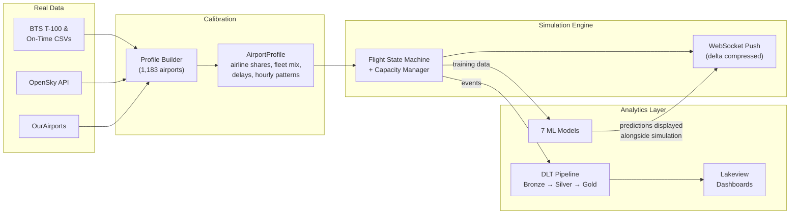
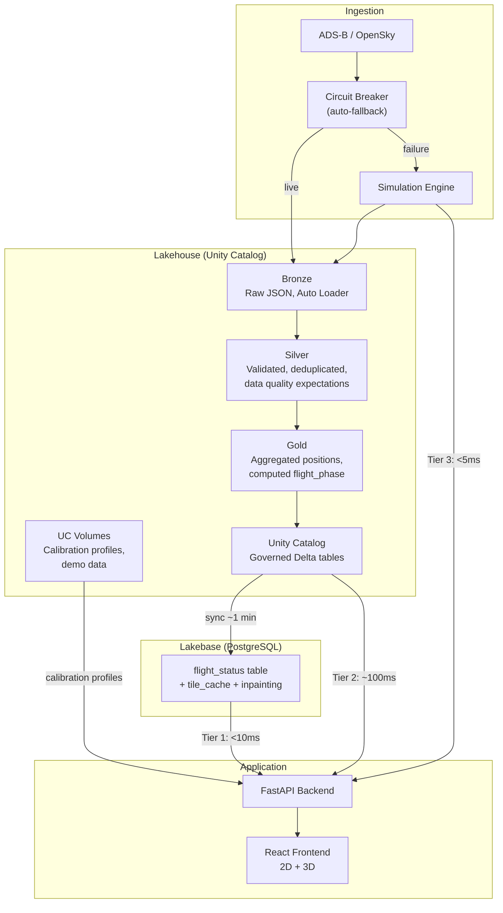
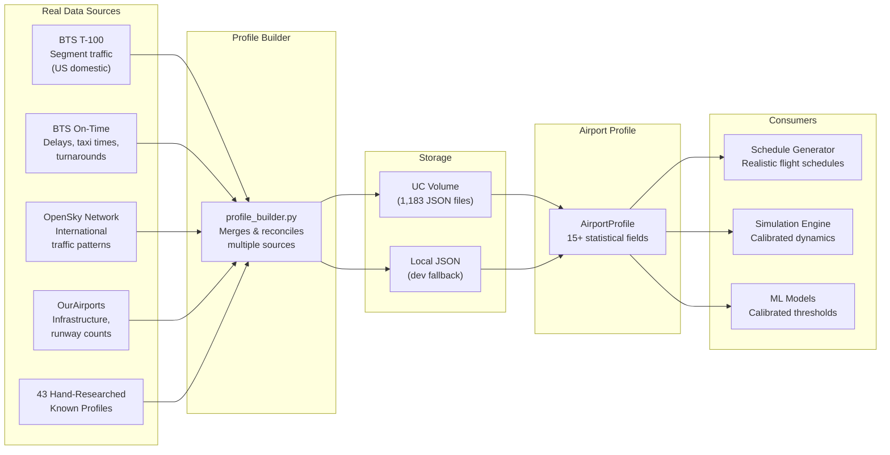
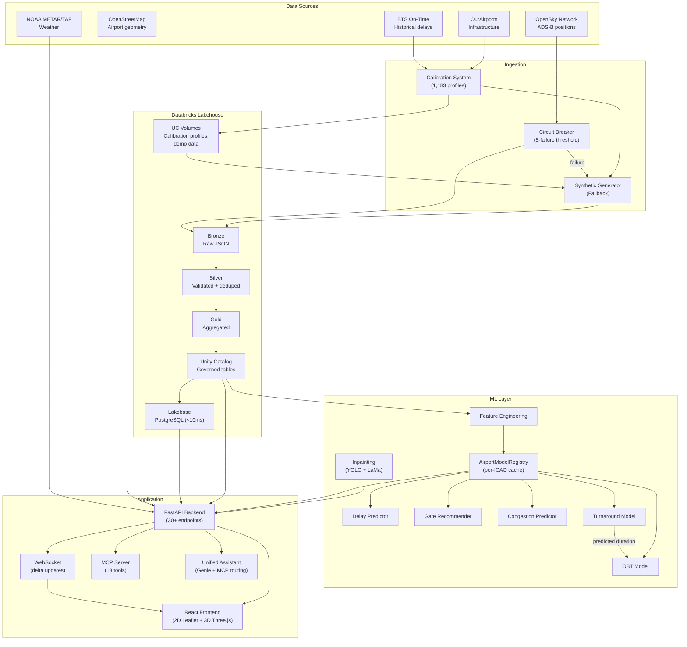
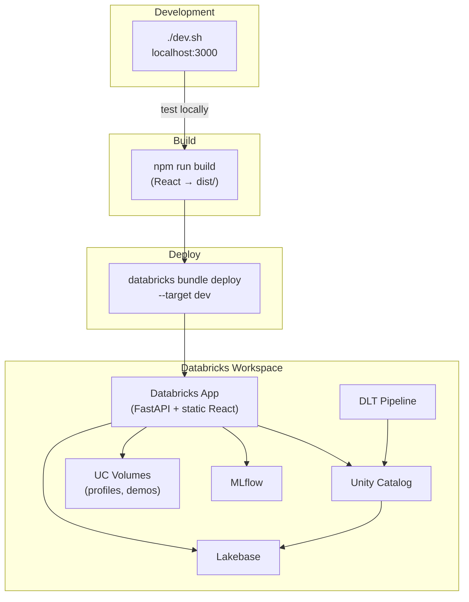

# Airport Digital Twin

> A real-time airport operations platform built on Databricks — combining physics-based flight simulation, live ADS-B tracking, and ML-powered predictions, served through interactive 2D/3D visualization across any airport worldwide.


**Live Demo**: [airport-digital-twin-dev](https://airport-digital-twin-dev-7474645572615955.aws.databricksapps.com)

---

## What It Does

The Airport Digital Twin merges three complementary engines into a single platform: a **real-time flight simulation** that animates 50+ aircraft through realistic taxi, takeoff, cruise, approach, and landing phases; a **live ADS-B feed** from OpenSky Network with in-app recording and replay; and an **analytics layer** that scores every flight with ML predictions, processes historical data through DLT pipelines, and serves operational dashboards.

### At a Glance

| Capability | Details |
|---|---|
| **Real-time simulation** | Physics-based flight state machine, 50+ concurrent aircraft, WebSocket delta streaming |
| **Live ADS-B tracking** | OpenSky Network integration with recording and frame-by-frame replay |
| **2D + 3D visualization** | Leaflet maps with OSM overlays, Three.js 3D with extruded terminal buildings |
| **Multi-airport** | 12 presets (SFO, JFK, LAX, ORD, ATL, LHR, CDG, AUH, DXB, HND, HKG, SIN) + any ICAO code |
| **7 ML models** | Delay, gate assignment, congestion, turnaround, off-block time, GSE allocation, aircraft inpainting |
| **Calibrated synthetic data** | 1,183 airport profiles from BTS, OpenSky, and OurAirports — real distributions drive simulation |
| **Two-tier serving** | Lakehouse (Unity Catalog) for governance + Lakebase (PostgreSQL) for <10ms real-time reads |
| **Live weather** | METAR/TAF — temperature, wind, visibility, flight category |
| **FIDS** | Arrivals & departures board, just like a real terminal |
| **LLM-powered reports** | Post-simulation narrative reports: KPIs, weather, events, performance assessment — configurable prompts |
| **Platform integration** | Lakeview dashboards, Genie NL queries, Unity Catalog, MLflow, Data Lineage |
| **Data format importers** | AIXM, OSM, IFC, AIDM, FAA NASR, MSFS BGL |
| **~3,900 tests** | ~3,089 Python + 822 frontend + 3 Databricks workspace jobs |

### Who Is This For?

| Role | Section | What You'll Find |
|---|---|---|
| Airport Operators | [Operations & Strategy](#for-airport-operators) | KPIs, dashboards, decision support, daily usage |
| Data Scientists | [ML & Calibration](#for-data-scientists) | Models, features, calibration pipeline, training |
| Developers | [Architecture & Modules](#for-developers) | Architecture, modules, API, testing, deployment |

---

## Project Modules

The codebase is organized into clearly separated modules. Each module has a single responsibility and well-defined boundaries.

### Core Logic (`src/`)

| Module | Path | Files | Purpose |
|---|---|---|---|
| **Simulation** | `src/simulation/` | 15 | Physics-based flight state machine, capacity management, scenario engine, video renderer, LLM report generator |
| **ML** | `src/ml/` | 15 | 7 ML models (delay, gate, congestion, turnaround, OBT, GSE, inpainting) + registry + feature engineering |
| **Calibration** | `src/calibration/` | 12 | Profile builder, multi-source ingestion (BTS, OpenSky, OurAirports), 1,183 airport profiles |
| **Ingestion** | `src/ingestion/` | 21 | Flight generation, approach/departure trajectories, taxi routing, schedule/weather/baggage generators, circuit breaker |
| **Formats** | `src/formats/` | 6 dirs | Data format importers: AIXM, OSM, IFC, AIDM, FAA NASR, MSFS BGL |
| **Pipelines** | `src/pipelines/` | 7 | DLT Bronze/Silver/Gold definitions for flights and baggage |
| **Persistence** | `src/persistence/` | 3 | Airport repository, Unity Catalog table management |
| **Inference** | `src/inference/` | 2 | OpenSky event processing |
| **Routing** | `src/routing/` | 2 | Taxiway graph construction and pathfinding |
| **Schemas** | `src/schemas/` | 3 | Pydantic models for flights and OpenSky data |
| **Config** | `src/config/` | — | Shared configuration |

### Backend Application (`app/backend/`)

| Module | Path | Files | Purpose |
|---|---|---|---|
| **API Routes** | `app/backend/api/` | 18 | FastAPI routers — flights, schedule, weather, predictions, airport, baggage, GSE, simulation, OpenSky, data ops, inpainting, assistant, MCP, debug |
| **Services** | `app/backend/services/` | 18 | Business logic singletons — flight data, predictions, weather, airport config, Lakebase, Delta, OpenSky, baggage, GSE, data ops, demo simulation |
| **Models** | `app/backend/models/` | — | Request/response Pydantic models |

Key API routers:

| Router | File | Endpoints |
|---|---|---|
| `routes.py` | Core flight & airport routes | `/api/flights`, `/api/airports`, `/api/airport/config` |
| `routes_schedule.py` | FIDS | `/api/schedule/arrivals`, `/api/schedule/departures` |
| `routes_weather.py` | Weather | `/api/weather/current` |
| `predictions.py` | ML outputs | `/api/predictions/delays`, `/predictions/gates/{icao24}`, `/predictions/congestion` |
| `opensky.py` | Live ADS-B + recordings | `/api/opensky/flights`, `/api/opensky/recordings`, `/api/opensky/record/*` |
| `simulation.py` | Sim replay + reports | `/api/simulation/files`, `/api/simulation/report/generate/{file}` |
| `inpainting.py` | Satellite cleanup | `/api/inpainting/clean-tile`, `/api/inpainting/status` |
| `assistant.py` | LLM chat | `/api/assistant/chat` |
| `mcp.py` | MCP server | `/api/mcp/rpc` (13 tools) |
| `data_ops.py` | Pipeline monitoring | `/api/data-ops/dashboard`, `/api/data-ops/stats` |
| `websocket.py` | Real-time push | `/ws` (delta-compressed flight updates) |

### Frontend Application (`app/frontend/`)

| Module | Path | Purpose |
|---|---|---|
| **Map (2D)** | `components/Map/` | Leaflet map — airport overlay, flight markers, trajectory lines, satellite inpainting |
| **Map3D** | `components/Map3D/` | Three.js 3D view — aircraft models, extruded terminals, altitude visualization |
| **SimulationControls** | `components/SimulationControls/` | Play/pause/speed, timeline scrubber, live mode, recording controls, recorded session picker |
| **FlightList** | `components/FlightList/` | Searchable flight list with phase filtering |
| **FlightDetail** | `components/FlightDetail/` | Selected flight info, ML predictions, trajectory toggle |
| **FIDS** | `components/FIDS/` | Arrivals/departures display board |
| **GateStatus** | `components/GateStatus/` | Terminal gate occupancy and congestion levels |
| **Weather** | `components/Weather/` | METAR/TAF widget — wind, visibility, flight category |
| **AirportSelector** | `components/AirportSelector/` | Airport picker — 12 presets + any ICAO code |
| **Header** | `components/Header/` | App header with mode indicators and navigation |
| **KPIDashboard** | `components/KPIDashboard/` | Operational KPI cards |
| **DataOps** | `components/DataOps/` | Pipeline health dashboard |
| **PlatformLinks** | `components/PlatformLinks/` | Links to Databricks tools (Lakeview, Genie, MLflow, Lineage) |
| **Baggage** | `components/Baggage/` | Baggage tracking UI |
| **GenieChat** | `components/GenieChat/` | Natural language query interface |
| **SceneCapture** | `components/SceneCapture/` | 3D scene screenshot utility |

Frontend state management:

| Context / Hook | Purpose |
|---|---|
| `FlightContext` | Flights array, selection, phase filtering, data mode (simulation/live/recorded) |
| `AirportConfigContext` | Current airport config, gates, terminals, runways from OSM |
| `CongestionFilterContext` | Congestion area visibility toggles |
| `ThemeContext` | Light/dark mode |
| `useSimulationReplay` | Frame-by-frame replay engine for simulation and recorded sessions |
| `useViewportState` | Syncs center/zoom/bearing between 2D and 3D views |
| `useWebSocket` | WebSocket connection for live simulation updates |
| `usePredictions` | ML prediction data per flight |
| `useTrajectory` | Flight trajectory fetching and display |

### Supporting Modules

| Module | Path | Purpose |
|---|---|---|
| **Scripts** | `scripts/` (43 files) | CLI tools — profile building, batch simulations, video rendering, deployment, validation, OpenSky collection |
| **Scenarios** | `scenarios/` (38 YAML) | Weather disruption scenarios (thunderstorms, fog, snow, wind shifts) |
| **Configs** | `configs/` | Simulation run configurations |
| **Prompts** | `prompts/` | LLM prompt templates for report generation |
| **Tests** | `tests/` (99 files) | Python test suite (~3,089 tests) |
| **Databricks** | `databricks/` | Notebooks — DLT pipeline, test runners |
| **Resources** | `resources/` | DABs YAML configs — app, jobs, pipelines, volumes |

### Codebase Stats

| Metric | Count |
|---|---|
| Python source files (`src/`) | 110 |
| App files (backend + frontend) | 162 |
| Source lines (`src/`) | ~37K |
| App lines (backend + frontend) | ~48K |
| Test files | 99 |
| Total tests | ~3,900 |
| Scenario files | 38 |
| Calibration profiles | 1,183 |
| Scripts | 43 |

---

## The Engines: Simulation, Live Tracking & Analytics

### Engine 1: Real-Time Flight Simulation

A physics-based **flight state machine** (`src/simulation/engine.py`) drives every aircraft through a complete lifecycle:

```
Scheduled → Pushback → Taxi-Out → Takeoff → Climb → Cruise → Descent → Approach → Landing → Taxi-In → Parked
```

Each phase has realistic dynamics — acceleration curves, altitude profiles, turn radii, speed constraints — calibrated from real aviation data. The engine manages runway capacity (sequencing, separation), gate assignments (terminal matching, size compatibility), and generates cascading events (delays propagate through turnaround chains).

On the backend, the simulation ticks at accelerated speed and the **WebSocket** (`app/backend/api/websocket.py`) pushes **delta-compressed updates** to the frontend — only fields that changed since the last frame are sent, keeping bandwidth under 2 KB/s for 100+ flights.

### Engine 2: Live ADS-B Tracking & Recording

The platform connects to the **OpenSky Network** for live ADS-B aircraft positions. The live mode:

- Polls OpenSky every 10 seconds for aircraft within the airport's bounding box
- Accumulates position history client-side for trajectory trails
- Follows the selected flight on the map (auto-pan with 55km clamp to airport area)
- Applies flight phase classification (parked/takeoff/climb/cruise/descent/landing) in real time

**In-app recording**: A Record button captures live snapshots to local JSONL files (`data/opensky_raw/`). Recordings are replayable through the same frame-based replay engine used for simulations — no Databricks pipeline needed for local replay.

### Engine 3: Analytics & ML

Every flight in the simulation is simultaneously scored by 7 ML models:

- **Delay Predictor** — how late will this flight arrive?
- **Gate Recommender** — which gate minimizes taxi time and balances terminals?
- **Congestion Predictor** — which runways/taxiways/aprons are approaching capacity?
- **Turnaround Model** — how long until this aircraft pushes back?
- **OBT Model** — when exactly will it depart (combining turnaround + delay + schedule)?
- **GSE Allocator** — which ground equipment is needed and when?
- **Aircraft Inpainting** — YOLO + LaMa removes real aircraft from satellite tiles for clean 3D views

Meanwhile, **DLT pipelines** process flight events through Bronze/Silver/Gold layers into Unity Catalog, **Lakeview dashboards** aggregate KPIs, and **Genie** enables natural-language queries against the governed data.

### The Bridge: How They Feed Each Other



Real airport statistics calibrate the simulation. The simulation generates training data for ML models. ML predictions enhance the simulation display. The loop closes.

---

## Data Architecture: Lakehouse & Lakebase

The platform uses a **two-tier serving architecture** that combines the governance and analytical power of the Databricks Lakehouse with the sub-10ms latency of Lakebase (managed PostgreSQL).

### Why Two Tiers?

| Tier | Technology | Latency | Purpose |
|---|---|---|---|
| **Lakehouse** | Unity Catalog + Delta Lake | ~100ms | Governed data lake — historical analytics, ML training, DLT processing, lineage, access control |
| **Lakebase** | PostgreSQL (Autoscaling) | <10ms | Real-time serving — frontend API, WebSocket updates, low-latency queries |

The Lakehouse is where data is **governed, processed, and analyzed**. Lakebase is where data is **served to users in real time**. Neither replaces the other — they're complementary.

### Data Flow



### Automatic Fallback Chain

The backend cascades through data sources transparently — if Lakebase goes down, the API falls back to Delta tables; if those are unavailable, it falls back to synthetic generation. The app never goes dark.

```
1. Lakebase (PostgreSQL)    → <10ms   → data_source="live"
2. Unity Catalog (Delta)    → ~100ms  → data_source="live"  
3. Synthetic Generator      → <5ms    → data_source="synthetic"
```

### Calibration Profile Loading

Airport calibration profiles (1,183 JSON files) are stored in a **UC Volume** and loaded with a fallback chain:

```
On Databricks:
1. UC Table (airport_profiles)      → governed, queryable
2. UC Volume (calibration_profiles) → 1,183 JSON files
3. Local JSON (data/calibration/)   → bundled fallback (dev only)
4. Known profiles (known_profiles)  → 43 hand-researched airports
5. OpenFlights auto-build           → derived from routes.dat
6. Hardcoded fallback               → generic defaults

Locally:
1. Local cache (data/cache/)  → fast dev reload
2. Local JSON → 3. Known profiles → 4. OpenFlights → 5. Hardcoded
```

### DLT Pipeline (Bronze / Silver / Gold)

| Layer | Table | Key Transformations |
|---|---|---|
| **Bronze** | `flights_bronze` | Auto Loader JSON ingestion, `_ingested_at` metadata |
| **Silver** | `flights_silver` | Explode state vectors, data quality expectations, deduplicate on `icao24 + position_time` |
| **Gold** | `flight_status_gold` | Aggregate latest position per aircraft, compute `flight_phase` |
| **Bronze** | `baggage_bronze` | Raw baggage events |
| **Silver** | `baggage_silver` | Validated baggage chain |
| **Gold** | `baggage_gold` | Aggregated baggage metrics |

Data quality enforced at Silver layer:
```sql
valid_position:  latitude IS NOT NULL AND longitude IS NOT NULL
valid_icao24:    icao24 IS NOT NULL AND LENGTH(icao24) = 6
valid_altitude:  baro_altitude >= 0 OR baro_altitude IS NULL
```

---

## Synthetic Data Calibrated with Real Data

The simulation doesn't generate random flights — it generates **statistically accurate** flights whose distributions match real-world airport operations.

### The Calibration Pipeline



### What's in a Profile?

Each of the **1,183 airport profiles** stored in a **UC Volume** (`calibration_profiles`) is a JSON file containing:

| Field | Example (SFO) | What It Drives |
|---|---|---|
| `airline_shares` | `{"UAL": 0.46, "SWA": 0.12, ...}` | Which airlines appear in simulation |
| `domestic_route_shares` | `{"LAX": 0.12, "ORD": 0.08, ...}` | Where flights come from / go to |
| `fleet_mix` | `{"UAL": {"B738": 0.35, "A320": 0.25}}` | Aircraft type per airline |
| `hourly_profile` | 24-element array of weights | Traffic peaks (6am rush, evening surge) |
| `taxi_out_mean_min` | `16.2` | Realistic taxi durations |
| `turnaround_median_min` | `52.0` | Gate occupancy time |
| `delay_rate` | `0.21` | Fraction of flights delayed |
| `mean_delay_minutes` | `18.5` | Severity of delays |

### Why This Matters

Without calibration, a simulation of JFK looks the same as a simulation of a regional airport — same airlines, same delays, same traffic patterns. With calibration:

- **SFO** generates 46% United flights peaking at 8am and 5pm, with 16-minute average taxi-out
- **ATL** generates Delta-heavy traffic with the busiest hourly profile in the US
- **LHR** generates British Airways and Virgin Atlantic with international-heavy routes
- **CDG** generates Air France with a European route network

The synthetic data is realistic enough to train ML models whose predictions make operational sense.

---

## For Airport Operators

### The Challenge

Airport operators manage thousands of flights daily across interconnected systems — runways, gates, baggage, ground equipment — with cascading delays that cost the US aviation industry **$33 billion annually** (FAA). Traditional monitoring is fragmented: one screen for flights, another for gates, another for weather.

### The Solution

The Airport Digital Twin provides a **single-pane-of-glass** for airport operations: live flight tracking, predictive analytics, and infrastructure visualization in one interactive platform.

### Key Performance Indicators

| KPI | What It Measures | How the Twin Helps |
|---|---|---|
| **On-Time Performance** | % flights within 15 min of schedule | Real-time delay predictions with confidence scoring |
| **Average Delay** | Mean schedule delay in minutes | Delay predictor with cause attribution |
| **Gate Utilization** | Gates occupied vs. available | Live gate board with ML-optimized assignments |
| **Runway Congestion** | Minutes held due to capacity | Congestion heatmap with threshold alerts |
| **Turnaround Duration** | Gate occupancy (AIBT to AOBT) | ML turnaround model with P10/P90 intervals |
| **Off-Block Time** | Predicted pushback vs. schedule | OBT model incorporating delay + turnaround |
| **Baggage Processing** | Bags/hour, mishandled rate | Bronze/Silver/Gold DLT pipeline tracking bag lifecycle |

### Decision Support Scenarios

1. **"Should we open a new gate area?"** — Visualize congestion patterns across terminals, see which areas hit CRITICAL levels during peak hours.

2. **"Which runway configuration handles weather best?"** — Overlay METAR conditions with flight phase data to see how wind shifts affect approach patterns.

3. **"Where are delays propagating from?"** — Origin-aware trajectories show which inbound routes carry the most delay, enabling proactive ground handling.

### Your Daily Command Center


*Flight list (left), map view (center), flight details and gate status (right)*

**Find any flight** — Type a callsign in the search box. Typing "UAL" filters to all United flights.

**Check arrivals/departures** — Click **FIDS** for the Flight Information Display with real-time status.


**Gate availability** — The Gate Status panel shows each terminal's gates color-coded green (available) or red (occupied), plus area congestion levels.

**Switch airports** — Click the airport button to choose from 12 presets or type any ICAO code.


*Paris CDG loaded with real terminal, gate, taxiway, and apron data from OpenStreetMap*

**3D view** — Click **3D** for the Three.js visualization with aircraft at actual altitude and extruded terminal buildings.


**Live ADS-B mode** — Switch to Live to see real aircraft from OpenSky Network. Click Record to capture a session for later replay.

### Three Data Modes

| Mode | Source | Use Case |
|---|---|---|
| **Simulation** | Physics engine + synthetic data | Training, demos, what-if analysis |
| **Live** | OpenSky Network ADS-B | Real-time monitoring, recording |
| **Recorded** | JSONL files (local) or Delta tables (cloud) | Replay past sessions, analysis |

### Flight Phase Color Codes

| Color | Phase | Meaning |
|---|---|---|
| Yellow | Ground | Aircraft on taxiway or at gate |
| Green | Climbing | Departed, gaining altitude |
| Red | Descending | On approach, losing altitude |
| Blue | Cruising | At cruise altitude, en route |

### ML Predictions (Per Flight)

When you select a flight, the details panel shows:
- **Expected Delay**: Predicted minutes late, with confidence %
- **Delay Category**: On Time / Slight / Moderate / Severe
- **Gate Recommendations**: Top 3 gates ranked by score with reasons

### Platform Integration

Click **Platform** in the header to jump to Databricks tools:


| Link | Use Case |
|---|---|
| **Flight Dashboard** | Lakeview dashboard with aggregated KPIs and trends |
| **Ask Genie** | Query flight data in plain English |
| **Data Lineage** | See where every data point comes from |
| **ML Experiments** | Monitor model performance in MLflow |
| **Unity Catalog** | Browse all tables and schemas |

### Keyboard Shortcuts

| Key | Action |
|---|---|
| `2` | Switch to 2D map |
| `3` | Switch to 3D view |
| `Esc` | Deselect flight |
| `/` | Focus search box |
| `Up` / `Down` | Navigate flight list |
| `Enter` | Select highlighted flight |

---

## For Data Scientists

### ML Model Suite (7 Models)

| Model | Module | Type | Input | Output |
|---|---|---|---|---|
| **Delay Prediction** | `src/ml/delay_model.py` | Rule-based heuristic | 14-feature vector | `delay_minutes`, `confidence`, `delay_category` |
| **Gate Recommendation** | `src/ml/gate_model.py` | Scoring optimization | Flight + gate status | Top-K gates with `score`, `reasons`, `estimated_taxi_time` |
| **Congestion Prediction** | `src/ml/congestion_model.py` | Capacity threshold | All flight positions | Area `level` (low/moderate/high/critical), `wait_minutes` |
| **Turnaround Duration** | `src/ml/turnaround_model.py` | HistGradientBoosting / CatBoost | 19 features | `turnaround_minutes` with P10/P90 intervals |
| **Off-Block Time** | `src/ml/obt_model.py` | HistGradientBoosting / CatBoost | 19 features | `departure_offset_min` (AOBT - SOBT) with P10/P90 |
| **GSE Allocation** | `src/ml/gse_model.py` | Optimization | Turnaround phase | Equipment assignments and timing |
| **Aircraft Inpainting** | `src/ml/inpainting/` | YOLO OBB + LaMa | Satellite tile (256x256 PNG) | Clean tile with aircraft removed |

All models are wrapped in `AirportModelRegistry` (`src/ml/registry.py`) which caches per-ICAO instances — switching airports hot-swaps all models with airport-specific calibration.

### Two-Stage Prediction Pipeline: Turnaround + OBT

The turnaround and OBT models form a chained pipeline:

```
                  Aircraft category
                  Gate properties          Turnaround
Schedule context  Weather          ──────► Prediction ──┐
                  Historical patterns      (AOBT-AIBT)  │
                                                        │
                  Schedule offset                       │
                  Arrival delay           ──────────────┼──► OBT Prediction
                  Operational context                   │    (AOBT - SOBT)
                  Turnaround prediction ◄───────────────┘
```

1. **Turnaround model** predicts gate occupancy duration from aircraft category, gate, weather, and schedule features. Three prediction horizons: T-90 (pre-arrival), T-park (at gate), T-board (boarding stage).

2. **OBT model** predicts departure offset from schedule. Uses the turnaround prediction as an input feature alongside arrival delay propagation and operational context. Two horizons: T-schedule (planning) and T-park (operational).

Both models support CatBoost (native categoricals) with sklearn HistGradientBoosting fallback, P10/P90 quantile regression for prediction intervals, and Conformalized Quantile Regression (CQR) calibration.

### Aircraft Inpainting Pipeline

Two-stage deep learning pipeline served on Databricks Model Serving (GPU_MEDIUM, scale-to-zero):

1. **Detection** — YOLOv8s-OBB (trained on DOTA satellite dataset) detects aircraft using **oriented bounding boxes** at confidence threshold 0.15. OBB is critical because aircraft sit at arbitrary angles.

2. **Inpainting** — LaMa (Large Mask Inpainting) fills each detected region with surrounding tarmac texture.

Results are cached in Lakebase with source ETag tracking — when satellite imagery updates, the cache auto-invalidates.

### Feature Engineering

**Delay model features** (`src/ml/features.py`): 14 features from raw flight data:
- 4 numeric: `hour_of_day`, `day_of_week`, `is_weekend`, `velocity_normalized`
- 3 one-hot: `flight_distance_category` (short/medium/long)
- 3 one-hot: `altitude_category` (ground/low/cruise)
- 4 one-hot: `heading_quadrant` (N/E/S/W)

**Turnaround/OBT features**: 19 features including aircraft size category, gate terminal, weather conditions (wind, visibility, flight category), schedule context (hour, day, peak flag), and operational state.

### Calibration System Deep Dive

The calibration system ensures synthetic data matches real-world statistics:

| Component | Module | Purpose |
|---|---|---|
| `AirportProfile` | `src/calibration/profile.py` | Dataclass: 15+ fields of airport statistics |
| `ProfileBuilder` | `src/calibration/profile_builder.py` | Orchestrates multi-source profile building |
| `BTS ingest` | `src/calibration/bts_ingest.py` | Parse BTS T-100 segment data and On-Time performance |
| `OpenSky ingest` | `src/calibration/opensky_ingest.py` | Query OpenSky API for international traffic patterns |
| `OurAirports ingest` | `src/calibration/ourairports_ingest.py` | Parse infrastructure data (runways, terminals) |
| `Known profiles` | `src/calibration/known_profiles.py` | 43 hand-researched US + international airports |
| `Auto-calibrate` | `src/calibration/auto_calibrate.py` | Auto-detect and apply best available profile |

**1,183 calibration profiles** stored in a **UC Volume** (`calibration_profiles`) — each a JSON file with airline shares, route frequencies, fleet mix, hourly traffic patterns, taxi times, turnaround stats, and delay distributions learned from real data. A local copy in `data/calibration/profiles/` is used for development and as a fallback.

### Experiment Tracking

Models are tracked in MLflow. Training runs log:
- Feature importance
- Train/validation metrics
- Prediction interval calibration (CQR)
- Model artifacts (serialized model + feature config)

---

## For Developers

### Architecture



### WebSocket Protocol

The WebSocket at `/ws` pushes delta-compressed flight updates:

```json
{
  "type": "update",
  "flights": [
    {"icao24": "a00001", "latitude": 37.621, "longitude": -122.379, "altitude": 150},
    {"icao24": "a00002", "heading": 285}
  ],
  "removed": ["a00045"]
}
```

Only changed fields are sent per flight (not the full object). New flights include all fields. Removed flights are listed by icao24. This keeps bandwidth under 2 KB/s for 100+ flights.

### Data Format Importers

| Format | Parser | Standard | Use Case |
|---|---|---|---|
| **AIXM** | `src/formats/aixm/` | ICAO/Eurocontrol | Aeronautical data exchange |
| **OSM** | `src/formats/osm/` | OpenStreetMap | Primary source — runways, gates, taxiways, terminals |
| **IFC** | `src/formats/ifc/` | BIM/IFC | 3D terminal building models |
| **AIDM** | `src/formats/aidm/` | Eurocontrol | Airport operational data (A-CDM) |
| **FAA NASR** | `src/formats/faa/` | US FAA | Runway and facility database |
| **MSFS BGL** | `src/formats/msfs/` | Microsoft | Flight Simulator scenery data |

### Simulation Engine

Run deterministic, accelerated simulations:

```bash
# Quick debug run (4h, 20 flights)
python -m src.simulation.cli --config configs/simulation_sfo_50_debug.yaml

# Full day simulation
python -m src.simulation.cli --airport SFO --arrivals 50 --departures 50 --seed 42

# Full day with weather scenario + auto-generate narrative report
python -m src.simulation.cli --airport SFO --arrivals 250 --departures 250 \
  --scenario scenarios/sfo_summer_thunderstorm.yaml --report
```

The engine manages the full flight lifecycle, runway capacity/sequencing, gate assignments, turnaround events, passenger flow, baggage generation, and weather events. Outputs structured JSON event logs compatible with the frontend replay player.

### Simulation Report Generation

After a simulation completes, an LLM-powered report generator can produce a **narrative markdown analysis** covering KPIs, weather evolution, key operational events, and performance assessment.

```
Simulation JSON ──► Report Generator ──► REPORT_*.md
                          │
              Configurable prompt template
           (scenario YAML / file / default)
```

Three layers of prompt configurability:

| Priority | Source | Use Case |
|---|---|---|
| 1 | Scenario YAML: `report_prompt` | Inline prompt for a specific scenario |
| 2 | File reference: `report_prompt_file` | Shared template across scenarios |
| 3 | Default: `prompts/simulation_report.md` | Standard operations analyst briefing |

### Test Suite

| Layer | Count | Framework | Command |
|---|---|---|---|
| Backend (Python) | ~3,089 | pytest | `uv run pytest tests/ -v` |
| Frontend (TypeScript) | ~822 | Vitest | `cd app/frontend && npm test -- --run` |
| E2E Smoke (Databricks) | 11 endpoints | DABs job | `databricks bundle run e2e_smoke_test --target dev` |
| ML Endpoints (Databricks) | 4 models | DABs job | `databricks bundle run ml_endpoint_test --target dev` |
| Baggage Integration | DLT pipeline | DABs job | `databricks bundle run baggage_pipeline_integration_test --target dev` |
| Unit (Databricks) | Full pytest | DABs job | `databricks bundle run unit_test --target dev` |

### Local Development

```bash
./dev.sh  # Starts FastAPI backend + React dev server, opens http://localhost:3000
```

### Deployment

The application deploys as a **Databricks App** using **Databricks Asset Bundles (DABs)**. Always use DABs — never `databricks apps deploy` directly.

```bash
# Full automated deploy (build + DABs + tables + app restart + SP grants)
./deploy.sh                    # default target: dev
./deploy.sh --target prod      # specify target
SKIP_BUILD=1 ./deploy.sh       # skip frontend build
```



### Infrastructure Components

| Component | Technology | Purpose | Config |
|---|---|---|---|
| **App Runtime** | Databricks Apps (APX) | Hosts FastAPI + React | `app.yaml` |
| **Compute** | Serverless SQL Warehouse | SQL queries, DLT | Warehouse ID in `app.yaml` |
| **Storage** | Unity Catalog (Delta + Volumes) | Governed data lake + file storage | `serverless_stable_3n0ihb_catalog` |
| **Low-Latency DB** | Lakebase (PostgreSQL) | <10ms frontend serving | Autoscaling endpoint |
| **ML Tracking** | MLflow | Experiment tracking | Workspace MLflow |
| **ML Serving** | Model Serving (GPU) | Inpainting endpoint | Scale-to-zero, GPU_MEDIUM |
| **Pipelines** | DLT | Bronze/Silver/Gold ETL | `resources/` YAML |
| **CI/CD** | DABs | Infrastructure as code | `databricks.yml` |

### Environment Variables

| Variable | Purpose | Required |
|---|---|---|
| `LAKEBASE_HOST` | Lakebase PostgreSQL host | For live data |
| `LAKEBASE_USE_OAUTH` | Use OAuth for Lakebase | In production |
| `LAKEBASE_ENDPOINT_NAME` | Lakebase autoscaling endpoint | With OAuth |
| `DATABRICKS_HOST` | Workspace URL | For Delta tables |
| `DATABRICKS_HTTP_PATH` | SQL Warehouse path | For Delta tables |
| `DATABRICKS_CATALOG` | Unity Catalog catalog | For Delta tables |
| `DATABRICKS_SCHEMA` | Schema name | For Delta tables |
| `INPAINTING_ENDPOINT_NAME` | Serving endpoint name | For inpainting |
| `ASSISTANT_MODEL_ENDPOINT` | LLM endpoint for assistant + report generation | For chat and reports |
| `GENIE_SPACE_ID` | Genie space for NL queries | For assistant |
| `DEBUG_MODE` | Enable verbose logging | Optional |
| `DEMO_MODE` | Force synthetic data | Optional |

### Monitoring

**Health endpoint**: `GET /health` — returns data source availability for Lakebase, Delta, and Synthetic.

**Debug logs**: `GET /api/debug/logs?pattern=DIAG` — ring-buffer (last 2,000 entries) with level and pattern filtering.

**Data Ops dashboard**: `GET /api/data-ops/dashboard` — pipeline health, acquisition stats, sync status, data freshness.

### Troubleshooting

| Symptom | Likely Cause | Fix |
|---|---|---|
| "Demo Mode" in header | Backend can't reach Lakebase/Delta | Check Lakebase instance, OAuth credentials |
| Flights not updating | WebSocket disconnected or DLT stopped | Check connection status, verify DLT pipeline |
| Airport switch hangs | Overpass API timeout | Check internet, try different airport |
| 3D view slow | GPU/WebGL limitations | Reduce window size, use Chrome/Firefox |
| Stale data (>5 min) | Sync job failing | Check `/api/data-ops/sync-status` |

### Directory Structure

```
app/
  backend/
    api/               # 18 FastAPI route modules
    services/          # 18 business logic singletons
    models/            # Pydantic request/response models
    main.py            # Uvicorn entry point
  frontend/
    src/
      components/      # 17 UI component modules
      context/         # 4 React contexts (Flight, AirportConfig, Congestion, Theme)
      hooks/           # 11 custom hooks (WebSocket, simulation replay, predictions)
      types/           # TypeScript type definitions
      constants/       # Airport layout constants
    dist/              # Production build output
    tests/             # ~822 Vitest tests

src/
  simulation/          # Flight state machine, capacity, scenarios, video, reports
  ml/                  # 7 ML models + registry + features + inpainting
  calibration/         # Profile builder, multi-source ingestion
  ingestion/           # Flight generation, trajectories, schedules, weather, baggage
  formats/             # 6 data format importers (AIXM, OSM, IFC, AIDM, FAA, MSFS)
  pipelines/           # DLT Bronze/Silver/Gold
  persistence/         # Airport repository, UC table management
  inference/           # OpenSky event processing
  routing/             # Taxiway graph pathfinding
  schemas/             # Pydantic data models

tests/                 # ~3,089 Python tests (99 files)
databricks/            # Notebooks (DLT pipeline, test runners)
resources/             # DABs YAML configs (app, jobs, pipelines, volumes)
data/                  # Local calibration profiles (dev fallback)
configs/               # Simulation run configurations
scenarios/             # 38 weather disruption scenario YAMLs
prompts/               # LLM prompt templates
scripts/               # 43 CLI tools
docs/                  # Technical documentation + screenshots
```

---

## Tech Stack

**Frontend**: React 18, TypeScript, Three.js, React Three Fiber, Leaflet, Tailwind CSS, Vite

**Backend**: Python 3.13, FastAPI, UV (package manager)

**Data Platform**: Databricks — Unity Catalog, Lakebase (PostgreSQL), DLT, MLflow, Lakeview, Genie, Model Serving

**ML**: CatBoost, scikit-learn (HistGradientBoosting), YOLOv8s-OBB, LaMa, Conformalized Quantile Regression

**Data Formats**: AIXM, OpenStreetMap (Overpass API), IFC (IfcOpenShell), AIDM, FAA NASR, MSFS BGL

---

## Documentation

| Document | Description |
|---|---|
| [User Guide](docs/USER_GUIDE.md) | Complete walkthrough with screenshots for all personas |
| [ML Models](docs/ML_MODELS.md) | Delay, gate, congestion model internals |
| [Data Pipeline](docs/PIPELINE.md) | DLT Bronze/Silver/Gold architecture |
| [Data Dictionary](docs/DATA_DICTIONARY.md) | Schema definitions for all tables |
| [Airport Data Import](docs/AIRPORT_DATA_IMPORT.md) | AIXM, OSM, IFC, AIDM, FAA import formats |
| [Synthetic Data](docs/SYNTHETIC_DATA_GENERATION.md) | Synthetic data generation constraints |
| [Aircraft Separation](docs/AIRCRAFT_SEPARATION.md) | FAA/ICAO separation standards |
| [Data Sources & KPIs](docs/AIRPORT_DATA_SOURCES_AND_KPIS.md) | Open aviation data catalog + KPI reference |
| [Simulation Guide](docs/simulation_user_guide.md) | Run deterministic airport simulations |
| [Report Prompt Template](prompts/simulation_report.md) | Default LLM prompt for post-simulation narrative reports |
| [Security Audit](docs/SECURITY_AUDIT.md) | Security review findings |
| [Delta Sharing](docs/DELTA_SHARING.md) | Cross-organization data sharing |
| [Development Philosophy](docs/DEVELOPMENT_PHILOSOPHY.md) | Design principles |
| [V2 Roadmap](docs/ROADMAP_V2.md) | Feature roadmap |

---

## Quick Start

### Local Development

```bash
./dev.sh  # Starts backend + frontend, opens http://localhost:3000
```

### Deploy to Databricks

```bash
./deploy.sh  # Build + deploy + restart (default: dev target)
```

### Run Tests

```bash
uv run pytest tests/ -v                    # ~3,089 backend tests
cd app/frontend && npm test -- --run       # ~822 frontend tests
```

---

## License

Internal Databricks Field Engineering demo.
