# Airport Digital Twin

> A real-time airport operations platform built on Databricks — combining physics-based flight simulation, live ADS-B tracking, and ML-powered predictions, served through interactive 2D/3D visualization across any airport worldwide.


**Live Demo**: [airport-digital-twin-dev](https://airport-digital-twin-dev-7474645572615955.aws.databricksapps.com)

---

## At a Glance

| Capability | Details |
|---|---|
| **Real-time simulation** | Physics-based flight state machine, 50+ concurrent aircraft, WebSocket delta streaming |
| **Live ADS-B tracking** | OpenSky Network integration with recording and frame-by-frame replay |
| **2D + 3D visualization** | Leaflet maps with OSM overlays, Three.js 3D with extruded terminal buildings |
| **Multi-airport** | 29 presets across 5 regions + any ICAO code worldwide |
| **7 ML models** | Delay, gate assignment, congestion, turnaround, off-block time, GSE allocation, aircraft inpainting |
| **Calibrated synthetic data** | 1,183 airport profiles from BTS, OpenSky, and OurAirports — real distributions drive simulation |
| **Two-tier serving** | Lakehouse (Unity Catalog) for governance + Lakebase (PostgreSQL) for <10ms real-time reads |
| **Live weather** | METAR/TAF — temperature, wind, visibility, flight category |
| **FIDS** | Arrivals & departures board, just like a real terminal |
| **LLM-powered reports** | Post-simulation narrative reports with interactive chat and what-if simulation |
| **Platform integration** | Lakeview dashboards, Genie NL queries, Unity Catalog, MLflow, Data Lineage |
| **Data format importers** | AIXM, OSM, IFC, AIDM, FAA NASR, MSFS BGL |
| **CI/CD** | GitHub Actions — CI on push (Python + frontend tests), CD on merge to main (DABs deploy + post-deploy verification) |
| **~4,700 tests** | Python + frontend + 3 Databricks workspace jobs |

### Who Is This For?

| Role | Section | What You'll Find |
|---|---|---|
| Airport Operators | [Airport Operations](#airport-operations) | KPIs, dashboards, decision support, daily usage |
| Platform Admins | [Application Administration](#application-administration) | Deployment, CI/CD, configuration, monitoring, backup |
| Data Scientists | [Data Science & ML](#data-science--ml) | Models, features, calibration pipeline, training |
| Developers | [Development](#development) | Architecture, modules, API, testing, contributing |

---

## Quick Start

```bash
./dev.sh                                  # Local dev: backend + frontend at http://localhost:3000
uv run pytest tests/ -v                   # Run ~4,700 Python tests
cd app/frontend && npm test -- --run      # Run frontend tests
./deploy.sh                               # Deploy to Databricks (default: dev target)
```

---

## Airport Operations

Airport operators manage thousands of flights daily across interconnected systems — runways, gates, baggage, ground equipment — with cascading delays that cost the US aviation industry **$33 billion annually** (FAA). The Airport Digital Twin provides a **single-pane-of-glass** for airport operations: live flight tracking, predictive analytics, and infrastructure visualization in one interactive platform.

> For the full walkthrough with all features, see [User Guide](docs/USER_GUIDE.md).

### Key Performance Indicators

| KPI | What It Measures | How the Twin Helps |
|---|---|---|
| **On-Time Performance** | % flights within 15 min of schedule | Real-time delay predictions with confidence scoring |
| **Average Delay** | Mean schedule delay in minutes | Delay predictor with cause attribution |
| **Gate Utilization** | Gates occupied vs. available | Live gate board with ML-optimized assignments |
| **Runway Congestion** | Minutes held due to capacity | Congestion heatmap with threshold alerts |
| **Turnaround Duration** | Gate occupancy (AIBT to AOBT) | ML turnaround model with P10/P90 intervals |
| **Off-Block Time** | Predicted pushback vs. schedule | OBT model incorporating delay + turnaround |
| **Baggage Processing** | Bags/hour, mishandled rate | Bronze/Silver/Gold DLT pipeline tracking bag lifecycle |

### Decision Support Scenarios

1. **"Should we open a new gate area?"** — Visualize congestion patterns across terminals, see which areas hit CRITICAL levels during peak hours.
2. **"Which runway configuration handles weather best?"** — Overlay METAR conditions with flight phase data to see how wind shifts affect approach patterns.
3. **"Where are delays propagating from?"** — Origin-aware trajectories show which inbound routes carry the most delay, enabling proactive ground handling.

### Daily Command Center

**Find any flight** — Type a callsign in the search box. Typing "UAL" filters to all United flights.


*Typing "UAL" filters the flight list to United Airlines flights only*

**Select a flight** — Click any flight to see details, ML predictions, and trajectory.


*AMX357 selected — route (LAX→SFO), position, movement data, trajectory toggle, and turnaround progress*

**Check arrivals/departures** — Click **FIDS** for the Flight Information Display with real-time status.


*Arrivals board showing airline, origin, gate, status, and remarks — with auto-refresh*

**Check weather** — The header bar shows live METAR conditions: temperature, wind speed/direction, visibility, and flight category (VFR/MVFR/IFR).


*Header displays 29°C, 251° at 10kt wind, 100M visibility — updated every 5 minutes from NOAA*

**Switch airports** — Click the airport button to choose from 29 presets or type any ICAO code.


*29 preset airports grouped by region — type any ICAO code to load airports worldwide*


*Progress overlay while loading airport geometry from OpenStreetMap*


*Paris CDG loaded with real terminal, gate, taxiway, and apron data from OpenStreetMap*

**3D view** — Click **3D** for the Three.js visualization with aircraft at actual altitude and extruded terminal buildings.


*SFO in 3D — extruded terminals, aircraft with callsign labels, altitude-accurate positioning*

**ML Predictions Dashboard** — Click **KPI** for real-time ML predictions across all active flights, with overview, congestion heatmaps, and delay forecasts.


*ML Predictions Dashboard with tabs for Overview, Congestion, and Delay Forecast*

**Live ADS-B mode** — Switch to Live to see real aircraft from OpenSky Network. Click Record to capture a session for later replay.

**Platform links** — Click **Platform** in the header to jump to Databricks tools (Lakeview, Genie, MLflow, Lineage, Unity Catalog).

| Link | Use Case |
|---|---|
| **Flight Dashboard** | Lakeview dashboard with aggregated KPIs and trends |
| **Ask Genie** | Query flight data in plain English |
| **Data Lineage** | See where every data point comes from |
| **ML Experiments** | Monitor model performance in MLflow |
| **Unity Catalog** | Browse all tables and schemas |

### Three Data Modes

| Mode | Source | Use Case |
|---|---|---|
| **Simulation** | Physics engine + synthetic data | Training, demos, what-if analysis |
| **Live** | OpenSky Network ADS-B | Real-time monitoring, recording |
| **Recorded** | JSONL files (local) or Delta tables (cloud) | Replay past sessions, analysis |

### Flight Phase Color Codes

| Color | Phase | Meaning |
|---|---|---|
| Yellow | Ground | Aircraft on taxiway or at gate |
| Green | Climbing | Departed, gaining altitude |
| Red | Descending | On approach, losing altitude |
| Blue | Cruising | At cruise altitude, en route |

### ML Predictions (Per Flight)

When you select a flight, the details panel shows:
- **Expected Delay**: Predicted minutes late, with confidence %
- **Delay Category**: On Time / Slight / Moderate / Severe
- **Gate Recommendations**: Top 3 gates ranked by score with reasons

### Mobile Experience (PWA — iOS & Android)

The platform is a **Progressive Web App** optimized for mobile — installable to the home screen with native-like behavior. On screens below 768px it switches to a dedicated mobile layout with bottom tab navigation, safe-area support for notched devices, and dynamic viewport handling for iOS Safari.

| Feature | Details |
|---|---|
| **Installable PWA** | Add to home screen on iOS/Android — opens full-screen with app icon |
| **Bottom tab bar** | Map, Flights, Gates, Info — safe-area-aware for iPhone home indicator |
| **Dynamic viewport** | Uses `100dvh` to handle iOS Safari URL bar collapse without layout shifts |
| **Offline support** | Service worker caches assets, friendly offline page with retry |
| **Controlled updates** | In-app toast notification when a new version is available |
| **Touch-optimized** | 48px minimum touch targets, no 300ms tap delay, no overscroll bounce |

#### Tab Navigation

| Tab | Content |
|---|---|
| **Map** | Full-screen interactive map with 2D/3D toggle, satellite view, and simulation timeline |
| **Flights** | Searchable flight list with phase filters and callsign search |
| **Gates** | Terminal gate occupancy with split map — zooms to selected gate area |
| **Info** | Flight details, origin/destination, trajectory, ML predictions |

#### Safari Mode (Mobile Browser)

Accessed via the browser URL. The Safari navigation bar is visible at the top — the app adapts its viewport dynamically as the URL bar collapses or expands during scrolling (using CSS `100dvh`).

<p align="center">
  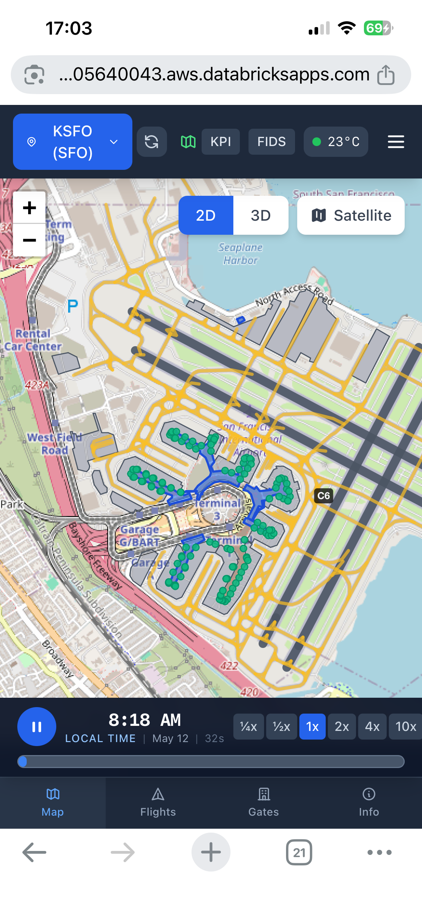
  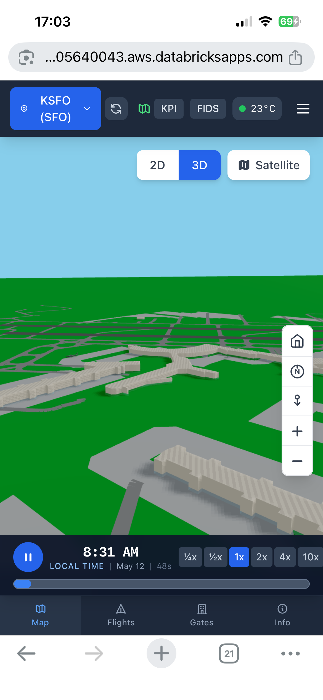
  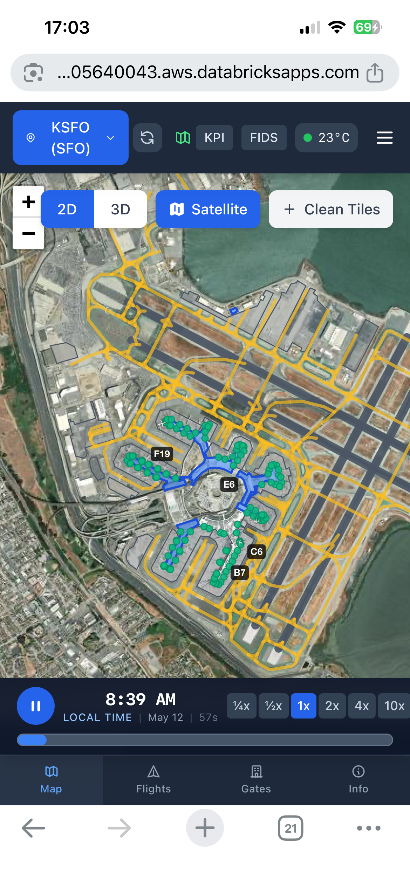
</p>

*Safari browser mode — URL bar visible at top. Left to right: 2D map with airport overlay and simulation timeline, 3D extruded terminals, satellite imagery with Clean Tiles and taxiway overlay*

#### Installed PWA (Add to Home Screen)

When installed via "Add to Home Screen" on iOS (or "Install" on Android), the app runs full-screen without any browser chrome — indistinguishable from a native app. The status bar blends with the app header, and the bottom tab bar accounts for the iPhone home indicator via safe-area insets.

<p align="center">
  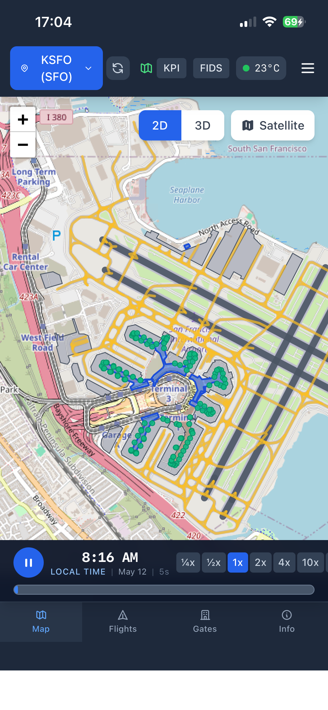
  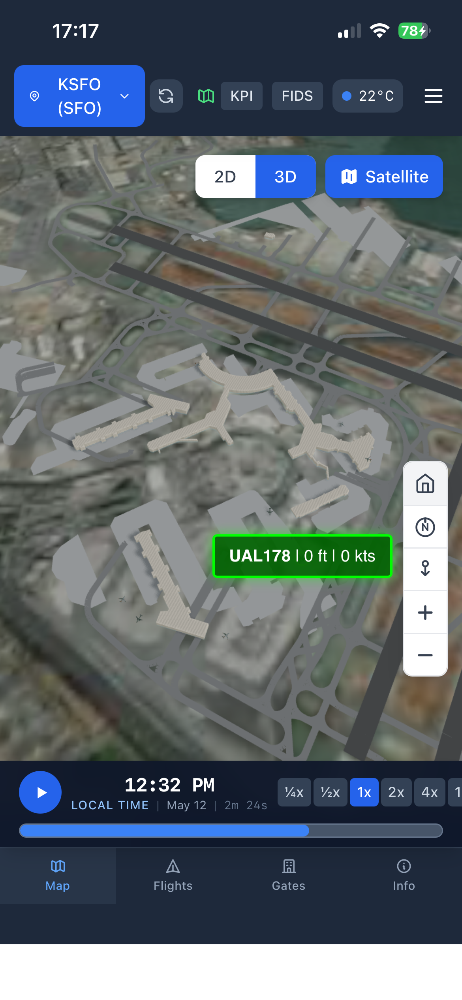
  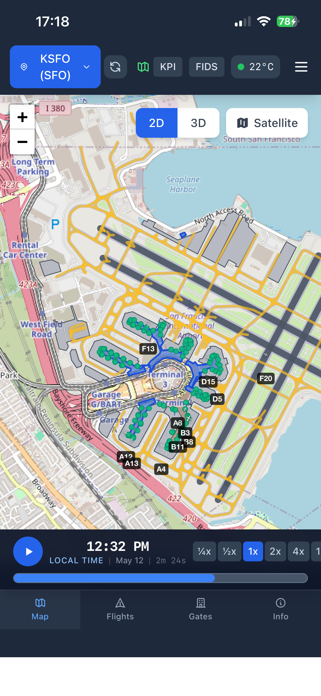
</p>

*Installed PWA — no browser chrome. Left to right: 2D map (dark theme) with full-screen layout, 3D satellite view with callsign labels, 2D map with gate labels visible at zoom*

<p align="center">
  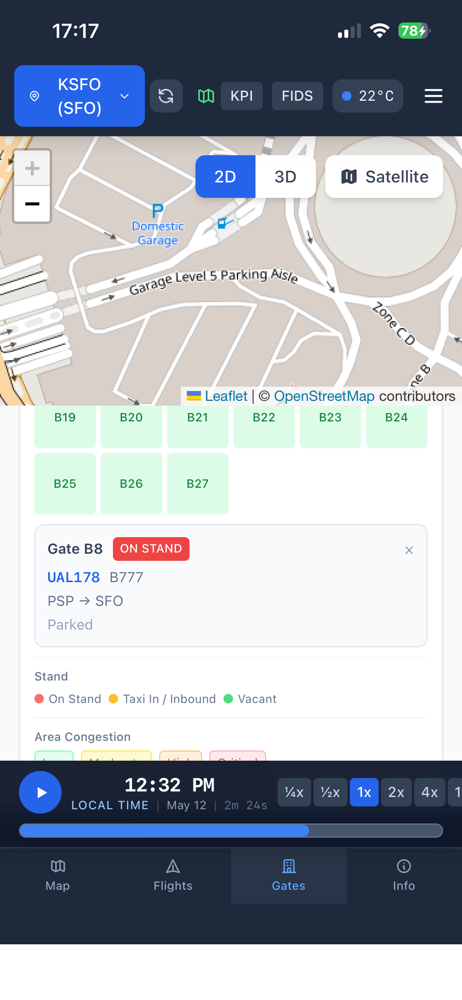
  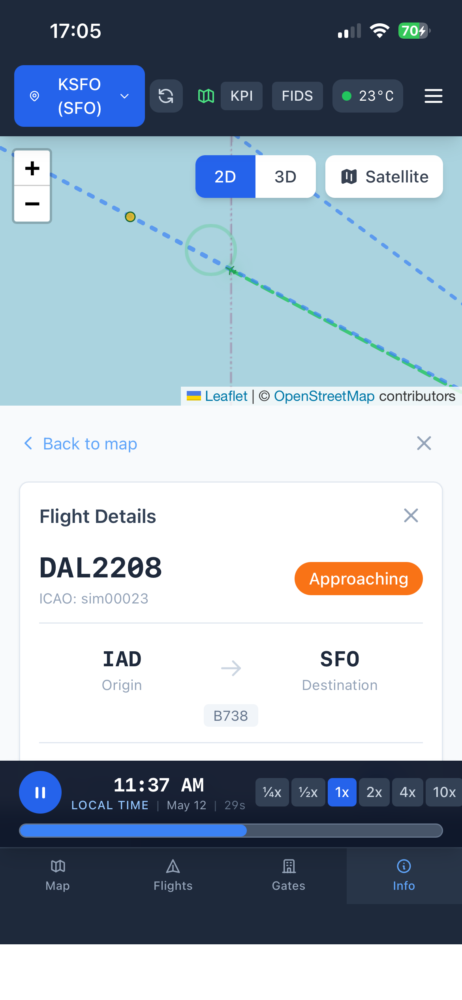
</p>

*Gate detail panel showing occupancy status and area congestion; Flight info tab with origin/destination, approach trajectory, and ML predictions*

#### Mobile Header & Menu

The compact header provides quick-access buttons for **KPI** dashboard and **FIDS** board, live weather, and a hamburger menu with phase filter and chat assistant. In both Safari and PWA modes, the bottom tab bar is fixed with 48px touch targets and safe-area padding for notched iPhones.

---

## Application Administration

This section covers deploying, configuring, monitoring, and maintaining the Airport Digital Twin.

> For first-time production setup, see [Production Deployment Guide](docs/PRODUCTION_DEPLOYMENT.md).
> For disaster recovery, see [Backup & Restore Guide](docs/BACKUP_AND_RESTORE.md).

### Deployment

The application deploys as a **Databricks App** using **Databricks Asset Bundles (DABs)**. Always use DABs — never `databricks apps deploy` directly.

```bash
./deploy.sh                    # Full deploy: build + DABs + tables + app restart + SP grants
./deploy.sh --target prod      # Specify target (default: dev)
SKIP_BUILD=1 ./deploy.sh       # Skip frontend build
./deploy.sh --seed             # First-time: seed calibration profiles, 3D models, Lakebase schema
```

`deploy.sh` runs these steps in order:
1. Build frontend (`npm run build`)
2. `databricks bundle deploy` — creates app, volumes, jobs, pipelines, endpoints
3. Create UC schema + tables via SQL API
4. Stop/start app, wait for RUNNING
5. `scripts/grant_sp_permissions.sh` — UC grants, workspace ACLs, secrets, Genie

**DABs manages:** app, 5 UC volumes, jobs, DLT pipelines, serving endpoints, SQL warehouse permissions.
**Post-deploy script manages:** workspace object ACLs, UC GRANT statements, secret scope ACLs, Genie space access.

### CI/CD Pipeline

| Workflow | Trigger | What It Does |
|---|---|---|
| **CI** (`.github/workflows/ci.yml`) | Every push + PR to main | Python tests (pytest), frontend tests (Vitest), TypeScript type check |
| **CD** (`.github/workflows/cd.yml`) | Merge to main or manual dispatch | Frontend build, DABs deploy, table creation, app restart, SP grants, post-deploy smoke test |

CD supports manual dispatch with target selection (dev/prod) and a `--seed` flag for first-time deployments.

### Infrastructure Components

| Component | Technology | Purpose | Config |
|---|---|---|---|
| **App Runtime** | Databricks Apps (APX) | Hosts FastAPI + React | `app.yaml` |
| **Compute** | Serverless SQL Warehouse | SQL queries, DLT | Warehouse ID in `app.yaml` |
| **Storage** | Unity Catalog (Delta + Volumes) | Governed data lake + file storage | `serverless_stable_3n0ihb_catalog` |
| **Low-Latency DB** | Lakebase (PostgreSQL) | <10ms frontend serving | Autoscaling endpoint |
| **ML Tracking** | MLflow | Experiment tracking | Workspace MLflow |
| **ML Serving** | Model Serving (GPU) | Inpainting endpoint | Scale-to-zero, GPU_MEDIUM |
| **Pipelines** | DLT | Bronze/Silver/Gold ETL | `resources/` YAML |
| **CI/CD** | GitHub Actions + DABs | Build, test, deploy | `databricks.yml` |

### UC Volumes

Five managed volumes under `serverless_stable_3n0ihb_catalog.airport_digital_twin`:

| Volume | Purpose | Size |
|---|---|---|
| `calibration_profiles` | Per-airport traffic/fleet statistics (1,183 JSON files) | ~6 MB |
| `static_assets` | 3D models + pre-computed OSM cache | ~57 MB |
| `simulation_data` | Sim outputs, ML models, debug logs | Variable |
| `demo_simulations` | Pre-generated demo replays | ~50 MB/airport |
| `opensky_raw` | Raw ADS-B JSONL from OpenSky Network | 92 MB+ |

> For volume details, population methods, and runtime access patterns, see [UC Volumes Reference](docs/UC_VOLUMES.md).

### Environment Variables

Configured in `app.yaml`:

| Variable | Purpose | Required |
|---|---|---|
| `LAKEBASE_HOST` | Lakebase PostgreSQL host | For live data |
| `LAKEBASE_USE_OAUTH` | Use OAuth for Lakebase | In production |
| `LAKEBASE_ENDPOINT_NAME` | Lakebase autoscaling endpoint | With OAuth |
| `DATABRICKS_HOST` | Workspace URL | For Delta tables |
| `DATABRICKS_HTTP_PATH` | SQL Warehouse path | For Delta tables |
| `DATABRICKS_CATALOG` | Unity Catalog catalog | For Delta tables |
| `DATABRICKS_SCHEMA` | Schema name | For Delta tables |
| `INPAINTING_ENDPOINT_NAME` | Serving endpoint name | For inpainting |
| `ASSISTANT_MODEL_ENDPOINT` | LLM endpoint for assistant + report generation | For chat and reports |
| `GENIE_SPACE_ID` | Genie space for NL queries | For assistant |
| `DEBUG_MODE` | Enable verbose logging | Optional |
| `DEMO_MODE` | Force synthetic data | Optional |

### Monitoring

| Endpoint | Purpose |
|---|---|
| `GET /health` | Data source availability (Lakebase, Delta, Synthetic) |
| `GET /api/debug/logs?pattern=DIAG` | Ring-buffer log viewer (last 2,000 entries) with level/pattern filtering |
| `GET /api/data-ops/dashboard` | Pipeline health, acquisition stats, sync status, data freshness |
| `GET /api/data-ops/sync-status` | Lakebase sync job status |
| `GET /api/metrics` | Application metrics |

### External API Dependencies

The application calls external services at runtime and during calibration. See [External API Calls](docs/external_api_calls.md) for the full inventory including endpoints, auth methods, and rate limits.

| Service | Purpose | Auth |
|---|---|---|
| OpenSky Network | Live ADS-B positions | OAuth2 / basic auth / anonymous (3-tier fallback) |
| OpenStreetMap Overpass | Airport geometry (runways, gates, taxiways) | None |
| NOAA METAR/TAF | Current weather conditions | None |

### Troubleshooting

| Symptom | Likely Cause | Fix |
|---|---|---|
| "Demo Mode" in header | Backend can't reach Lakebase/Delta | Check Lakebase instance, OAuth credentials |
| Flights not updating | WebSocket disconnected or DLT stopped | Check connection status, verify DLT pipeline |
| Airport switch hangs | Overpass API timeout | Check internet, try different airport |
| 3D view slow | GPU/WebGL limitations | Reduce window size, use Chrome/Firefox |
| Stale data (>5 min) | Sync job failing | Check `/api/data-ops/sync-status` |
| Deploy doesn't take effect | Hot deploy broken for APX | Must stop/start app after bundle deploy (deploy.sh does this) |

---

## Data Science & ML

> For full model documentation, see [ML Models](docs/ML_MODELS.md).
> For synthetic data generation details, see [Synthetic Data](docs/SYNTHETIC_DATA_GENERATION.md).

### ML Model Suite (7 Models)

| Model | Module | Type | Input | Output |
|---|---|---|---|---|
| **Delay Prediction** | `src/ml/delay_model.py` | Rule-based heuristic | 14-feature vector | `delay_minutes`, `confidence`, `delay_category` |
| **Gate Recommendation** | `src/ml/gate_model.py` | Scoring optimization | Flight + gate status | Top-K gates with `score`, `reasons`, `estimated_taxi_time` |
| **Congestion Prediction** | `src/ml/congestion_model.py` | Capacity threshold | All flight positions | Area `level` (low/moderate/high/critical), `wait_minutes` |
| **Turnaround Duration** | `src/ml/turnaround_model.py` | HistGradientBoosting / CatBoost | 19 features | `turnaround_minutes` with P10/P90 intervals |
| **Off-Block Time** | `src/ml/obt_model.py` | HistGradientBoosting / CatBoost | 19 features | `departure_offset_min` (AOBT - SOBT) with P10/P90 |
| **GSE Allocation** | `src/ml/gse_model.py` | Optimization | Turnaround phase | Equipment assignments and timing |
| **Aircraft Inpainting** | `src/ml/inpainting/` | YOLO OBB + LaMa | Satellite tile (256x256 PNG) | Clean tile with aircraft removed |

All models are wrapped in `AirportModelRegistry` (`src/ml/registry.py`) which caches per-ICAO instances — switching airports hot-swaps all models with airport-specific calibration.

### Two-Stage Prediction Pipeline: Turnaround + OBT

```
                  Aircraft category
                  Gate properties          Turnaround
Schedule context  Weather          -------> Prediction ---+
                  Historical patterns      (AOBT-AIBT)   |
                                                          |
                  Schedule offset                         |
                  Arrival delay           ----------------+---> OBT Prediction
                  Operational context                     |     (AOBT - SOBT)
                  Turnaround prediction <-----------------+
```

1. **Turnaround model** predicts gate occupancy duration from aircraft category, gate, weather, and schedule features. Three prediction horizons: T-90 (pre-arrival), T-park (at gate), T-board (boarding stage).

2. **OBT model** predicts departure offset from schedule. Uses the turnaround prediction as an input feature alongside arrival delay propagation and operational context. Two horizons: T-schedule (planning) and T-park (operational).

Both models support CatBoost (native categoricals) with sklearn HistGradientBoosting fallback, P10/P90 quantile regression for prediction intervals, and Conformalized Quantile Regression (CQR) calibration.

### Aircraft Inpainting Pipeline

Two-stage deep learning pipeline served on Databricks Model Serving (GPU_MEDIUM, scale-to-zero):

1. **Detection** — YOLOv8s-OBB (trained on DOTA satellite dataset) detects aircraft using **oriented bounding boxes** at confidence threshold 0.15.
2. **Inpainting** — LaMa (Large Mask Inpainting) fills each detected region with surrounding tarmac texture.

Results are cached in Lakebase with source ETag tracking — when satellite imagery updates, the cache auto-invalidates.

> For full pipeline details, see [Aircraft Inpainting](docs/AIRCRAFT_INPAINTING.md).

### Calibration System

The simulation doesn't generate random flights — it generates **statistically accurate** flights whose distributions match real-world airport operations.

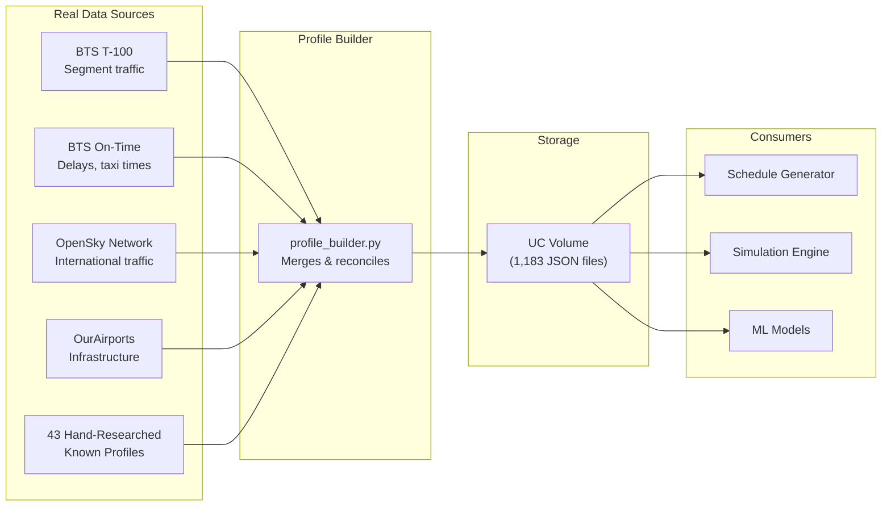

Each of the **1,183 airport profiles** contains:

| Field | Example (SFO) | What It Drives |
|---|---|---|
| `airline_shares` | `{"UAL": 0.46, "SWA": 0.12, ...}` | Which airlines appear in simulation |
| `domestic_route_shares` | `{"LAX": 0.12, "ORD": 0.08, ...}` | Where flights come from / go to |
| `fleet_mix` | `{"UAL": {"B738": 0.35, "A320": 0.25}}` | Aircraft type per airline |
| `hourly_profile` | 24-element array of weights | Traffic peaks (6am rush, evening surge) |
| `taxi_out_mean_min` | `16.2` | Realistic taxi durations |
| `turnaround_median_min` | `52.0` | Gate occupancy time |
| `delay_rate` | `0.21` | Fraction of flights delayed |
| `mean_delay_minutes` | `18.5` | Severity of delays |

### Experiment Tracking

Models are tracked in MLflow. Training runs log feature importance, train/validation metrics, prediction interval calibration (CQR), and model artifacts.

---

## Development

> For design principles, see [Development Philosophy](docs/DEVELOPMENT_PHILOSOPHY.md).

### Architecture

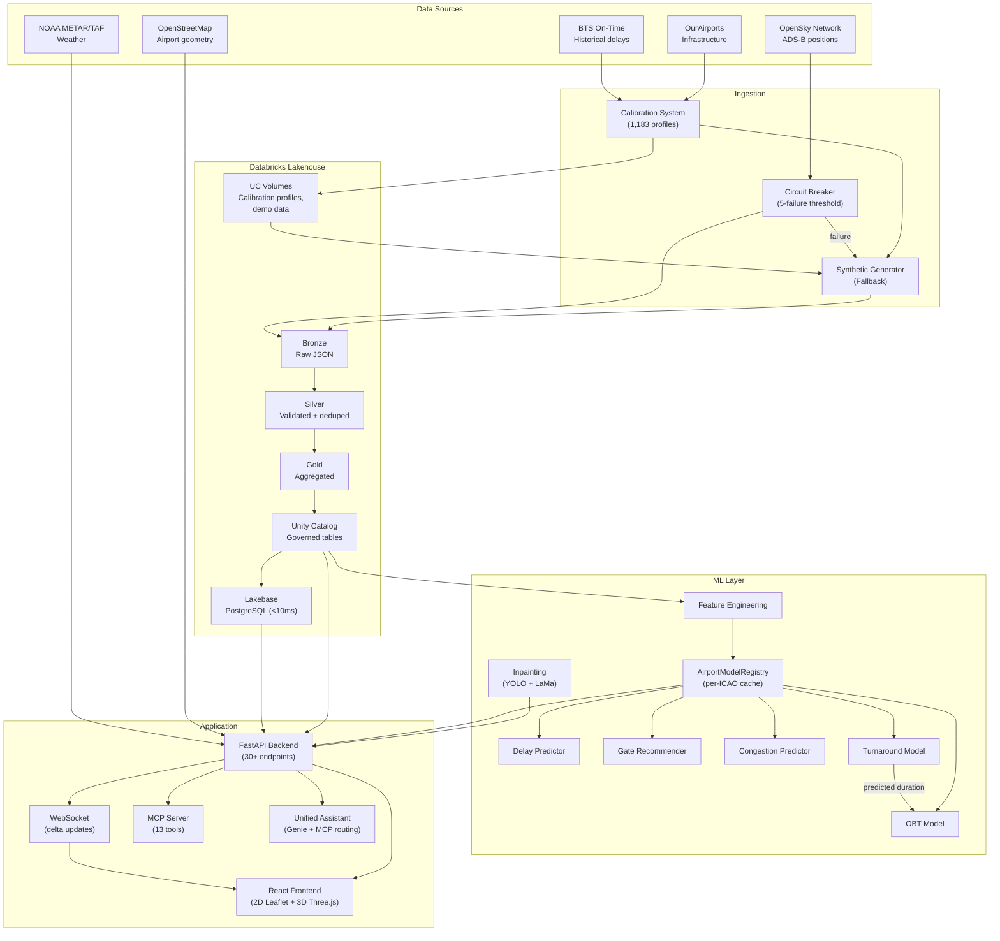

### Data Architecture: Lakehouse + Lakebase

Two-tier serving: Lakehouse for governance and analytics, Lakebase for sub-10ms latency.

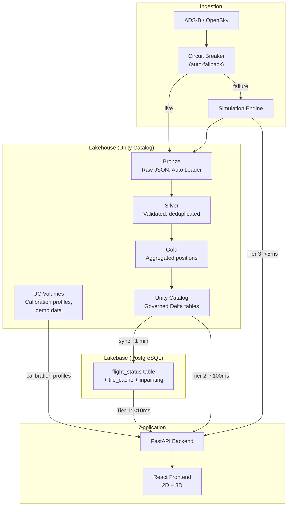

**Automatic fallback chain** — the backend cascades through data sources transparently:

```
1. Lakebase (PostgreSQL)    -> <10ms   -> data_source="live"
2. Unity Catalog (Delta)    -> ~100ms  -> data_source="live"
3. Synthetic Generator      -> <5ms    -> data_source="synthetic"
```

### Project Modules

#### Core Logic (`src/`)

| Module | Path | Purpose |
|---|---|---|
| **Simulation** | `src/simulation/` | Physics-based flight state machine, capacity management, scenario engine, video renderer, LLM report generator |
| **ML** | `src/ml/` | 7 ML models (delay, gate, congestion, turnaround, OBT, GSE, inpainting) + registry + feature engineering |
| **Calibration** | `src/calibration/` | Profile builder, multi-source ingestion (BTS, OpenSky, OurAirports), 1,183 airport profiles |
| **Ingestion** | `src/ingestion/` | Flight generation, approach/departure trajectories, taxi routing, schedule/weather/baggage generators |
| **Formats** | `src/formats/` | Data format importers: AIXM, OSM, IFC, AIDM, FAA NASR, MSFS BGL |
| **Pipelines** | `src/pipelines/` | DLT Bronze/Silver/Gold definitions for flights and baggage |
| **Persistence** | `src/persistence/` | Airport repository, Unity Catalog table management |
| **Routing** | `src/routing/` | Taxiway graph construction and pathfinding |

#### Backend (`app/backend/`)

| Module | Path | Purpose |
|---|---|---|
| **API Routes** | `app/backend/api/` | 18 FastAPI route modules — flights, schedule, weather, predictions, airport, baggage, GSE, simulation, OpenSky, data ops, inpainting, assistant, MCP, Genie, debug |
| **Services** | `app/backend/services/` | Business logic singletons — flight data, predictions, weather, airport config, Lakebase, Delta, OpenSky, baggage, GSE, data ops, demo simulation |
| **Models** | `app/backend/models/` | Request/response Pydantic models |

#### Frontend (`app/frontend/`)

| Module | Path | Purpose |
|---|---|---|
| **Map (2D)** | `components/Map/` | Leaflet map — airport overlay, flight markers, trajectory lines, satellite inpainting |
| **Map3D** | `components/Map3D/` | Three.js 3D view — aircraft models, extruded terminals, altitude visualization |
| **SimulationControls** | `components/SimulationControls/` | Play/pause/speed, timeline, live mode, recording controls |
| **FlightList** | `components/FlightList/` | Searchable flight list with phase filtering |
| **FlightDetail** | `components/FlightDetail/` | Selected flight info, ML predictions, trajectory toggle |
| **FIDS** | `components/FIDS/` | Arrivals/departures display board |
| **GateStatus** | `components/GateStatus/` | Terminal gate occupancy and congestion levels |
| **Weather** | `components/Weather/` | METAR/TAF widget |
| **AirportSelector** | `components/AirportSelector/` | Airport picker — 29 presets + any ICAO code |
| **DataOps** | `components/DataOps/` | Pipeline health dashboard |
| **GenieChat** | `components/GenieChat/` | Natural language query interface |

### WebSocket Protocol

The WebSocket at `/ws` pushes delta-compressed flight updates:

```json
{
  "type": "update",
  "flights": [
    {"icao24": "a00001", "latitude": 37.621, "longitude": -122.379, "altitude": 150},
    {"icao24": "a00002", "heading": 285}
  ],
  "removed": ["a00045"]
}
```

Only changed fields are sent per flight. Bandwidth stays under 2 KB/s for 100+ flights.

### Data Format Importers

| Format | Parser | Standard | Use Case |
|---|---|---|---|
| **AIXM** | `src/formats/aixm/` | ICAO/Eurocontrol | Aeronautical data exchange |
| **OSM** | `src/formats/osm/` | OpenStreetMap | Primary source — runways, gates, taxiways, terminals |
| **IFC** | `src/formats/ifc/` | BIM/IFC | 3D terminal building models |
| **AIDM** | `src/formats/aidm/` | Eurocontrol | Airport operational data (A-CDM) |
| **FAA NASR** | `src/formats/faa/` | US FAA | Runway and facility database |
| **MSFS BGL** | `src/formats/msfs/` | Microsoft | Flight Simulator scenery data |

> For MSFS scenery import details, see [MSFS BGL Import](docs/MSFS_BGL_IMPORT.md).

### Simulation Engine

Run deterministic, accelerated simulations:

```bash
# Quick debug run (4h, 20 flights)
python -m src.simulation.cli --config configs/simulation_sfo_50_debug.yaml

# Full day simulation
python -m src.simulation.cli --airport SFO --arrivals 50 --departures 50 --seed 42

# Full day with weather scenario + auto-generate narrative report
python -m src.simulation.cli --airport SFO --arrivals 250 --departures 250 \
  --scenario scenarios/sfo_summer_thunderstorm.yaml --report
```

After a simulation completes, an LLM-powered report generator can produce a narrative markdown analysis covering KPIs, weather evolution, key events, and performance assessment.

> For full CLI reference and scenario configuration, see [Simulation Guide](docs/SIMULATION_GUIDE.md).

### Test Suite

| Layer | Framework | Command |
|---|---|---|
| Backend (Python) | pytest | `uv run pytest tests/ -v` |
| Frontend (TypeScript) | Vitest | `cd app/frontend && npm test -- --run` |
| E2E Smoke (Databricks) | DABs job | `databricks bundle run e2e_smoke_test --target dev` |
| ML Endpoints (Databricks) | DABs job | `databricks bundle run ml_endpoint_test --target dev` |
| Baggage Integration | DABs job | `databricks bundle run baggage_pipeline_integration_test --target dev` |
| Unit on Databricks | DABs job | `databricks bundle run unit_test --target dev` |

### Local Development

```bash
./dev.sh  # Starts FastAPI backend + React dev server, opens http://localhost:3000
```

### Directory Structure

```
app/
  backend/
    api/               # 18 FastAPI route modules
    services/          # 18 business logic singletons
    models/            # Pydantic request/response models
    main.py            # Uvicorn entry point
  frontend/
    src/
      components/      # 17 UI component modules
      context/         # 4 React contexts (Flight, AirportConfig, Congestion, Theme)
      hooks/           # 11 custom hooks (WebSocket, simulation replay, predictions)
      types/           # TypeScript type definitions
    dist/              # Production build output

src/
  simulation/          # Flight state machine, capacity, scenarios, video, reports
  ml/                  # 7 ML models + registry + features + inpainting
  calibration/         # Profile builder, multi-source ingestion
  ingestion/           # Flight generation, trajectories, schedules, weather, baggage
  formats/             # 6 data format importers (AIXM, OSM, IFC, AIDM, FAA, MSFS)
  pipelines/           # DLT Bronze/Silver/Gold
  persistence/         # Airport repository, UC table management
  routing/             # Taxiway graph pathfinding

tests/                 # Python tests
databricks/            # Notebooks (DLT pipeline, test runners)
resources/             # DABs YAML configs (app, jobs, pipelines, volumes)
data/                  # Local calibration profiles (dev fallback)
configs/               # Simulation run configurations
scenarios/             # 38 weather disruption scenario YAMLs
prompts/               # LLM prompt templates
scripts/               # CLI tools (profile building, batch sims, deployment)
docs/                  # Technical documentation + screenshots
```

---

## Tech Stack

**Frontend**: React 18, TypeScript, Three.js, React Three Fiber, Leaflet, Tailwind CSS, Vite

**Backend**: Python 3.13, FastAPI, UV (package manager)

**Data Platform**: Databricks — Unity Catalog, Lakebase (PostgreSQL), DLT, MLflow, Lakeview, Genie, Model Serving

**ML**: CatBoost, scikit-learn (HistGradientBoosting), YOLOv8s-OBB, LaMa, Conformalized Quantile Regression

**Data Formats**: AIXM, OpenStreetMap (Overpass API), IFC (IfcOpenShell), AIDM, FAA NASR, MSFS BGL

---

## Documentation

| Document | Audience | Description |
|---|---|---|
| [User Guide](docs/USER_GUIDE.md) | Operators | Complete walkthrough with screenshots for all personas |
| [Data Sources & KPIs](docs/AIRPORT_DATA_SOURCES_AND_KPIS.md) | Operators | Open aviation data catalog + KPI reference |
| [Production Deployment](docs/PRODUCTION_DEPLOYMENT.md) | Admins | First-time workspace setup, secrets, network access |
| [Backup & Restore](docs/BACKUP_AND_RESTORE.md) | Admins | Portable backup and cross-workspace migration |
| [UC Volumes](docs/UC_VOLUMES.md) | Admins | Volume inventory, population, and access patterns |
| [External API Calls](docs/external_api_calls.md) | Admins | Full inventory of outbound service dependencies |
| [Security Audit](docs/SECURITY_AUDIT.md) | Admins | Security review findings |
| [Data Pipeline](docs/PIPELINE.md) | Developers | DLT Bronze/Silver/Gold architecture |
| [Data Dictionary](docs/DATA_DICTIONARY.md) | Developers | Schema definitions for all tables |
| [MSFS BGL Import](docs/MSFS_BGL_IMPORT.md) | Developers | Microsoft Flight Simulator scenery data import |
| [Development Philosophy](docs/DEVELOPMENT_PHILOSOPHY.md) | Developers | Design principles |
| [ML Models](docs/ML_MODELS.md) | Data Scientists | Delay, gate, congestion, turnaround, OBT model internals |
| [OBT Pipeline](docs/OBT_PIPELINE.md) | Data Scientists | Off-Block Time model training pipeline |
| [Aircraft Inpainting](docs/AIRCRAFT_INPAINTING.md) | Data Scientists | YOLO + LaMa satellite cleanup pipeline |
| [Synthetic Data](docs/SYNTHETIC_DATA_GENERATION.md) | Data Scientists | Synthetic data generation constraints |
| [Aircraft Separation](docs/AIRCRAFT_SEPARATION.md) | Data Scientists | FAA/ICAO separation standards |
| [Simulation Guide](docs/SIMULATION_GUIDE.md) | All | Run deterministic airport simulations |
| [Delta Sharing](docs/DELTA_SHARING.md) | All | Cross-organization data sharing |
| [V2 Roadmap](docs/ROADMAP_V2.md) | All | Feature roadmap |

---

## License

Internal Databricks Field Engineering demo.
