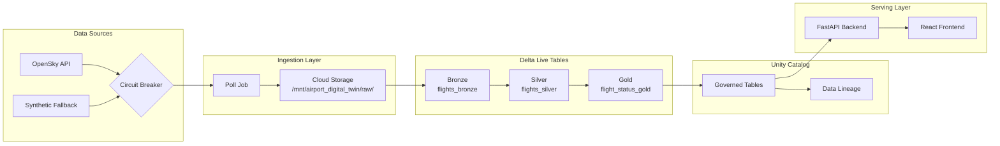

# Airport Digital Twin

A comprehensive airport digital twin demo application showcasing the full Databricks platform stack. Built as a **Databricks App** using the APX framework (FastAPI + React + Three.js), it visualizes real-time airport operations through 2D maps, 3D visualizations, and AI/BI dashboards — all powered by live flight data.


## Table of Contents

- [Business Purpose](#business-purpose)
- [Architecture Overview](#architecture-overview)
- [Data Architecture](#data-architecture)
- [Frontend Serving Layer](#frontend-serving-layer)
- [Backend Analytics Layer](#backend-analytics-layer)
- [Synchronization Between Layers](#synchronization-between-layers)
- [Project Structure](#project-structure)
- [Prerequisites](#prerequisites)
- [Installation](#installation)
- [Local Development](#local-development)
- [Deployment](#deployment)
- [Platform Features](#platform-features)
- [Scripts & Tools](#scripts--tools)
- [API Reference](#api-reference)
- [Contributing](#contributing)

---

## Business Purpose

This is a **customer demonstration tool** for Databricks Field Engineering. The goal is to show prospects and customers what's possible with the Databricks platform through an engaging, visually impressive domain (airports).

### Demo Highlights

| Capability | Feature | Where to See It |
|------------|---------|-----------------|
| **Streaming** | Real-time data from OpenSky API → Structured Streaming | DLT Pipeline |
| **ML/AI** | Delay, Gate, Congestion predictions | Prediction panels in UI |
| **Unity Catalog** | Governance, lineage tracking | Platform Links → Data Lineage |
| **AI/BI** | Lakeview dashboards, Genie NL queries | Platform Links dropdown |
| **Apps** | Full-stack deployment | The application itself |

---

## Architecture Overview

The Airport Digital Twin consists of **three primary layers** that work together to provide a seamless real-time experience:

```
┌─────────────────────────────────────────────────────────────────────────────┐
│                         DATABRICKS PLATFORM                                  │
├─────────────────────────────────────────────────────────────────────────────┤
│                                                                              │
│  ┌──────────────────┐    ┌──────────────────┐    ┌───────────────────────┐  │
│  │   DATA SOURCES   │    │   DELTA LIVE     │    │    UNITY CATALOG      │  │
│  │                  │    │   TABLES (DLT)   │    │                       │  │
│  │  ┌────────────┐  │    │                  │    │  ┌─────────────────┐  │  │
│  │  │  OpenSky   │  │───▶│  Bronze ──────┐  │───▶│  │ Governed Tables │  │  │
│  │  │    API     │  │    │               │  │    │  └─────────────────┘  │  │
│  │  └────────────┘  │    │  Silver ◄─────┘  │    │          │            │  │
│  │        │         │    │     │            │    │          ▼            │  │
│  │        ▼         │    │     ▼            │    │  ┌─────────────────┐  │  │
│  │  ┌────────────┐  │    │  Gold ◄──────────│    │  │  Data Lineage   │  │  │
│  │  │  Fallback  │  │    │                  │    │  └─────────────────┘  │  │
│  │  │ (Synthetic)│  │    └──────────────────┘    └───────────────────────┘  │
│  │  └────────────┘  │              │                                        │
│  └──────────────────┘              │                                        │
│                                    ▼                                        │
│  ┌──────────────────────────────────────────────────────────────────────┐  │
│  │                      DATABRICKS APP (APX)                             │  │
│  │  ┌────────────────────────────┐  ┌────────────────────────────────┐  │  │
│  │  │     FASTAPI BACKEND        │  │       REACT FRONTEND           │  │  │
│  │  │                            │  │                                │  │  │
│  │  │  ┌──────────────────────┐  │  │  ┌────────────────────────┐   │  │  │
│  │  │  │   Flight Service     │◄─┼──┼──│   2D Map (Leaflet)     │   │  │  │
│  │  │  │   (REST + WebSocket) │  │  │  └────────────────────────┘   │  │  │
│  │  │  └──────────────────────┘  │  │                                │  │  │
│  │  │  ┌──────────────────────┐  │  │  ┌────────────────────────┐   │  │  │
│  │  │  │  Prediction Service  │◄─┼──┼──│   3D View (Three.js)   │   │  │  │
│  │  │  │  (Delay/Gate/Cong.)  │  │  │  └────────────────────────┘   │  │  │
│  │  │  └──────────────────────┘  │  │                                │  │  │
│  │  │  ┌──────────────────────┐  │  │  ┌────────────────────────┐   │  │  │
│  │  │  │    ML Models         │  │  │  │   Flight List + Detail │   │  │  │
│  │  │  │ (Rule-based/MLflow)  │  │  │  └────────────────────────┘   │  │  │
│  │  │  └──────────────────────┘  │  │                                │  │  │
│  │  └────────────────────────────┘  └────────────────────────────────┘  │  │
│  └──────────────────────────────────────────────────────────────────────┘  │
│                                                                              │
│  ┌──────────────────────────────────────────────────────────────────────┐  │
│  │                      PLATFORM INTEGRATIONS                            │  │
│  │  ┌────────────┐  ┌────────────┐  ┌────────────┐  ┌────────────────┐  │  │
│  │  │  Lakeview  │  │   Genie    │  │   MLflow   │  │ Model Serving  │  │  │
│  │  │ Dashboards │  │  (NL SQL)  │  │  Tracking  │  │   Endpoints    │  │  │
│  │  └────────────┘  └────────────┘  └────────────┘  └────────────────┘  │  │
│  └──────────────────────────────────────────────────────────────────────┘  │
└─────────────────────────────────────────────────────────────────────────────┘
```

---

## Data Architecture

### Data Flow: From Source to Visualization



### Medallion Architecture (DLT Pipeline)

| Layer | Table | Purpose | Data Quality |
|-------|-------|---------|--------------|
| **Bronze** | `flights_bronze` | Raw JSON from OpenSky API | None (raw data) |
| **Silver** | `flights_silver` | Cleaned, validated, deduplicated | `valid_position`, `valid_icao24`, `valid_altitude` |
| **Gold** | `flight_status_gold` | Aggregated with computed metrics | Business-ready |

### Bronze Layer (`src/pipelines/bronze.py`)

```python
# Raw data ingestion using Auto Loader
spark.readStream.format("cloudFiles")
    .option("cloudFiles.format", "json")
    .load("/mnt/airport_digital_twin/raw/opensky/")
    .withColumn("_ingested_at", F.current_timestamp())
    .withColumn("_source_file", F.input_file_name())
```

**Schema:**
- `time`: API response timestamp
- `states`: Array of flight state vectors (17 fields each)
- `_ingested_at`: Ingestion timestamp
- `_source_file`: Source file path

### Silver Layer (`src/pipelines/silver.py`)

Transforms raw state vectors into structured records with data quality expectations:

```python
@dlt.expect_or_drop("valid_position", "latitude IS NOT NULL AND longitude IS NOT NULL")
@dlt.expect_or_drop("valid_icao24", "icao24 IS NOT NULL AND LENGTH(icao24) = 6")
@dlt.expect("valid_altitude", "baro_altitude >= 0 OR baro_altitude IS NULL")
```

**Schema (17 fields):**
| Column | Type | Description |
|--------|------|-------------|
| `icao24` | STRING | Unique aircraft identifier (6-char hex) |
| `callsign` | STRING | Flight callsign (e.g., "UAL123") |
| `origin_country` | STRING | Country of aircraft registration |
| `position_time` | TIMESTAMP | Time of position report |
| `longitude` | DOUBLE | Longitude in degrees |
| `latitude` | DOUBLE | Latitude in degrees |
| `baro_altitude` | DOUBLE | Barometric altitude in meters |
| `on_ground` | BOOLEAN | Whether aircraft is on ground |
| `velocity` | DOUBLE | Ground speed in m/s |
| `true_track` | DOUBLE | True heading in degrees |
| `vertical_rate` | DOUBLE | Vertical rate in m/s |

### Gold Layer (`src/pipelines/gold.py`)

Aggregates to latest state per aircraft with computed `flight_phase`:

```python
flight_phase = CASE
    WHEN on_ground = TRUE THEN 'ground'
    WHEN vertical_rate > 1.0 THEN 'climbing'
    WHEN vertical_rate < -1.0 THEN 'descending'
    WHEN ABS(vertical_rate) <= 1.0 THEN 'cruising'
    ELSE 'unknown'
END
```

---

## Frontend Serving Layer

The frontend is a **React 18 + TypeScript** application providing real-time visualization:

### Components

```
app/frontend/src/
├── App.tsx                      # Main app with 2D/3D toggle
├── main.tsx                     # React entry point
├── context/
│   └── FlightContext.tsx        # Global flight state management
├── hooks/
│   └── useFlights.ts            # Data fetching with TanStack Query
├── components/
│   ├── Header/                  # App header with status indicators
│   ├── Map/                     # 2D Leaflet map
│   │   ├── AirportMap.tsx       # Main map container
│   │   ├── AirportOverlay.tsx   # Runways, terminals, gates
│   │   └── FlightMarker.tsx     # Individual flight markers
│   ├── Map3D/                   # 3D Three.js scene
│   │   ├── Map3D.tsx            # Canvas and controls
│   │   ├── AirportScene.tsx     # 3D airport geometry
│   │   └── Aircraft3D.tsx       # 3D aircraft models
│   ├── FlightList/              # Searchable flight list
│   ├── FlightDetail/            # Selected flight info
│   ├── GateStatus/              # Gate occupancy panel
│   └── PlatformLinks/           # Databricks platform links
└── types/
    └── flight.ts                # TypeScript interfaces
```

### Data Flow in Frontend

```
┌─────────────────────────────────────────────────────────────┐
│                    React Application                         │
├─────────────────────────────────────────────────────────────┤
│                                                              │
│   TanStack Query                                             │
│   ┌─────────────────────────────────────────────────────┐   │
│   │  useFlights() hook                                  │   │
│   │  - Polls /api/flights every 5 seconds              │   │
│   │  - Auto-retry with exponential backoff             │   │
│   │  - Returns: flights[], isLoading, error, dataSource│   │
│   └─────────────────────────────────────────────────────┘   │
│                          │                                   │
│                          ▼                                   │
│   FlightContext (Global State)                               │
│   ┌─────────────────────────────────────────────────────┐   │
│   │  - flights: Flight[]                                │   │
│   │  - selectedFlight: Flight | null                    │   │
│   │  - dataSource: 'live' | 'cached' | 'synthetic'      │   │
│   │  - isLoading, error, lastUpdated                    │   │
│   └─────────────────────────────────────────────────────┘   │
│                          │                                   │
│          ┌───────────────┼───────────────┐                  │
│          ▼               ▼               ▼                  │
│   ┌─────────────┐ ┌─────────────┐ ┌─────────────┐          │
│   │  2D Map     │ │  3D View    │ │ Flight List │          │
│   │  (Leaflet)  │ │  (Three.js) │ │  + Detail   │          │
│   └─────────────┘ └─────────────┘ └─────────────┘          │
└─────────────────────────────────────────────────────────────┘
```

### Key Technologies

| Technology | Purpose | Version |
|------------|---------|---------|
| React | UI framework | 18.x |
| TypeScript | Type safety | 5.x |
| Vite | Build tool | 5.x |
| Leaflet | 2D mapping | 1.9.x |
| Three.js / R3F | 3D rendering | 8.x / 9.x |
| TanStack Query | Data fetching | 5.x |
| Tailwind CSS | Styling | 3.x |

---

## Backend Analytics Layer

The backend is a **FastAPI** application serving flight data and ML predictions:

### API Structure

```
app/backend/
├── main.py                      # FastAPI app entry point
├── api/
│   ├── routes.py                # /api/flights endpoints
│   ├── predictions.py           # /api/predictions/* endpoints
│   └── websocket.py             # WebSocket for real-time updates
├── services/
│   ├── flight_service.py        # Flight data management
│   └── prediction_service.py    # ML prediction orchestration
└── models/
    └── flight.py                # Pydantic models
```

### REST API Endpoints

| Endpoint | Method | Description |
|----------|--------|-------------|
| `/health` | GET | Health check |
| `/api/flights` | GET | List all flights |
| `/api/flights/{icao24}` | GET | Get specific flight |
| `/api/predictions/delays` | GET | Delay predictions for all flights |
| `/api/predictions/gates/{icao24}` | GET | Gate recommendations |
| `/api/predictions/congestion` | GET | Congestion levels |
| `/api/predictions/bottlenecks` | GET | High congestion areas |

### ML Models (`src/ml/`)

| Model | File | Input | Output |
|-------|------|-------|--------|
| **Delay Prediction** | `delay_model.py` | Flight features (14) | delay_minutes, confidence, category |
| **Gate Optimization** | `gate_model.py` | Flight + gate status | gate_id, score, reasons, taxi_time |
| **Congestion Prediction** | `congestion_model.py` | All flights | area_id, level, flight_count, wait_minutes |

### Feature Engineering (`src/ml/features.py`)

Extracts 14 features from flight data:

```python
features = {
    'hour_of_day',        # 0-23
    'is_peak_hour',       # Boolean
    'is_weekend',         # Boolean
    'altitude_category',  # ground/low/medium/high
    'speed_category',     # slow/normal/fast
    'flight_phase',       # ground/climb/cruise/descent
    'vertical_rate_abs',  # Absolute vertical rate
    'heading_quadrant',   # N/E/S/W
    'is_international',   # Based on callsign prefix
    'aircraft_category',  # Based on icao24 prefix
    # ... and more
}
```

---

## Synchronization Between Layers

### Data Freshness Architecture

The application uses a **cascading data source strategy** to optimize for both latency and reliability:

```
┌─────────────────────────────────────────────────────────────────────────────┐
│                     DATA SYNCHRONIZATION FLOW                                │
├─────────────────────────────────────────────────────────────────────────────┤
│                                                                              │
│  ANALYTICS LAYER                    │  SERVING LAYER                         │
│  (Batch + Streaming)                │  (Real-time Application)               │
│                                     │                                        │
│  ┌─────────────────────────────┐   │   ┌─────────────────────────────────┐  │
│  │ OpenSky API                 │   │   │ Frontend (React)                │  │
│  │ Polling: Every 1 minute     │   │   │ Polling: Every 5 seconds        │  │
│  └─────────────┬───────────────┘   │   └─────────────▲───────────────────┘  │
│                │                    │                 │                       │
│                ▼                    │                 │                       │
│  ┌─────────────────────────────┐   │   ┌─────────────┴───────────────────┐  │
│  │ Cloud Storage               │   │   │ FastAPI Backend                 │  │
│  │ /mnt/.../raw/opensky/       │   │   │ GET /api/flights                │  │
│  └─────────────┬───────────────┘   │   └─────────────▲───────────────────┘  │
│                │                    │                 │                       │
│                ▼                    │                 │ Cascading Query       │
│  ┌─────────────────────────────┐   │                 │                       │
│  │ DLT Pipeline (Streaming)    │   │   ┌─────────────┴───────────────────┐  │
│  │ Bronze → Silver → Gold      │   │   │ 1. Lakebase (PostgreSQL)        │  │
│  │ Latency: ~30-60 seconds     │   │   │    Latency: <10ms               │  │
│  └─────────────┬───────────────┘   │   └─────────────┬───────────────────┘  │
│                │                    │                 │ fallback             │
│                ▼                    │   ┌─────────────▼───────────────────┐  │
│  ┌─────────────────────────────┐   │   │ 2. Delta Tables (Databricks SQL)│  │
│  │ Unity Catalog               │   │   │    Latency: ~100ms              │  │
│  │ Delta Tables (Governed)     │◄──┼───│                                 │  │
│  └─────────────┬───────────────┘   │   └─────────────┬───────────────────┘  │
│                │                    │                 │ fallback             │
│                │ Sync Job (1 min)   │   ┌─────────────▼───────────────────┐  │
│                ▼                    │   │ 3. Synthetic (In-memory)        │  │
│  ┌─────────────────────────────┐   │   │    Latency: <5ms                │  │
│  │ Lakebase (PostgreSQL)       │◄──┼───│                                 │  │
│  │ Low-latency serving         │   │   └─────────────────────────────────┘  │
│  └─────────────────────────────┘   │                                        │
│                                     │                                        │
└─────────────────────────────────────┴────────────────────────────────────────┘
```

### Cascading Data Source Strategy

The backend queries data sources in priority order, falling back automatically:

| Priority | Source | Latency | Use Case |
|----------|--------|---------|----------|
| 1 | **Lakebase** (PostgreSQL) | <10ms | Production serving |
| 2 | **Delta Tables** (Databricks SQL) | ~100ms | When Lakebase unavailable |
| 3 | **Synthetic** (In-memory) | <5ms | Demos, development |

```python
# flight_service.py - Cascading logic
async def get_flights(self, count: int = 50):
    # Try Lakebase first (lowest latency)
    if data := self._lakebase.get_flights(limit=count):
        return FlightListResponse(flights=data, data_source="live")

    # Fall back to Delta tables
    if data := self._delta.get_flights(limit=count):
        return FlightListResponse(flights=data, data_source="live")

    # Fall back to synthetic data
    return FlightListResponse(
        flights=self._generate_synthetic_flights(count),
        data_source="synthetic"
    )
```

### Three Operating Modes

#### 1. Production Mode (Lakebase + Delta)

```
OpenSky API ──1min──▶ DLT Pipeline ──▶ Gold Delta Tables
                                              │
                                              │ Sync Job (1 min)
                                              ▼
                                        Lakebase (PostgreSQL)
                                              │
Frontend ──5s poll──▶ Backend ──<10ms──▶ Lakebase
                                              │
                                        data_source="live"
```

- **End-to-end latency**: ~2 minutes (API → visualization)
- **Query latency**: <10ms
- **Use case**: Production demos with real data

#### 2. Delta-Only Mode (No Lakebase)

```
OpenSky API ──1min──▶ DLT Pipeline ──▶ Gold Delta Tables
                                              │
Frontend ──5s poll──▶ Backend ──~100ms──▶ Databricks SQL
                                              │
                                        data_source="live"
```

- **End-to-end latency**: ~1.5 minutes
- **Query latency**: ~100ms
- **Use case**: When Lakebase not provisioned

#### 3. Demo Mode (Synthetic)

```
Frontend ──5s poll──▶ Backend ──▶ generate_synthetic_flights()
                                        │
                                  data_source="synthetic"
```

- **Latency**: <5ms
- **Use case**: Demos without Databricks backend

### Data Source Indicator

The API response includes a `data_source` field that the UI displays:

```json
{
  "flights": [...],
  "count": 50,
  "timestamp": "2026-03-06T10:00:00Z",
  "data_source": "synthetic"  // or "live" or "cached"
}
```

The header shows a **"Demo Mode"** banner when `data_source !== 'live'`.

---

## Project Structure

```
airport_digital_twin/
├── app/                          # Databricks App (APX)
│   ├── backend/                  # FastAPI backend
│   │   ├── api/                  # REST endpoints
│   │   ├── models/               # Pydantic models
│   │   └── services/             # Business logic
│   └── frontend/                 # React frontend
│       ├── src/
│       │   ├── components/       # UI components
│       │   ├── context/          # React context
│       │   └── hooks/            # Custom hooks
│       └── dist/                 # Built assets
│
├── src/                          # Data & ML layer
│   ├── config/                   # Configuration
│   ├── ingestion/                # Data ingestion
│   │   ├── opensky_client.py     # API client
│   │   ├── circuit_breaker.py    # Fault tolerance
│   │   └── fallback.py           # Synthetic data
│   ├── pipelines/                # DLT pipelines
│   │   ├── bronze.py             # Raw ingestion
│   │   ├── silver.py             # Cleaning
│   │   └── gold.py               # Aggregation
│   ├── schemas/                  # Data schemas
│   └── ml/                       # ML models
│       ├── features.py           # Feature engineering
│       ├── delay_model.py        # Delay prediction
│       ├── gate_model.py         # Gate optimization
│       └── congestion_model.py   # Congestion prediction
│
├── scripts/                      # Utility scripts
│   ├── health_check.py           # Pre-demo validation
│   └── warmup.py                 # Service warmup
│
├── dashboards/                   # Lakeview dashboards
│   └── flight_metrics.lvdash.json
│
├── databricks/                   # Databricks configs
│   └── genie_space_config.json   # Genie space setup
│
├── resources/                    # DAB resources
│   ├── app.yml                   # App resource
│   └── pipeline.yml              # DLT pipeline resource
│
├── tests/                        # Test suite
├── databricks.yml                # Databricks Asset Bundle config
├── app.yaml                      # App entry point
├── requirements.txt              # Python dependencies
└── pyproject.toml                # Project configuration
```

---

## Prerequisites

- **Python**: 3.10+
- **Node.js**: 18+
- **Databricks CLI**: 0.200+
- **UV** (recommended): For Python dependency management

---

## Installation

### 1. Clone Repository

```bash
git clone <repository-url>
cd airport_digital_twin
```

### 2. Install Python Dependencies

```bash
# Using uv (recommended)
uv sync

# Or using pip
pip install -r requirements.txt
```

### 3. Install Frontend Dependencies

```bash
cd app/frontend
npm install
```

### 4. Build Frontend

```bash
npm run build
```

---

## Local Development

### Start Both Services

```bash
./dev.sh
```

This starts:
- Backend: http://localhost:8000
- Frontend: http://localhost:3000

### Start Services Separately

```bash
# Backend
uv run uvicorn app.backend.main:app --reload --port 8000

# Frontend (in separate terminal)
cd app/frontend
npm run dev
```

### Run Tests

```bash
uv run pytest tests/ -v
```

---

## Deployment

### Deploy to Databricks

```bash
# Authenticate
databricks auth login <workspace-url> --profile <profile>

# Deploy
databricks bundle deploy --profile <profile>

# Start app
databricks bundle run airport_digital_twin --profile <profile>
```

### Current Deployment

- **Workspace**: https://fevm-serverless-stable-3n0ihb.cloud.databricks.com
- **App URL**: https://airport-digital-twin-dev-7474645572615955.aws.databricksapps.com
- **Profile**: `FEVM_SERVERLESS_STABLE`

---

## Platform Features

Access via the **Platform** dropdown in the header:

| Feature | Description |
|---------|-------------|
| **Flight Dashboard** | Lakeview dashboard with real-time metrics |
| **Ask Genie** | Natural language queries about flights |
| **Data Lineage** | Unity Catalog lineage visualization |
| **ML Experiments** | MLflow experiment tracking |
| **Unity Catalog** | Browse tables and schemas |

---

## Scripts & Tools

### Health Check

Validate all services before a demo:

```bash
python scripts/health_check.py --url <app-url>
python scripts/health_check.py --json  # JSON output
```

### Service Warmup

Pre-warm services to avoid cold-start latency:

```bash
python scripts/warmup.py --url <app-url> --requests 5
```

---

## API Reference

### GET /api/flights

Returns current flight positions.

**Response:**
```json
{
  "flights": [
    {
      "icao24": "a12345",
      "callsign": "UAL123",
      "latitude": 37.6213,
      "longitude": -122.3790,
      "altitude": 5000.0,
      "velocity": 200.0,
      "heading": 270.0,
      "on_ground": false,
      "vertical_rate": 5.0,
      "flight_phase": "climbing",
      "data_source": "synthetic"
    }
  ],
  "count": 50,
  "timestamp": "2026-03-06T10:00:00Z",
  "data_source": "synthetic"
}
```

### GET /api/predictions/delays

Returns delay predictions for all flights.

**Response:**
```json
{
  "delays": [
    {
      "icao24": "a12345",
      "delay_minutes": 15.5,
      "confidence": 0.85,
      "category": "slight"
    }
  ],
  "count": 50
}
```

### GET /api/predictions/congestion

Returns congestion levels for airport areas.

**Response:**
```json
{
  "areas": [
    {
      "area_id": "runway_28L",
      "area_type": "runway",
      "level": "moderate",
      "flight_count": 5,
      "wait_minutes": 8
    }
  ],
  "count": 12
}
```

---

## Contributing

1. Fork the repository
2. Create a feature branch
3. Make changes with tests
4. Submit a pull request

---

## License

Internal Databricks Field Engineering demo. Not for external distribution.

---

*Documentation generated: 2026-03-06*
