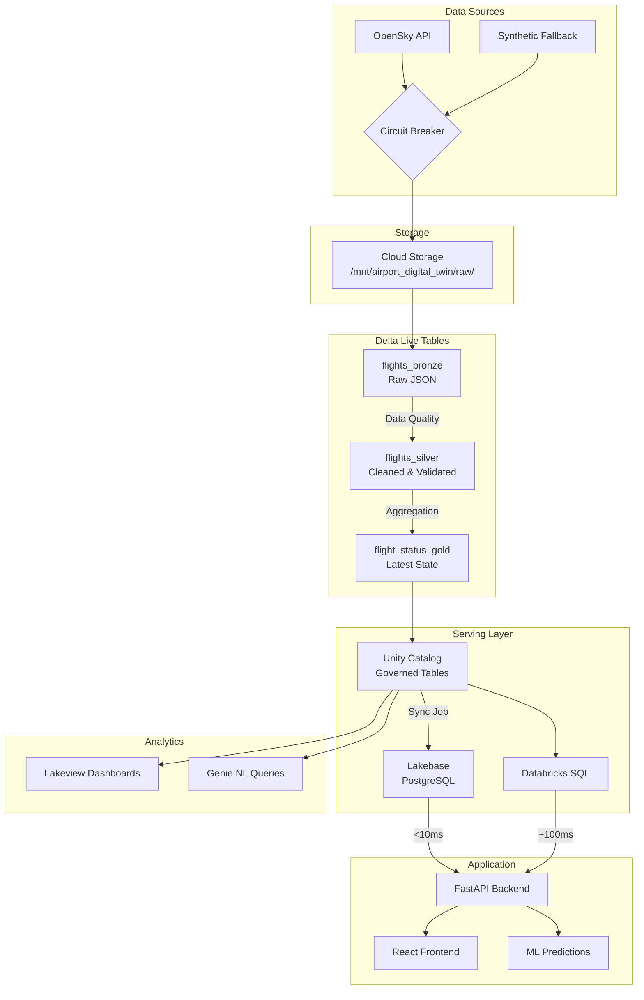

# Data Dictionary

This document describes all data tables, schemas, and fields in the Airport Digital Twin application.

---

## Table of Contents

- [Delta Tables (DLT Pipeline)](#delta-tables-dlt-pipeline)
  - [Bronze Layer](#bronze-layer)
  - [Silver Layer](#silver-layer)
  - [Gold Layer](#gold-layer)
- [Lakebase Tables](#lakebase-tables)
- [API Models](#api-models)
- [ML Model Types](#ml-model-types)
- [Frontend Types](#frontend-types)

---

## Delta Tables (DLT Pipeline)

### Bronze Layer

#### Table: `flights_bronze`

**Description**: Raw flight data ingested from OpenSky Network API via Auto Loader.

**Source**: OpenSky Network REST API (`/states/all`)

**Refresh Frequency**: Every 1 minute (poll job)

**Retention**: 7 days

**Location**: `/mnt/airport_digital_twin/raw/opensky/`

| Column | Data Type | Nullable | Description | Example |
|--------|-----------|----------|-------------|---------|
| `time` | LONG | NO | API response timestamp (Unix epoch) | `1709654400` |
| `states` | ARRAY<ARRAY<ANY>> | YES | Array of flight state vectors | `[[...], [...]]` |
| `_ingested_at` | TIMESTAMP | NO | When record was ingested | `2026-03-06T10:00:00Z` |
| `_source_file` | STRING | NO | Source file path | `dbfs:/mnt/.../file.json` |

**State Vector Format** (17 fields per flight):

| Index | Field | Type | Description |
|-------|-------|------|-------------|
| 0 | icao24 | STRING | Unique ICAO 24-bit address (hex) |
| 1 | callsign | STRING | Aircraft callsign (8 chars, may have trailing spaces) |
| 2 | origin_country | STRING | Country of aircraft registration |
| 3 | time_position | INT | Unix timestamp of last position update |
| 4 | last_contact | INT | Unix timestamp of last message received |
| 5 | longitude | DOUBLE | WGS-84 longitude in degrees |
| 6 | latitude | DOUBLE | WGS-84 latitude in degrees |
| 7 | baro_altitude | DOUBLE | Barometric altitude in meters |
| 8 | on_ground | BOOLEAN | Whether aircraft is on ground |
| 9 | velocity | DOUBLE | Ground speed in m/s |
| 10 | true_track | DOUBLE | Track angle in degrees (clockwise from north) |
| 11 | vertical_rate | DOUBLE | Vertical rate in m/s |
| 12 | sensors | ARRAY<INT> | IDs of receivers that contributed |
| 13 | geo_altitude | DOUBLE | Geometric altitude in meters |
| 14 | squawk | STRING | Transponder code |
| 15 | spi | BOOLEAN | Special purpose indicator |
| 16 | position_source | INT | Source of position (0=ADS-B, 1=ASTERIX, etc.) |

---

### Silver Layer

#### Table: `flights_silver`

**Description**: Cleaned and validated flight position data with quality checks applied.

**Source**: `flights_bronze` (streaming)

**Refresh Frequency**: Continuous streaming

**Retention**: 30 days

**Data Quality Expectations**:
- `valid_position`: latitude and longitude must not be null
- `valid_icao24`: icao24 must be 6 characters
- `valid_altitude`: altitude must be >= 0 or null

| Column | Data Type | Nullable | Description | Example | Business Rules |
|--------|-----------|----------|-------------|---------|----------------|
| `icao24` | STRING | NO | Unique aircraft identifier (6 chars) | `"a12345"` | Primary Key (with position_time) |
| `callsign` | STRING | YES | Flight callsign (trimmed) | `"UAL123"` | May be null for unidentified flights |
| `origin_country` | STRING | YES | Registration country | `"United States"` | |
| `position_time` | TIMESTAMP | NO | Time of position report | `2026-03-06T10:00:00Z` | Used for watermark (2 min) |
| `last_contact` | TIMESTAMP | YES | Last message received | `2026-03-06T10:00:05Z` | |
| `longitude` | DOUBLE | NO | Longitude in degrees | `-122.3790` | Must be between -180 and 180 |
| `latitude` | DOUBLE | NO | Latitude in degrees | `37.6213` | Must be between -90 and 90 |
| `baro_altitude` | DOUBLE | YES | Barometric altitude (meters) | `5000.0` | Must be >= 0 |
| `on_ground` | BOOLEAN | YES | Aircraft on ground | `false` | |
| `velocity` | DOUBLE | YES | Ground speed (m/s) | `200.0` | |
| `true_track` | DOUBLE | YES | Heading in degrees | `270.0` | 0-360 |
| `vertical_rate` | DOUBLE | YES | Vertical rate (m/s) | `5.0` | Positive=climbing |
| `geo_altitude` | DOUBLE | YES | Geometric altitude (meters) | `5100.0` | |
| `squawk` | STRING | YES | Transponder code | `"1200"` | |
| `position_source` | INT | YES | Position source | `0` | 0=ADS-B |
| `category` | INT | YES | Aircraft category | `0` | |
| `_ingested_at` | TIMESTAMP | NO | Ingestion timestamp | `2026-03-06T10:00:00Z` | From Bronze |
| `_source_file` | STRING | NO | Source file path | `dbfs:/mnt/.../file.json` | From Bronze |

**Deduplication**: By `icao24` + `position_time`

**Watermark**: 2 minutes (for late data handling)

---

### Gold Layer

#### Table: `flight_status_gold`

**Description**: Business-ready aggregated flight status with computed metrics. One row per aircraft showing latest state.

**Source**: `flights_silver` (streaming aggregation)

**Refresh Frequency**: Continuous streaming

**Retention**: 90 days

| Column | Data Type | Nullable | Description | Example | Business Rules |
|--------|-----------|----------|-------------|---------|----------------|
| `icao24` | STRING | NO | Unique aircraft identifier | `"a12345"` | Primary Key |
| `callsign` | STRING | YES | Latest callsign | `"UAL123"` | |
| `origin_country` | STRING | YES | Registration country | `"United States"` | |
| `last_seen` | TIMESTAMP | NO | Most recent position time | `2026-03-06T10:00:00Z` | MAX(position_time) |
| `longitude` | DOUBLE | NO | Latest longitude | `-122.3790` | |
| `latitude` | DOUBLE | NO | Latest latitude | `37.6213` | |
| `altitude` | DOUBLE | YES | Latest altitude (meters) | `5000.0` | |
| `velocity` | DOUBLE | YES | Latest ground speed (m/s) | `200.0` | |
| `heading` | DOUBLE | YES | Latest heading (degrees) | `270.0` | |
| `on_ground` | BOOLEAN | YES | Latest on_ground status | `false` | |
| `vertical_rate` | DOUBLE | YES | Latest vertical rate | `5.0` | |
| `flight_phase` | STRING | NO | Computed flight phase | `"climbing"` | See logic below |
| `data_source` | STRING | NO | Data source identifier | `"opensky"` | Always "opensky" |

**Flight Phase Logic**:
```sql
CASE
    WHEN on_ground = TRUE THEN 'ground'
    WHEN vertical_rate > 1.0 THEN 'climbing'
    WHEN vertical_rate < -1.0 THEN 'descending'
    WHEN ABS(vertical_rate) <= 1.0 THEN 'cruising'
    ELSE 'unknown'
END
```

---

## Lakebase Tables

### Table: `flight_status`

**Description**: Low-latency serving table for real-time frontend queries. Synchronized from Unity Catalog Gold table.

**Database**: `airport_digital_twin`

**Host**: `ep-summer-scene-d2ew95fl.database.us-east-1.cloud.databricks.com`

**Sync Frequency**: Every 1 minute (from Delta Gold table)

**Query Latency**: <10ms P99

| Column | Data Type | Nullable | Description | Example | Constraints |
|--------|-----------|----------|-------------|---------|-------------|
| `icao24` | VARCHAR(6) | NO | Unique aircraft identifier | `"a12345"` | PRIMARY KEY |
| `callsign` | VARCHAR(8) | YES | Flight callsign | `"UAL123"` | |
| `latitude` | DOUBLE PRECISION | YES | Latitude in degrees | `37.6213` | -90 to 90 |
| `longitude` | DOUBLE PRECISION | YES | Longitude in degrees | `-122.3790` | -180 to 180 |
| `altitude` | DOUBLE PRECISION | YES | Altitude in meters | `5000.0` | >= 0 |
| `velocity` | DOUBLE PRECISION | YES | Ground speed in m/s | `200.0` | >= 0 |
| `heading` | DOUBLE PRECISION | YES | Heading in degrees | `270.0` | 0 to 360 |
| `on_ground` | BOOLEAN | YES | Aircraft on ground | `false` | |
| `vertical_rate` | DOUBLE PRECISION | YES | Vertical rate in m/s | `5.0` | |
| `flight_phase` | VARCHAR(20) | YES | Computed flight phase | `"climbing"` | |
| `last_seen` | TIMESTAMPTZ | YES | Last position update | `2026-03-06T10:00:00Z` | |
| `updated_at` | TIMESTAMPTZ | NO | Row update time | `2026-03-06T10:00:30Z` | DEFAULT NOW() |

**Indexes**:
- Primary Key: `icao24`
- `idx_flight_status_last_seen` on `last_seen DESC` (for recent flights query)
- `idx_flight_status_on_ground` on `on_ground` (for ground operations filter)

**DDL**:
```sql
CREATE TABLE flight_status (
    icao24 VARCHAR(6) PRIMARY KEY,
    callsign VARCHAR(8),
    latitude DOUBLE PRECISION,
    longitude DOUBLE PRECISION,
    altitude DOUBLE PRECISION,
    velocity DOUBLE PRECISION,
    heading DOUBLE PRECISION,
    on_ground BOOLEAN,
    vertical_rate DOUBLE PRECISION,
    flight_phase VARCHAR(20),
    last_seen TIMESTAMP WITH TIME ZONE,
    updated_at TIMESTAMP WITH TIME ZONE DEFAULT NOW()
);

CREATE INDEX idx_flight_status_last_seen ON flight_status(last_seen DESC);
CREATE INDEX idx_flight_status_on_ground ON flight_status(on_ground);
```

---

## API Models

### FlightPosition

**Description**: Single flight position as returned by the API.

| Field | Type | Required | Description |
|-------|------|----------|-------------|
| `icao24` | string | Yes | ICAO 24-bit address (hex) |
| `callsign` | string | No | Aircraft callsign |
| `latitude` | number | No | Latitude in degrees |
| `longitude` | number | No | Longitude in degrees |
| `altitude` | number | No | Altitude in meters |
| `velocity` | number | No | Ground speed in m/s |
| `heading` | number | No | True track in degrees |
| `on_ground` | boolean | Yes | Whether aircraft is on ground |
| `vertical_rate` | number | No | Vertical rate in m/s |
| `last_seen` | integer | No | Unix timestamp of last contact |
| `data_source` | string | Yes | Source: "live", "cached", "synthetic" |
| `flight_phase` | string | No | Phase: "ground", "climbing", "cruising", "descending" |

### FlightListResponse

**Description**: Response from `/api/flights` endpoint.

| Field | Type | Required | Description |
|-------|------|----------|-------------|
| `flights` | FlightPosition[] | Yes | Array of flight positions |
| `count` | integer | Yes | Number of flights |
| `timestamp` | string | Yes | Response timestamp (ISO 8601) |
| `data_source` | string | Yes | Overall data source |

### DelayPrediction

**Description**: Delay prediction for a single flight.

| Field | Type | Required | Description |
|-------|------|----------|-------------|
| `icao24` | string | Yes | Flight identifier |
| `delay_minutes` | number | Yes | Predicted delay in minutes |
| `confidence` | number | Yes | Confidence score (0-1) |
| `category` | string | Yes | "on_time", "slight", "moderate", "severe" |

### GateRecommendation

**Description**: Gate assignment recommendation.

| Field | Type | Required | Description |
|-------|------|----------|-------------|
| `gate_id` | string | Yes | Recommended gate (e.g., "A1") |
| `score` | number | Yes | Recommendation score (0-1) |
| `reasons` | string[] | Yes | Reasons for recommendation |
| `taxi_time` | integer | Yes | Estimated taxi time (minutes) |

### CongestionArea

**Description**: Congestion status for an airport area.

| Field | Type | Required | Description |
|-------|------|----------|-------------|
| `area_id` | string | Yes | Area identifier (e.g., "runway_28L") |
| `area_type` | string | Yes | "runway", "taxiway", "apron", "terminal" |
| `level` | string | Yes | "low", "moderate", "high", "critical" |
| `flight_count` | integer | Yes | Number of flights in area |
| `wait_minutes` | integer | Yes | Estimated wait time |

---

## ML Model Types

### FeatureSet

**Description**: Features extracted from flight data for ML model input.

**Module**: `src/ml/features.py`

| Field | Type | Description | Value Range |
|-------|------|-------------|-------------|
| `hour_of_day` | int | Hour of position timestamp | 0-23 |
| `day_of_week` | int | Day of week | 0=Mon, 6=Sun |
| `is_weekend` | bool | Saturday or Sunday | true/false |
| `flight_distance_category` | str | Inferred flight distance | "short", "medium", "long" |
| `altitude_category` | str | Altitude classification | "ground", "low", "cruise" |
| `heading_quadrant` | int | Heading direction | 1=N, 2=E, 3=S, 4=W |
| `velocity_normalized` | float | Normalized ground speed | 0.0-1.0 |

### Gate

**Description**: Airport gate configuration.

**Module**: `src/ml/gate_model.py`

| Field | Type | Description | Example |
|-------|------|-------------|---------|
| `gate_id` | str | Unique gate identifier | "A1", "B3" |
| `terminal` | str | Terminal assignment | "A", "B" |
| `status` | GateStatus | Current availability | AVAILABLE, OCCUPIED |
| `current_flight` | str | ICAO24 of current flight | "a12345" |
| `available_at` | datetime | When gate becomes free | 2026-03-06T10:30:00Z |

### GateStatus (Enum)

| Value | Description |
|-------|-------------|
| `AVAILABLE` | Gate is free for assignment |
| `OCCUPIED` | Gate currently in use |
| `DELAYED` | Gate will be available soon |
| `MAINTENANCE` | Gate under maintenance |

### CongestionLevel (Enum)

| Value | Capacity Ratio | Description |
|-------|---------------|-------------|
| `LOW` | <50% | Normal operations |
| `MODERATE` | 50-75% | Minor delays possible |
| `HIGH` | 75-90% | Significant delays expected |
| `CRITICAL` | >90% | Operations at capacity |

### AirportArea

**Description**: Airport area definition for congestion tracking.

**Module**: `src/ml/congestion_model.py`

| Field | Type | Description | Example |
|-------|------|-------------|---------|
| `area_id` | str | Unique area identifier | "runway_28L" |
| `area_type` | str | Area classification | "runway", "taxiway", "apron" |
| `capacity` | int | Maximum flight capacity | 2 (runway), 5 (taxiway) |
| `lat_range` | tuple | Latitude bounds | (37.497, 37.499) |
| `lon_range` | tuple | Longitude bounds | (-122.015, -121.985) |

---

## Frontend Types

### TypeScript Interfaces

```typescript
// Flight data as received from API
interface Flight {
  icao24: string;
  callsign: string | null;
  latitude: number;
  longitude: number;
  altitude: number | null;
  velocity: number | null;
  heading: number | null;
  on_ground: boolean;
  vertical_rate: number | null;
  last_seen: string;
  data_source: string;
  flight_phase: "ground" | "climbing" | "descending" | "cruising";
}

// API response
interface FlightsResponse {
  flights: Flight[];
  count: number;
  timestamp: string;
  data_source: 'live' | 'cached' | 'synthetic';
}
```

---

## Data Lineage



### Data Flow Summary

| Stage | Source | Destination | Latency | Description |
|-------|--------|-------------|---------|-------------|
| Ingestion | OpenSky API | Cloud Storage | ~1 min | Raw JSON polling |
| Bronze | Cloud Storage | flights_bronze | ~10s | Auto Loader ingestion |
| Silver | flights_bronze | flights_silver | ~20s | Data quality + dedup |
| Gold | flights_silver | flight_status_gold | ~30s | Aggregation to latest |
| Sync | flight_status_gold | Lakebase | ~1 min | PostgreSQL UPSERT |
| Serve | Lakebase | Frontend | <10ms | Real-time queries |

---

*Last updated: 2026-03-08*
