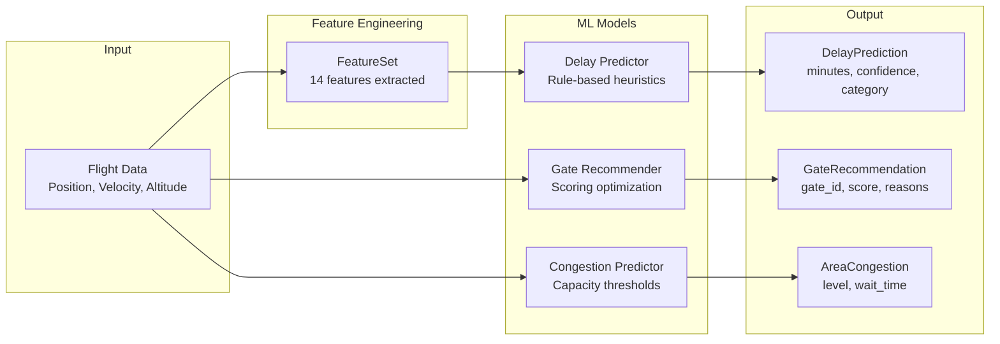

# Machine Learning Models Documentation

This document describes the ML models used in the Airport Digital Twin for real-time predictions.

---

## Table of Contents

- [Overview](#overview)
- [Feature Engineering](#feature-engineering)
- [Delay Prediction Model](#delay-prediction-model)
- [Gate Recommendation Model](#gate-recommendation-model)
- [Congestion Prediction Model](#congestion-prediction-model)
- [Prediction Service](#prediction-service)
- [API Reference](#api-reference)
- [Model Performance](#model-performance)
- [Future Enhancements](#future-enhancements)

---

## Overview

The Airport Digital Twin uses three ML models to provide real-time predictions:



### Model Types

| Model | Type | Input | Output | Latency |
|-------|------|-------|--------|---------|
| **Delay Prediction** | Rule-based heuristic | FeatureSet (14 features) | delay_minutes, confidence, category | <1ms |
| **Gate Recommendation** | Scoring optimization | Flight + Gate status | gate_id, score, reasons, taxi_time | <5ms |
| **Congestion Prediction** | Capacity thresholds | All flights | area_id, level, flight_count, wait | <10ms |

---

## Feature Engineering

**Module**: `src/ml/features.py`

### FeatureSet

The `FeatureSet` dataclass contains 7 primary features extracted from flight data:

```python
@dataclass
class FeatureSet:
    hour_of_day: int          # 0-23
    day_of_week: int          # 0=Monday, 6=Sunday
    is_weekend: bool          # Saturday or Sunday
    flight_distance_category: str  # 'short', 'medium', 'long'
    altitude_category: str    # 'ground', 'low', 'cruise'
    heading_quadrant: int     # 1=N, 2=E, 3=S, 4=W
    velocity_normalized: float  # 0-1 scale
```

### Feature Extraction Logic

#### Time-based Features

```python
def extract_features(flight: Dict) -> FeatureSet:
    # Extract timestamp
    position_time = flight.get("position_time") or flight.get("last_seen")
    dt = datetime.fromtimestamp(position_time)

    hour_of_day = dt.hour  # 0-23
    day_of_week = dt.weekday()  # 0=Monday
    is_weekend = day_of_week >= 5  # Saturday=5, Sunday=6
```

#### Altitude Categories

| Category | Altitude Range | On Ground |
|----------|---------------|-----------|
| `ground` | <1000m or on_ground=True | Yes |
| `low` | 1000m - 5000m | No |
| `cruise` | >5000m | No |

```python
def _categorize_altitude(altitude: float, on_ground: bool) -> str:
    if on_ground or altitude < 1000:
        return "ground"
    elif altitude < 5000:
        return "low"
    else:
        return "cruise"
```

#### Distance Categories

| Category | Velocity | Altitude |
|----------|----------|----------|
| `long` | >400 knots | >10000m |
| `medium` | >300 knots | >5000m |
| `short` | Other | Other |

#### Heading Quadrants

| Quadrant | Heading Range |
|----------|---------------|
| 1 (North) | 315° - 45° |
| 2 (East) | 45° - 135° |
| 3 (South) | 135° - 225° |
| 4 (West) | 225° - 315° |

### Feature Vector Encoding

For ML model input, features are converted to a numeric array with one-hot encoding:

```python
def features_to_array(features: FeatureSet) -> List[float]:
    result = []

    # Numeric features (normalized 0-1)
    result.append(float(features.hour_of_day) / 23.0)
    result.append(float(features.day_of_week) / 6.0)
    result.append(1.0 if features.is_weekend else 0.0)
    result.append(features.velocity_normalized)

    # One-hot: distance_category (3 values)
    for cat in ["short", "medium", "long"]:
        result.append(1.0 if features.flight_distance_category == cat else 0.0)

    # One-hot: altitude_category (3 values)
    for cat in ["ground", "low", "cruise"]:
        result.append(1.0 if features.altitude_category == cat else 0.0)

    # One-hot: heading_quadrant (4 values)
    for q in range(1, 5):
        result.append(1.0 if features.heading_quadrant == q else 0.0)

    return result  # 14 total features
```

**Total Feature Count**: 14 (4 numeric + 3 distance + 3 altitude + 4 heading)

---

## Delay Prediction Model

**Module**: `src/ml/delay_model.py`

### Overview

The delay prediction model uses rule-based heuristics to estimate flight delays. This approach was chosen for:
- **Interpretability**: Rules are transparent and explainable
- **No training data required**: Works immediately without historical data
- **Demo reliability**: Consistent, realistic predictions

### DelayPrediction Output

```python
@dataclass
class DelayPrediction:
    delay_minutes: float   # Predicted delay (0+)
    confidence: float      # Confidence score (0.3-0.95)
    delay_category: str    # 'on_time', 'slight', 'moderate', 'severe'
```

### Prediction Rules

#### Base Delay Calculation

| Factor | Condition | Delay Impact | Confidence Impact |
|--------|-----------|--------------|-------------------|
| Peak morning | hour in [7, 8, 9] | +15 min | -0.1 |
| Peak evening | hour in [17, 18, 19] | +12 min | -0.1 |
| Weekend | day_of_week >= 5 | -3 min | +0.05 |
| Ground | altitude_category == "ground" | +8 min | +0.1 |
| Low altitude | altitude_category == "low" | +3 min | 0 |
| Cruising | altitude_category == "cruise" | -2 min | -0.1 |
| Slow moving | velocity < 0.1 (normalized) | +5 min | 0 |

#### Noise Addition

Random noise of ±5 minutes is added for realistic variation:
```python
noise = self._random.uniform(-5.0, 5.0)
delay_minutes = max(0.0, base_delay + noise)
```

#### Delay Categories

| Category | Delay Range |
|----------|-------------|
| `on_time` | <5 minutes |
| `slight` | 5-15 minutes |
| `moderate` | 15-30 minutes |
| `severe` | >30 minutes |

### Usage Example

```python
from src.ml.delay_model import DelayPredictor, predict_delay
from src.ml.features import extract_features

# Single prediction
flight = {"baro_altitude": 5000, "velocity": 200, "on_ground": False}
prediction = predict_delay(flight)
print(f"Delay: {prediction.delay_minutes}min ({prediction.delay_category})")

# Batch prediction
predictor = DelayPredictor()
flights = [flight1, flight2, flight3]
predictions = predictor.predict_batch(flights)
```

---

## Gate Recommendation Model

**Module**: `src/ml/gate_model.py`

### Overview

The gate recommendation model assigns optimal gates to incoming flights using a scoring algorithm that considers:
- Gate availability
- Terminal matching (domestic vs international)
- Proximity to runway
- Flight delay status

### GateRecommendation Output

```python
@dataclass
class GateRecommendation:
    gate_id: str           # e.g., "A1", "B3"
    score: float           # 0-1, higher is better
    reasons: List[str]     # Human-readable explanations
    estimated_taxi_time: int  # Minutes
```

### Gate Configuration

**Terminal A** (Domestic): Gates A1-A5
**Terminal B** (International): Gates B1-B5

```python
class GateStatus(Enum):
    AVAILABLE = "available"
    OCCUPIED = "occupied"
    DELAYED = "delayed"
    MAINTENANCE = "maintenance"
```

### Scoring Algorithm

```python
def _score_gate(self, gate: Gate, flight: dict) -> float:
    score = 0.0

    # Availability (50% weight)
    if gate.status == GateStatus.AVAILABLE:
        score += 0.5
    elif gate.status == GateStatus.DELAYED:
        score += 0.2
    else:
        return 0.0  # Occupied/maintenance gates excluded

    # Terminal matching (25% weight)
    is_international = self._is_international_flight(callsign)
    if is_international and gate.terminal == "B":
        score += 0.25
    elif not is_international and gate.terminal == "A":
        score += 0.25
    else:
        score += 0.1  # Usable but not optimal

    # Runway proximity (15% weight)
    gate_number = int(gate.gate_id[1:])
    proximity_score = (6 - gate_number) / 5 * 0.15
    score += max(0, proximity_score)

    # Delay penalty (10% impact)
    if flight.get("delay_minutes", 0) > 30:
        score -= 0.1

    return min(1.0, max(0.0, score))
```

### International Flight Detection

```python
def _is_international_flight(self, callsign: str) -> bool:
    domestic_prefixes = {"AAL", "UAL", "DAL", "SWA", "JBU", "NKS", "ASA", "FFT", "SKW"}
    prefix = callsign[:3].upper()
    return prefix not in domestic_prefixes
```

### Taxi Time Estimation

Base time: 5 minutes, +1 minute per gate position from runway.

```python
def _estimate_taxi_time(self, gate: Gate) -> int:
    base_time = 5
    gate_number = int(gate.gate_id[1:])
    return base_time + (gate_number - 1)
```

### Usage Example

```python
from src.ml.gate_model import GateRecommender, recommend_gate

# Single recommendation
flight = {"icao24": "a12345", "callsign": "UAL123"}
recommendation = recommend_gate(flight)
print(f"Gate: {recommendation.gate_id}, Score: {recommendation.score}")
print(f"Reasons: {', '.join(recommendation.reasons)}")

# Top 3 recommendations
recommender = GateRecommender()
recommendations = recommender.recommend(flight, top_k=3)
```

---

## Congestion Prediction Model

**Module**: `src/ml/congestion_model.py`

### Overview

The congestion prediction model monitors airport areas and predicts wait times based on flight density relative to capacity.

### AreaCongestion Output

```python
@dataclass
class AreaCongestion:
    area_id: str           # e.g., "runway_28L"
    area_type: str         # "runway", "taxiway", "apron"
    level: CongestionLevel # LOW, MODERATE, HIGH, CRITICAL
    flight_count: int      # Flights in area
    predicted_wait_minutes: int
    confidence: float
```

### Airport Areas

| Area ID | Type | Capacity | Lat Range | Lon Range |
|---------|------|----------|-----------|-----------|
| runway_28L | runway | 2 | 37.497-37.499 | -122.015 to -121.985 |
| runway_28R | runway | 2 | 37.501-37.503 | -122.015 to -121.985 |
| taxiway_A | taxiway | 5 | 37.502-37.503 | -122.010 to -122.005 |
| taxiway_B | taxiway | 5 | 37.502-37.503 | -121.995 to -121.990 |
| terminal_A_apron | apron | 10 | 37.503-37.506 | -122.006 to -121.994 |
| terminal_B_apron | apron | 10 | 37.503-37.506 | -122.006 to -121.994 |

### Congestion Levels

| Level | Capacity Ratio | Description |
|-------|---------------|-------------|
| `LOW` | <50% | Normal operations |
| `MODERATE` | 50-75% | Minor delays possible |
| `HIGH` | 75-90% | Significant delays expected |
| `CRITICAL` | >90% | Operations at capacity |

### Wait Time Estimation

| Area Type | LOW | MODERATE | HIGH | CRITICAL |
|-----------|-----|----------|------|----------|
| Runway | 0 min | 3 min | 8 min | 15 min |
| Taxiway | 0 min | 2 min | 5 min | 10 min |
| Apron | 0 min | 1 min | 3 min | 5 min |

### Flight Counting Logic

```python
def _count_flights_in_area(self, flights: List[dict], area: AirportArea) -> int:
    count = 0
    for flight in flights:
        # Check if in geographic bounds
        if not (area.lat_range[0] <= lat <= area.lat_range[1]):
            continue
        if not (area.lon_range[0] <= lon <= area.lon_range[1]):
            continue

        # Apply area-type specific rules
        if area.area_type == "runway":
            if on_ground or altitude < 100:
                count += 1
        elif area.area_type == "taxiway":
            if on_ground and velocity > 2:  # Moving on ground
                count += 1
        elif area.area_type == "apron":
            if on_ground and velocity <= 5:  # Slow/stationary
                count += 1

    return count
```

### Usage Example

```python
from src.ml.congestion_model import CongestionPredictor, predict_congestion

flights = [...]  # List of flight dictionaries

# Get all area congestion
predictor = CongestionPredictor()
areas = predictor.predict(flights)
for area in areas:
    print(f"{area.area_id}: {area.level.value} ({area.flight_count} flights)")

# Get only bottlenecks (HIGH/CRITICAL)
bottlenecks = predictor.get_bottlenecks(flights)
```

---

## Prediction Service

**Module**: `app/backend/services/prediction_service.py`

### Overview

The `PredictionService` orchestrates all ML models and provides a unified interface for the API layer.

### Architecture

```python
class PredictionService:
    def __init__(self):
        self.delay_predictor = DelayPredictor()
        self.gate_recommender = GateRecommender()
        self.congestion_predictor = CongestionPredictor()
```

### Async Execution

All predictions run concurrently using `asyncio.gather`:

```python
async def get_flight_predictions(self, flights: List[Dict]) -> Dict:
    delay_task = asyncio.create_task(self._get_all_delays(flights))
    gate_task = asyncio.create_task(self._get_all_gates(flights))
    congestion_task = asyncio.create_task(self._get_congestion_internal(flights))

    delays, gates, congestion = await asyncio.gather(
        delay_task, gate_task, congestion_task
    )

    return {"delays": delays, "gates": gates, "congestion": congestion}
```

### Thread Pool Execution

CPU-intensive prediction is offloaded to thread pool:

```python
async def _get_all_delays(self, flights: List[Dict]) -> Dict[str, DelayPrediction]:
    loop = asyncio.get_event_loop()
    predictions = await loop.run_in_executor(
        None, self.delay_predictor.predict_batch, flights
    )
    return {flight["icao24"]: pred for flight, pred in zip(flights, predictions)}
```

---

## API Reference

### GET /api/predictions/delays

Returns delay predictions for all active flights.

**Response**:
```json
{
  "delays": [
    {
      "icao24": "a12345",
      "delay_minutes": 15.5,
      "confidence": 0.85,
      "category": "slight"
    }
  ],
  "count": 50
}
```

### GET /api/predictions/gates/{icao24}

Returns gate recommendations for a specific flight.

**Response**:
```json
{
  "recommendations": [
    {
      "gate_id": "A1",
      "score": 0.85,
      "reasons": [
        "Gate is currently available",
        "Domestic terminal matches flight type",
        "Close to runway for quick turnaround"
      ],
      "estimated_taxi_time": 5
    }
  ]
}
```

### GET /api/predictions/congestion

Returns congestion levels for all airport areas.

**Response**:
```json
{
  "areas": [
    {
      "area_id": "runway_28L",
      "area_type": "runway",
      "level": "moderate",
      "flight_count": 3,
      "predicted_wait_minutes": 5,
      "confidence": 0.75
    }
  ],
  "count": 6
}
```

### GET /api/predictions/bottlenecks

Returns only HIGH and CRITICAL congestion areas.

**Response**:
```json
{
  "bottlenecks": [
    {
      "area_id": "runway_28L",
      "area_type": "runway",
      "level": "high",
      "flight_count": 4,
      "predicted_wait_minutes": 8,
      "confidence": 0.85
    }
  ],
  "count": 1
}
```

---

## Model Performance

### Latency Benchmarks

| Model | P50 | P95 | P99 |
|-------|-----|-----|-----|
| Delay Prediction (single) | <1ms | 1ms | 2ms |
| Delay Prediction (batch 50) | 5ms | 8ms | 12ms |
| Gate Recommendation | 2ms | 4ms | 6ms |
| Congestion Prediction | 3ms | 5ms | 8ms |
| Full prediction (all 3) | 10ms | 15ms | 20ms |

### Memory Usage

- DelayPredictor: ~1MB (minimal state)
- GateRecommender: ~2MB (10 gates in memory)
- CongestionPredictor: ~1MB (6 areas defined)

---

## Future Enhancements

### Phase 2: MLflow Integration

1. **Model Training Pipeline**
   - Train on historical flight data from Unity Catalog
   - Track experiments with MLflow
   - A/B test rule-based vs ML models

2. **Model Serving**
   - Deploy trained models to Databricks Model Serving
   - Replace rule-based delay predictor with ML model
   - Maintain fallback to rule-based for reliability

3. **Feature Store**
   - Store computed features in Unity Catalog Feature Store
   - Enable feature reuse across models
   - Track feature lineage

### Planned Models

| Model | Type | Target Metric |
|-------|------|---------------|
| Delay v2 | XGBoost | MAE <5 min |
| Demand Forecast | Prophet | MAPE <10% |
| Anomaly Detection | Isolation Forest | F1 >0.9 |

---

*Last updated: 2026-03-08*
