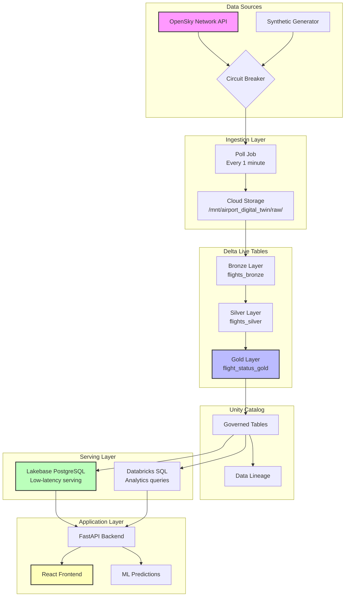

# Data Pipeline Documentation

This document describes the end-to-end data pipeline for the Airport Digital Twin application.

---

## Table of Contents

- [Pipeline Overview](#pipeline-overview)
- [Data Sources](#data-sources)
- [Ingestion Layer](#ingestion-layer)
- [Delta Live Tables Pipeline](#delta-live-tables-pipeline)
- [Serving Layer](#serving-layer)
- [Synchronization](#synchronization)
- [Monitoring](#monitoring)
- [Troubleshooting](#troubleshooting)

---

## Pipeline Overview



---

## Data Sources

### Primary: OpenSky Network API

**Endpoint**: `https://opensky-network.org/api/states/all`

**Parameters**:
- `lamin`: 36.0 (bounding box south)
- `lamax`: 39.0 (bounding box north)
- `lomin`: -124.0 (bounding box west)
- `lomax`: -120.0 (bounding box east)

**Response Format**: JSON with `states` array containing 17 fields per aircraft.

**Rate Limits**:
- Anonymous: 10 requests/minute
- Authenticated: 100 requests/minute

**Client**: `src/ingestion/opensky_client.py`

### Fallback: Synthetic Data Generator

**Module**: `src/ingestion/fallback.py`

**Triggers**:
- Circuit breaker opens after 5 consecutive failures
- OpenSky API returns empty response
- Network timeout (>10 seconds)

**Features**:
- Generates realistic flight positions around SFO area
- Supports configurable flight count
- Includes aircraft in various flight phases (ground, takeoff, cruise, landing)
- Deterministic seeding for reproducible demos

---

## Ingestion Layer

### Poll Job (`src/ingestion/poll_job.py`)

**Schedule**: Every 1 minute (cron: `*/1 * * * *`)

**Workflow**:
1. Attempt OpenSky API call with circuit breaker protection
2. If successful, write raw JSON to cloud storage
3. If failed, check circuit breaker state
4. If circuit open, use synthetic fallback
5. Log metrics (latency, record count, source)

**Output Path**: `/mnt/airport_digital_twin/raw/opensky/{date}/{timestamp}.json`

### Circuit Breaker (`src/ingestion/circuit_breaker.py`)

**Configuration**:
- Failure threshold: 5 consecutive failures
- Recovery timeout: 60 seconds
- Half-open requests: 1

**States**:
- **CLOSED**: Normal operation, all requests pass through
- **OPEN**: All requests bypass external API, use fallback
- **HALF_OPEN**: Single test request to check recovery

---

## Delta Live Tables Pipeline

### Bronze Layer

**Table**: `flights_bronze`

**Module**: `src/pipelines/bronze.py`

**Input**: Raw JSON files from `/mnt/airport_digital_twin/raw/opensky/`

**Transformation**:
```python
spark.readStream.format("cloudFiles")
    .option("cloudFiles.format", "json")
    .option("cloudFiles.schemaLocation", schema_path)
    .load(raw_path)
    .withColumn("_ingested_at", F.current_timestamp())
    .withColumn("_source_file", F.input_file_name())
```

**Output Schema**:
| Column | Type | Description |
|--------|------|-------------|
| time | LONG | API response timestamp |
| states | ARRAY | Raw state vectors |
| _ingested_at | TIMESTAMP | Ingestion time |
| _source_file | STRING | Source file path |

### Silver Layer

**Table**: `flights_silver`

**Module**: `src/pipelines/silver.py`

**Input**: `flights_bronze` (streaming)

**Data Quality Expectations**:
```python
@dlt.expect_or_drop("valid_position", "latitude IS NOT NULL AND longitude IS NOT NULL")
@dlt.expect_or_drop("valid_icao24", "icao24 IS NOT NULL AND LENGTH(icao24) = 6")
@dlt.expect("valid_altitude", "baro_altitude >= 0 OR baro_altitude IS NULL")
```

**Transformations**:
1. Explode `states` array into individual rows
2. Map array indices to named columns
3. Convert Unix timestamps to TIMESTAMP type
4. Trim whitespace from callsigns
5. Deduplicate by `icao24` + `position_time`

**Watermark**: 2 minutes (for late-arriving data)

### Gold Layer

**Table**: `flight_status_gold`

**Module**: `src/pipelines/gold.py`

**Input**: `flights_silver` (streaming)

**Aggregation**:
```python
df.groupBy("icao24").agg(
    F.last("callsign").alias("callsign"),
    F.max("position_time").alias("last_seen"),
    F.last("longitude").alias("longitude"),
    F.last("latitude").alias("latitude"),
    F.last("baro_altitude").alias("altitude"),
    F.last("velocity").alias("velocity"),
    F.last("true_track").alias("heading"),
    F.last("on_ground").alias("on_ground"),
    F.last("vertical_rate").alias("vertical_rate"),
)
```

**Computed Columns**:
```sql
flight_phase = CASE
    WHEN on_ground = TRUE THEN 'ground'
    WHEN vertical_rate > 1.0 THEN 'climbing'
    WHEN vertical_rate < -1.0 THEN 'descending'
    WHEN ABS(vertical_rate) <= 1.0 THEN 'cruising'
    ELSE 'unknown'
END
```

---

## Serving Layer

### Lakebase (PostgreSQL)

**Purpose**: Low-latency serving (<10ms) for real-time frontend queries

**Host**: `ep-summer-scene-d2ew95fl.database.us-east-1.cloud.databricks.com`

**Database**: `airport_digital_twin`

**Schema**:
```sql
CREATE TABLE flight_status (
    icao24 VARCHAR(6) PRIMARY KEY,
    callsign VARCHAR(8),
    latitude DOUBLE PRECISION,
    longitude DOUBLE PRECISION,
    altitude DOUBLE PRECISION,
    velocity DOUBLE PRECISION,
    heading DOUBLE PRECISION,
    on_ground BOOLEAN,
    vertical_rate DOUBLE PRECISION,
    flight_phase VARCHAR(20),
    last_seen TIMESTAMP WITH TIME ZONE,
    updated_at TIMESTAMP WITH TIME ZONE DEFAULT NOW()
);

CREATE INDEX idx_flight_status_last_seen ON flight_status(last_seen DESC);
CREATE INDEX idx_flight_status_on_ground ON flight_status(on_ground);
```

**Service**: `app/backend/services/lakebase_service.py`

### Delta Tables (Databricks SQL)

**Purpose**: Analytics queries and fallback serving (~100ms)

**Catalog**: `serverless_stable_3n0ihb_catalog`

**Schema**: `airport_digital_twin`

**Tables**:
- `flight_status_gold`: Current flight positions
- `flight_positions_history`: Historical trajectory data

**Service**: `app/backend/services/delta_service.py`

---

## Synchronization

### Unity Catalog → Lakebase Sync

**Schedule**: Every 1 minute

**Strategy**: Full table replacement with UPSERT semantics

**SQL**:
```sql
-- Read from Unity Catalog
SELECT icao24, callsign, latitude, longitude, altitude,
       velocity, heading, on_ground, vertical_rate,
       flight_phase, last_seen
FROM serverless_stable_3n0ihb_catalog.airport_digital_twin.flight_status_gold
WHERE last_seen > NOW() - INTERVAL '5 minutes'
```

**Sync Logic** (`app/backend/services/lakebase_service.py`):
```python
def sync_from_delta(self, flights: List[dict]) -> int:
    """Upsert flights to Lakebase from Delta tables."""
    with self._get_connection() as conn:
        with conn.cursor() as cur:
            for flight in flights:
                cur.execute("""
                    INSERT INTO flight_status (icao24, callsign, ...)
                    VALUES (%s, %s, ...)
                    ON CONFLICT (icao24) DO UPDATE SET
                        callsign = EXCLUDED.callsign,
                        latitude = EXCLUDED.latitude,
                        ...
                """, flight_values)
        conn.commit()
```

---

## Monitoring

### Pipeline Metrics

| Metric | Description | Alert Threshold |
|--------|-------------|-----------------|
| Ingestion latency | Time from API call to cloud storage | >30 seconds |
| DLT processing time | Bronze to Gold transformation | >60 seconds |
| Sync latency | Delta to Lakebase | >120 seconds |
| Query latency (Lakebase) | P99 query time | >50ms |
| Circuit breaker state | Current state | OPEN for >5 minutes |

### Health Check Endpoints

**Backend Health**: `GET /health`
```json
{
  "status": "healthy",
  "data_sources": {
    "lakebase": {"available": true, "healthy": true},
    "delta": {"available": true, "healthy": true},
    "synthetic": {"available": true, "healthy": true}
  }
}
```

**Data Sources Status**: `GET /api/data-sources`
```json
{
  "primary": "lakebase",
  "fallback_chain": ["delta", "synthetic"],
  "current_source": "lakebase",
  "mock_mode": false
}
```

---

## Troubleshooting

### Common Issues

#### 1. Empty Flight Data

**Symptoms**: Frontend shows no flights, API returns empty array

**Diagnosis**:
```bash
# Check DLT pipeline status
databricks pipelines get <pipeline-id>

# Check Gold table
databricks sql "SELECT COUNT(*) FROM flight_status_gold WHERE last_seen > NOW() - INTERVAL '5 minutes'"

# Check Lakebase
psql -h <host> -d airport_digital_twin -c "SELECT COUNT(*) FROM flight_status"
```

**Resolution**:
1. Verify DLT pipeline is running
2. Check circuit breaker state
3. Manually trigger sync job

#### 2. High Query Latency

**Symptoms**: Frontend slow to load, >1s response times

**Diagnosis**:
```bash
# Check Lakebase connection pool
curl http://localhost:8000/api/data-sources

# Check Delta tables
databricks sql "DESCRIBE HISTORY flight_status_gold LIMIT 5"
```

**Resolution**:
1. Check if Lakebase is healthy
2. Verify indexes exist
3. Check for query plan regression

#### 3. Circuit Breaker Open

**Symptoms**: Data source shows "synthetic", no live data

**Diagnosis**:
```python
from src.ingestion.circuit_breaker import get_circuit_state
print(get_circuit_state())  # OPEN, CLOSED, or HALF_OPEN
```

**Resolution**:
1. Check OpenSky API status
2. Verify network connectivity
3. Wait for recovery timeout (60s) or manually reset

---

## Pipeline SLAs

| Metric | Target | Current |
|--------|--------|---------|
| End-to-end latency (API → Frontend) | <3 minutes | ~2 minutes |
| Query latency (Lakebase) | <20ms P99 | ~10ms |
| Query latency (Delta) | <200ms P99 | ~100ms |
| Data freshness | <2 minutes | ~1.5 minutes |
| Availability | 99.9% | 99.5% (with fallback) |

---

*Last updated: 2026-03-08*
