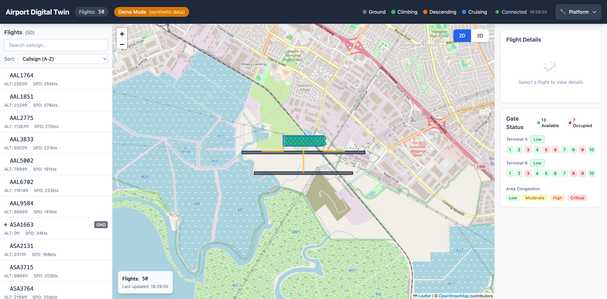
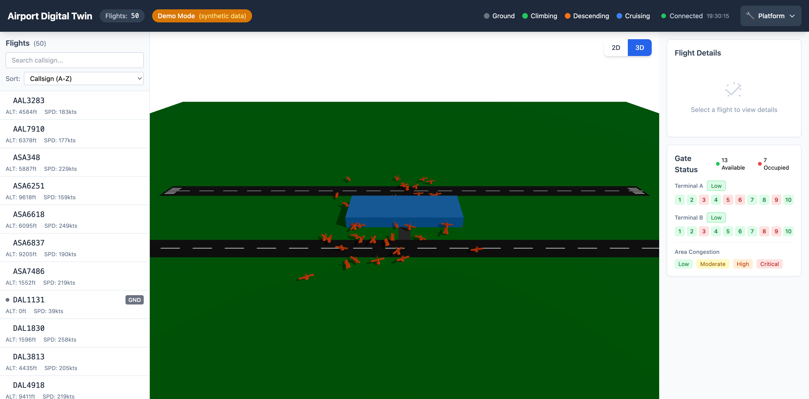
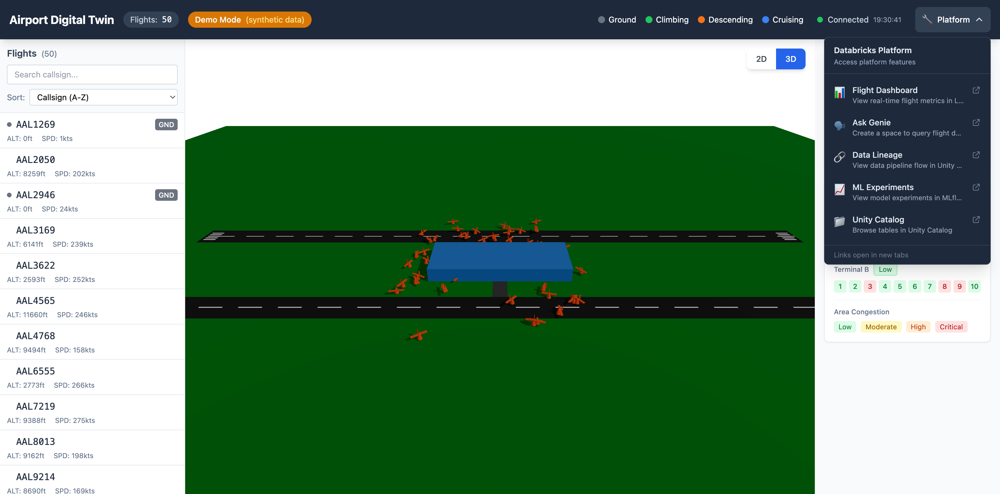

# Airport Digital Twin - User Guide

This guide walks you through using the Airport Digital Twin application.

## Overview

The Airport Digital Twin is a real-time visualization tool showing flight activity around San Francisco International Airport (SFO). It demonstrates Databricks platform capabilities including streaming data, ML predictions, and AI/BI dashboards.

## Getting Started

### Accessing the Application

- **Local Development**: http://localhost:3000
- **Production**: https://airport-digital-twin-dev-7474645572615955.aws.databricksapps.com

### Main Interface

The main interface consists of:

1. **Header** - Shows flight count, data source indicator, and platform links
2. **Flight List** (left panel) - Searchable list of active flights
3. **Map View** (center) - 2D or 3D visualization of flights
4. **Flight Details** (right panel) - Details for selected flight
5. **Gate Status** (right panel) - Terminal gate occupancy

## Features

### 2D Map View

The default view shows flights on a Leaflet map with:
- **Flight markers** colored by phase (ground, climbing, descending, cruising)
- **Airport overlay** showing runways, taxiways, and terminals
- **Zoom controls** for navigation

### 3D View

Click the **3D** button to switch to the Three.js 3D view:
- Aircraft rendered as 3D models
- Interactive camera controls (rotate, pan, zoom)
- Altitude visualization in 3D space

### Flight List

- **Search**: Filter flights by callsign
- **Sort**: Sort by callsign or altitude
- **Click**: Select a flight to view details

### Data Source Indicator

The header shows the current data source:
- **Live** - Real data from OpenSky API via Lakebase
- **Demo Mode (synthetic)** - Generated demo data when backend unavailable

### Platform Links

Click **🔧 Platform** to access Databricks platform features:

| Link | Description |
|------|-------------|
| **Flight Dashboard** | Lakeview dashboard with real-time metrics |
| **Ask Genie** | Natural language queries about flight data |
| **Data Lineage** | Unity Catalog lineage visualization |
| **ML Experiments** | MLflow experiment tracking |
| **Unity Catalog** | Browse tables and schemas |

## Flight Details Panel

When you select a flight, the details panel shows:
- **Callsign** and ICAO24 identifier
- **Position** (latitude, longitude)
- **Altitude** in feet
- **Speed** in knots
- **Heading** in degrees
- **Flight Phase** (ground, climbing, cruising, descending)
- **Vertical Rate** in feet/minute

## Gate Status Panel

Shows terminal gate occupancy:
- **Available** gates (green)
- **Occupied** gates (red)
- **Congestion level** per terminal

## Area Congestion

The bottom of the right panel shows airport area congestion:
- **Low** (green) - Normal operations
- **Moderate** (yellow) - Some delays expected
- **High** (orange) - Significant congestion
- **Critical** (red) - Major delays

## Demo Tips

When presenting to customers:

1. **Start with 2D view** - Show the real-time map with flight movements
2. **Switch to 3D** - Demonstrate the immersive visualization
3. **Click Platform** - Show integration with Databricks services
4. **Open Dashboard** - Show Lakeview analytics
5. **Try Genie** - Demonstrate natural language queries

## Troubleshooting

### "Demo Mode" showing instead of live data

This means the backend cannot connect to Lakebase or Delta tables. Check:
- Lakebase instance is running
- Network connectivity to Databricks workspace
- OAuth credentials are valid

### Flights not updating

- Check the "Connected" status in the header
- Verify the backend is running (`/health` endpoint)
- Check browser console for errors

### 3D view performance issues

- Reduce browser window size
- Close other GPU-intensive applications
- Try Chrome or Firefox for best WebGL performance

## Keyboard Shortcuts

| Key | Action |
|-----|--------|
| `2` | Switch to 2D view |
| `3` | Switch to 3D view |
| `Esc` | Deselect flight |
| `/` | Focus search box |

---

*Last updated: 2026-03-06*
