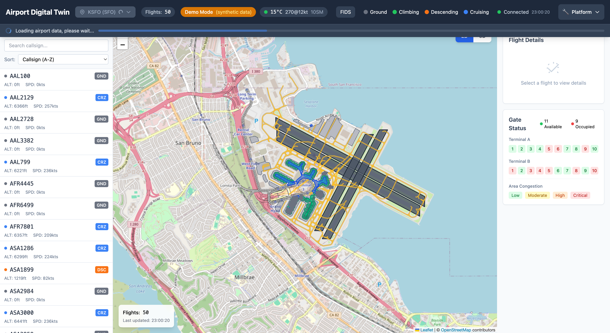
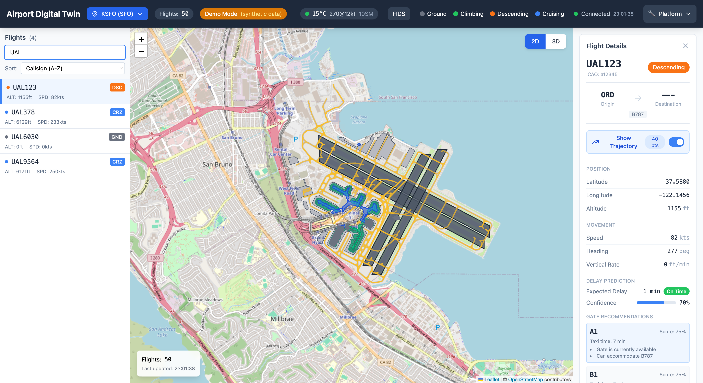
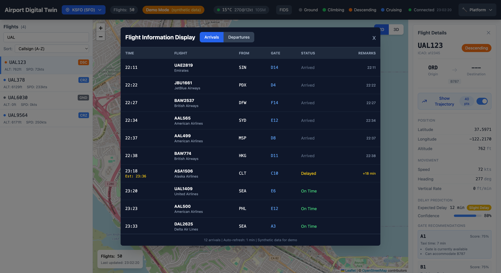
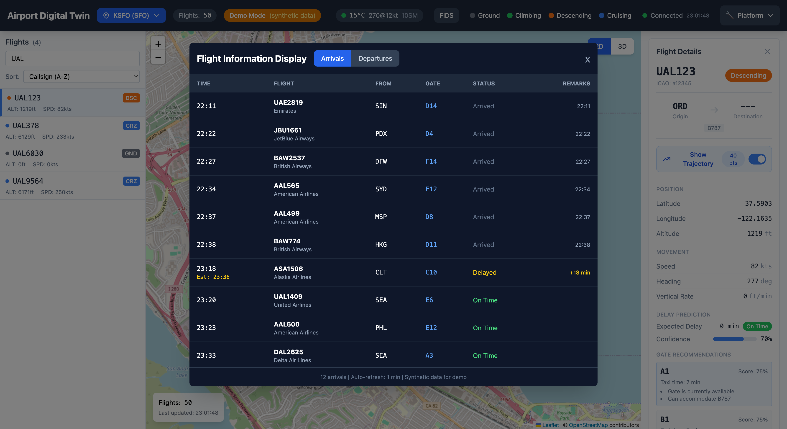
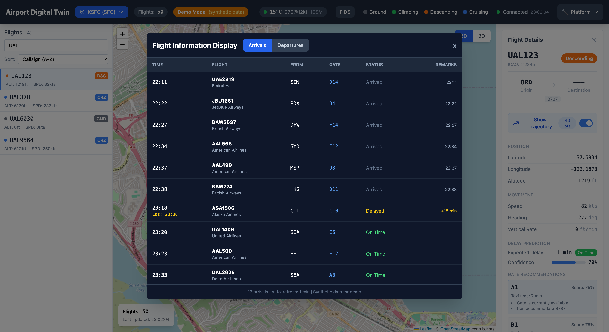
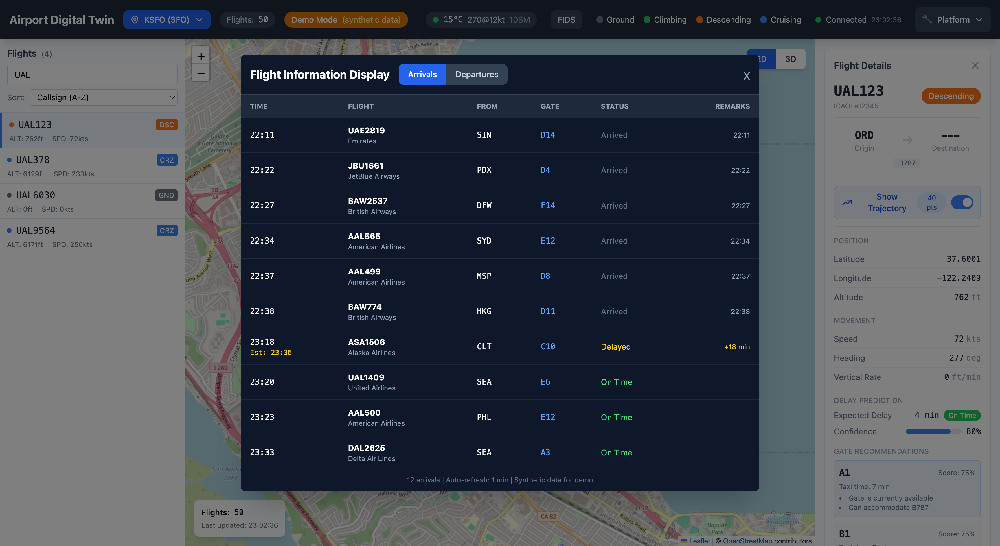

# Airport Digital Twin - Complete User Guide

This comprehensive guide covers all features of the Airport Digital Twin application, from end-user features to administrator data management and data scientist ML capabilities.

---

## Table of Contents

1. [Application Overview](#application-overview)
2. [Main Dashboard](#main-dashboard)
3. [Airport Selector & Multi-Airport Switching](#airport-selector--multi-airport-switching)
4. [Flight List Panel](#flight-list-panel)
5. [2D Map View](#2d-map-view)
6. [3D Visualization](#3d-visualization)
7. [Flight Details Panel](#flight-details-panel)
8. [Flight Information Display System (FIDS)](#flight-information-display-system-fids)
9. [Weather Widget](#weather-widget)
10. [Gate Status Panel](#gate-status-panel)
11. [Platform Integration](#platform-integration)
12. [Administrator Guide: Data Architecture](#administrator-guide-data-architecture)
13. [Data Scientist Guide: ML Models](#data-scientist-guide-ml-models)
14. [Troubleshooting](#troubleshooting)
15. [Keyboard Shortcuts](#keyboard-shortcuts)

---

## Application Overview

The Airport Digital Twin is a real-time visualization platform that demonstrates the full Databricks stack through an engaging airport operations domain. It provides:

- **Real-time flight tracking** with 2D and 3D visualizations
- **Multi-airport support** with 12 presets + any ICAO code worldwide
- **ML-powered predictions** for delays, gate assignments, and congestion
- **Live weather data** via METAR/TAF feeds
- **FIDS** (Flight Information Display System) for arrivals and departures
- **Industry-standard data formats** — AIXM, OSM, IFC, AIDM, FAA NASR
- **Platform integration** with Lakeview dashboards, Genie NL queries, Unity Catalog, MLflow, and Data Lineage

**Access URLs:**
- **Production**: https://airport-digital-twin-dev-7474645572615955.aws.databricksapps.com
- **Local Development**: http://localhost:3000

---

## Main Dashboard


The main dashboard consists of five key areas:

| # | Component | Description |
|---|-----------|-------------|
| **A** | **Header Bar** | Airport selector, flight count, data source, weather, FIDS, phase legend, connection status, Platform links |
| **B** | **Flight List** | Searchable, sortable list of all active flights with phase/altitude/speed |
| **C** | **Map View** | 2D (Leaflet with OSM overlay) or 3D (Three.js) visualization of flights |
| **D** | **Flight Details** | Detailed information for the selected flight including ML predictions |
| **E** | **Gate Status** | Terminal gate occupancy and area congestion levels |

### Header Components

- **Airport Selector**: Click the airport button (e.g., "KSFO (SFO)") to switch airports
- **Flights Counter**: Total number of tracked flights (e.g., "Flights: 50")
- **Data Source Indicator**: Shows data origin
  - `Live` — Real data from Lakebase/Delta tables
  - `Demo Mode (synthetic)` — Generated demo data when backend unavailable
- **Weather Badge**: Current METAR conditions (temperature, wind, visibility) — click to expand
- **FIDS Button**: Opens the Flight Information Display System modal
- **Flight Phase Legend**: Color-coded indicators for Ground, Climbing, Descending, Cruising
- **Connection Status**: Real-time connection health
- **Platform Button**: Access Databricks platform integrations

---

## Airport Selector & Multi-Airport Switching


Click the airport button in the header to open the airport selector dropdown.

### Preset Airports (12)

| ICAO | IATA | Airport | Location |
|------|------|---------|----------|
| KSFO | SFO | San Francisco International | San Francisco, CA |
| KJFK | JFK | John F. Kennedy International | New York, NY |
| KLAX | LAX | Los Angeles International | Los Angeles, CA |
| KORD | ORD | O'Hare International | Chicago, IL |
| KATL | ATL | Hartsfield-Jackson Atlanta | Atlanta, GA |
| EGLL | LHR | London Heathrow | London, UK |
| LFPG | CDG | Charles de Gaulle | Paris, France |
| OMAA | AUH | Abu Dhabi International | Abu Dhabi, UAE |
| OMDB | DXB | Dubai International | Dubai, UAE |
| RJTT | HND | Tokyo Haneda | Tokyo, Japan |
| VHHH | HKG | Hong Kong International | Hong Kong |
| WSSS | SIN | Singapore Changi | Singapore |

### Custom ICAO Code

Enter any 4-letter ICAO code in the text field and click **Load** to switch to any airport worldwide.

### What Happens During Airport Switch



When you switch airports, a progress overlay appears showing "Loading airport data, please wait..." while the system:

1. Fetches airport infrastructure from OpenStreetMap (terminals, gates, taxiways, aprons)
2. Generates new synthetic flight data positioned at the airport
3. Updates the 2D map center and zoom level
4. Loads weather data for the new airport

### Multi-Airport Example: CDG (Paris)


*Charles de Gaulle loaded with OSM-sourced terminal polygons, gate markers, taxiways, and aprons — demonstrating worldwide airport support.*

---

## Flight List Panel



The flight list panel on the left side shows all active flights.

### Search Functionality
- **Search Box**: Type a callsign prefix to filter flights instantly
- Example: Typing "UAL" filters to show only United Airlines flights
- Search is case-insensitive and matches partial callsigns

### Sorting Options
- **Callsign (A-Z)**: Alphabetical order by flight callsign
- **Altitude (High-Low)**: Sort by current altitude descending

### Flight Card Information
Each flight card displays:
- **Callsign** (e.g., "UAL123")
- **Phase Badge**: GND (Ground), CLB (Climbing), CRZ (Cruising), DSC (Descending)
- **Origin/Destination**: Airport codes showing where the flight is from/to
- **Altitude**: Current altitude in feet
- **Speed**: Ground speed in knots

**Click any flight card** to select it and view detailed information in the right panel.

---

## 2D Map View

The 2D view uses Leaflet with OpenStreetMap tiles and a rich airport overlay.

### OSM Airport Overlay

The map renders real airport infrastructure loaded from OpenStreetMap:

| Feature | Color | Description |
|---------|-------|-------------|
| **Terminals** | Blue polygons | Terminal building footprints |
| **Gates** | Green circle markers | Gate positions with labels |
| **Taxiways** | Yellow polylines | Taxiway centerlines |
| **Aprons** | Gray polygons | Aircraft parking/ramp areas |

### Flight Markers
- **Color** indicates flight phase: yellow=ground, green=climbing, red=descending, blue=cruising
- **Icon rotation** shows heading direction
- **Hover** shows flight callsign tooltip
- **Click** selects the flight and shows details panel
- **Selected flight** has a pulsing highlight effect

### Map Controls
- **Zoom**: + / - buttons or mouse scroll wheel
- **Pan**: Click and drag to move the map
- **2D/3D Toggle**: Buttons above the map to switch between views

---

## 3D Visualization



The 3D view provides an immersive visualization using Three.js and React Three Fiber.

### 3D Features
- **Aircraft Models**: GLTF 3D models for major airlines (United, Delta, American, etc.) with procedural fallback
- **Altitude Representation**: Aircraft positioned at actual altitude in 3D space
- **Terminal Buildings**: 3D extrusions of OSM terminal polygons
- **Flight Labels**: Hovering callsign, altitude, and speed indicators

### Camera Controls
- **Rotate**: Left-click and drag
- **Pan**: Right-click and drag
- **Zoom**: Mouse scroll wheel

### Switching Views
Click the **2D** or **3D** buttons above the map to toggle between views.

---

## Flight Details Panel


When a flight is selected, the details panel shows comprehensive information:

### Position Section
| Field | Description | Example |
|-------|-------------|---------|
| Latitude | Current latitude in degrees | 37.4940 |
| Longitude | Current longitude in degrees | -122.0078 |
| Altitude | Current altitude in feet | 35,000 ft |

### Movement Section
| Field | Description | Example |
|-------|-------------|---------|
| Speed | Ground speed in knots | 450 kts |
| Heading | True heading in degrees | 273 deg |
| Vertical Rate | Climb/descent rate in ft/min | +1,500 ft/min |

### Origin & Destination
- **Origin Airport**: ICAO/IATA code of departure airport
- **Destination Airport**: ICAO/IATA code of arrival airport
- Arriving flights show the current airport as destination; departing flights show it as origin

### Delay Prediction (ML)
- **Expected Delay**: Predicted delay in minutes
- **Delay Category**: On Time, Slight, Moderate, or Severe
- **Confidence**: Model confidence percentage (0-100%)

### Gate Recommendations (ML)
Top 3 recommended gates with:
- **Gate ID**: Terminal and gate number (e.g., A1, B3)
- **Score**: Assignment quality score (0-100%)
- **Taxi Time**: Estimated taxi time to gate
- **Reasons**: Why this gate is recommended

### Trajectory Button
Click **"Show Trajectory"** to display the flight's historical path on the map (requires historical data in Delta tables).

---

## Flight Information Display System (FIDS)



Click the **FIDS** button in the header to open the Flight Information Display System.

### Features
- **Arrivals Tab**: Shows all incoming flights with scheduled times, origins, gates, and status
- **Departures Tab**: Shows all outbound flights with scheduled times, destinations, gates, and status
- **Flight Status**: Color-coded status indicators (On Time, Delayed, Boarding, Landed, etc.)
- **Schedule Data**: Estimated arrival/departure times

### Usage
The FIDS provides a familiar airport-style display board view of all flights, similar to what passengers see in real airport terminals.

---

## Weather Widget



Click the **weather badge** in the header (showing temperature, wind, visibility) to expand the weather panel.

### METAR Data
- **Temperature**: Current temperature in Celsius
- **Wind**: Direction (degrees) and speed (knots)
- **Visibility**: Statute miles
- **Altimeter**: Barometric pressure

### TAF Forecast
- **Forecast periods** with expected conditions
- **Wind changes** and visibility predictions

### Flight Category
- **VFR** (Visual Flight Rules) — good conditions
- **MVFR** (Marginal VFR) — reduced visibility
- **IFR** (Instrument Flight Rules) — low visibility
- **LIFR** (Low IFR) — very low visibility

---

## Gate Status Panel

The gate status panel on the right shows terminal occupancy.

### Terminal Overview
- **Available**: Number of open gates (green count)
- **Occupied**: Number of occupied gates (red count)

### Terminal Details
For each terminal:
- **Gate Grid**: Visual representation of gates
  - Green = Available
  - Red = Occupied

### Area Congestion
Shows congestion levels for airport zones:
- **Low** (green): Normal operations
- **Moderate** (yellow): Minor delays expected
- **High** (orange): Significant congestion
- **Critical** (red): Major operational impact

---

## Platform Integration



Click **"Platform"** in the header to access Databricks platform features.

| Link | Description | Use Case |
|------|-------------|----------|
| **Flight Dashboard** | Lakeview dashboard with real-time metrics | View aggregated KPIs and trends |
| **Ask Genie** | Natural language SQL queries | Query flight data conversationally |
| **Data Lineage** | Unity Catalog lineage view | Track data flow and dependencies |
| **ML Experiments** | MLflow experiment tracking | Monitor model performance |
| **Unity Catalog** | Table browser | Explore schemas and data |

---

## Administrator Guide: Data Architecture

### Architecture Overview

The Airport Digital Twin uses a **two-tier data architecture** optimized for both analytics and real-time serving:

```
                    ┌─────────────────────────────────────────────────────────┐
                    │                    DATA ARCHITECTURE                      │
                    ├─────────────────────────────────────────────────────────┤
                    │                                                           │
   Data Sources     │     Analytics Layer          │     Serving Layer          │
                    │     (Batch/Streaming)        │     (Real-time)            │
                    │                              │                            │
┌──────────────┐    │  ┌─────────────────────┐    │  ┌─────────────────────┐   │
│  OpenSky API │────┼─▶│  DLT Pipeline       │    │  │  Lakebase           │   │
│  (Live Data) │    │  │  Bronze→Silver→Gold │    │  │  (PostgreSQL)       │   │
└──────────────┘    │  └──────────┬──────────┘    │  └──────────▲──────────┘   │
                    │             │                │             │              │
┌──────────────┐    │             ▼                │             │ <10ms        │
│  Synthetic   │────┼─▶┌─────────────────────┐    │             │              │
│  (Fallback)  │    │  │  Unity Catalog      │────┼─────────────┤              │
└──────────────┘    │  │  Delta Tables       │    │  Sync Job   │              │
                    │  │  (Governed)         │    │  (1 min)    │              │
                    │  └──────────┬──────────┘    │             │              │
                    │             │                │             ▼              │
                    │             │ ~100ms         │  ┌─────────────────────┐   │
                    │             └────────────────┼─▶│  FastAPI Backend    │   │
                    │                              │  └──────────┬──────────┘   │
                    │                              │             │              │
                    │                              │             ▼              │
                    │                              │  ┌─────────────────────┐   │
                    │                              │  │  React Frontend     │   │
                    │                              │  └─────────────────────┘   │
                    └──────────────────────────────┴────────────────────────────┘
```

### Lakebase (Frontend Serving Layer)

**Purpose**: Sub-10ms query latency for real-time frontend serving

**Configuration**:
```
Host: ep-summer-scene-d2ew95fl.database.us-east-1.cloud.databricks.com
Endpoint: projects/airport-digital-twin/branches/production/endpoints/primary
Database: databricks_postgres
Schema: public
```

**Tables**:
| Table | Purpose | Key Columns |
|-------|---------|-------------|
| `flight_status` | Current flight positions | icao24, callsign, lat, lon, altitude, velocity, heading, on_ground, vertical_rate, last_seen, flight_phase, data_source |

**Authentication Modes**:
1. **Direct Credentials** (Local Development):
   ```bash
   export LAKEBASE_HOST="ep-xxx.database.us-east-1.cloud.databricks.com"
   export LAKEBASE_USER="your_user"
   export LAKEBASE_PASSWORD="your_password"
   ```

2. **OAuth** (Databricks Apps - Autoscaling):
   ```bash
   export LAKEBASE_USE_OAUTH="true"
   export LAKEBASE_ENDPOINT_NAME="projects/airport-digital-twin/branches/production/endpoints/primary"
   ```

### Unity Catalog (Lakehouse Analytics Layer)

**Purpose**: Governed data storage with lineage tracking and historical analytics

**Catalog Structure**:
```
serverless_stable_3n0ihb_catalog
└── airport_digital_twin
    ├── flight_status_gold        # Current positions (DLT Gold layer)
    └── flight_positions_history  # Historical trajectory data
```

**Connection Configuration**:
```bash
export DATABRICKS_HOST="fevm-serverless-stable-3n0ihb.cloud.databricks.com"
export DATABRICKS_HTTP_PATH="/sql/1.0/warehouses/b868e84cedeb4262"
export DATABRICKS_CATALOG="serverless_stable_3n0ihb_catalog"
export DATABRICKS_SCHEMA="airport_digital_twin"
```

### Synchronization Strategy

The system uses a **cascading data source strategy** with automatic fallback:

```
1. TRY LAKEBASE (PostgreSQL)     → Latency: <10ms  → data_source="live"
2. FALLBACK TO DELTA TABLES      → Latency: ~100ms → data_source="live"
3. FALLBACK TO SYNTHETIC          → Latency: <5ms  → data_source="synthetic"
```

**Sync Job**: Every 1 minute, UPSERT from Delta tables → Lakebase on `icao24` key.

### Operational Procedures

**Health Check**: `GET /health` — returns Lakebase connectivity, Delta tables status, current data source.

**Data Freshness**:
```sql
SELECT MAX(last_seen) as latest_update,
       TIMESTAMPDIFF(MINUTE, MAX(last_seen), NOW()) as minutes_stale
FROM flight_status;
```

---

## Data Scientist Guide: ML Models

### Feature Engineering

**Module**: `src/ml/features.py`

The feature extraction pipeline transforms raw flight data into 14 ML-ready features:

| Feature | Computation | Rationale |
|---------|-------------|-----------|
| `hour_of_day` | Extract from timestamp | Peak hours (7-9am, 5-7pm) have more delays |
| `is_weekend` | day_of_week >= 5 | Weekends typically have fewer delays |
| `altitude_category` | ground/low/cruise thresholds | Ground aircraft more likely delayed |
| `velocity_normalized` | velocity_knots / 500 | Slow aircraft may indicate taxi delays |
| `flight_distance_category` | Based on velocity + altitude | Long-haul vs short-haul patterns |
| `heading_quadrant` | Heading degrees → N/E/S/W | Runway direction affects operations |

### Delay Prediction Model

**Module**: `src/ml/delay_model.py` | **Type**: Rule-based heuristic (demo)

**Prediction Logic**:
- Peak hours (7-9am): +15 min | Peak hours (5-7pm): +12 min
- Weekend: -3 min | Ground aircraft: +8 min
- Random noise: +/-5 min for realism

**Delay Categories**: On Time (<5 min), Slight (5-15 min), Moderate (15-30 min), Severe (>30 min)

### Gate Recommendation Model

**Module**: `src/ml/gate_model.py` | **Type**: Scoring-based optimization

**Scoring Factors** (max score 1.0):
- Availability (0.5 max): Available +0.5, Delayed +0.2
- Terminal Match (0.25 max): International→Terminal B, Domestic→Terminal A
- Proximity (0.15 max): Lower gate numbers = closer to runway
- Delay Penalty: >30 min delay: -0.1

### Congestion Prediction Model

**Module**: `src/ml/congestion_model.py` | **Type**: Capacity-based threshold

**Congestion Levels**: LOW (<50% capacity), MODERATE (50-75%), HIGH (75-90%), CRITICAL (>90%)

### Model Performance

| Model | Type | Latency | Notes |
|-------|------|---------|-------|
| Delay Prediction | Rule-based heuristic | <1ms | Demo model, not ML-trained |
| Gate Recommendation | Scoring optimization | <1ms | Deterministic scoring |
| Congestion Prediction | Capacity threshold | <1ms | Real-time calculation |

Models are designed for MLflow tracking and can be enhanced with XGBoost/LightGBM for delay prediction, reinforcement learning for gate assignment, and time-series forecasting for congestion.

---

## Troubleshooting

### "Demo Mode" Showing Instead of Live Data

**Cause**: Backend cannot connect to Lakebase or Delta tables

**Solutions**:
1. Verify Lakebase instance is running
2. Check network connectivity to Databricks workspace
3. Validate OAuth credentials (for Databricks Apps)
4. Check environment variables are set correctly

### Flights Not Updating

1. Check "Connected" status in header
2. Verify backend health: `GET /health`
3. Check browser console for JavaScript errors
4. Verify DLT pipeline is running

### Airport Switch Hangs or Fails

1. Check backend logs for OSM Overpass API errors
2. Verify internet connectivity (OSM data fetched from overpass-api.de)
3. Try a different airport — some small airports may have limited OSM data
4. Refresh the page and try again

### 3D View Performance Issues

1. Reduce browser window size
2. Close other GPU-intensive applications
3. Use Chrome or Firefox (best WebGL support)
4. Switch to 2D view for lower-end hardware

### Gate Recommendations Not Appearing

1. Click on a specific flight to select it
2. Check backend logs for prediction service errors
3. Verify flight has valid callsign (needed for domestic/international classification)

---

## Keyboard Shortcuts

| Key | Action |
|-----|--------|
| `2` | Switch to 2D map view |
| `3` | Switch to 3D visualization |
| `Esc` | Deselect current flight |
| `/` | Focus search box |
| `Up` / `Down` | Navigate flight list |
| `Enter` | Select highlighted flight |

---

*Documentation updated: 2026-03-09*
*Version: 2.0*
