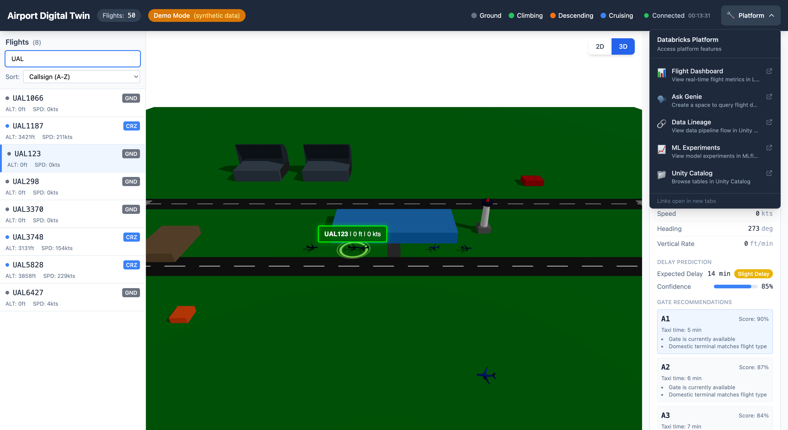
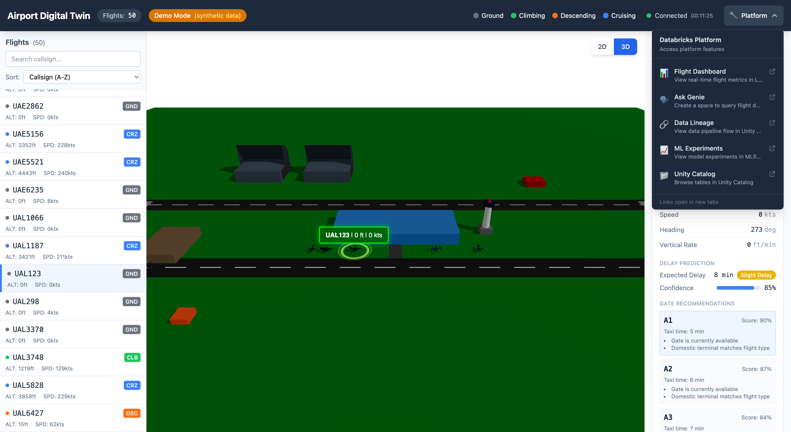

# Airport Digital Twin - Complete User Guide

This comprehensive guide covers all functionalities of the Airport Digital Twin application, from end-user features to administrator data management and data scientist ML capabilities.

---

## Table of Contents

1. [Application Overview](#application-overview)
2. [User Interface Guide](#user-interface-guide)
   - [Main Dashboard](#main-dashboard)
   - [Flight List Panel](#flight-list-panel)
   - [2D Map View](#2d-map-view)
   - [3D Visualization](#3d-visualization)
   - [Flight Details Panel](#flight-details-panel)
   - [Gate Status Panel](#gate-status-panel)
   - [Platform Integration](#platform-integration)
3. [Administrator Guide: Data Persistence Strategy](#administrator-guide-data-persistence-strategy)
   - [Architecture Overview](#architecture-overview)
   - [Lakebase (Frontend Serving Layer)](#lakebase-frontend-serving-layer)
   - [Unity Catalog (Lakehouse Analytics Layer)](#unity-catalog-lakehouse-analytics-layer)
   - [Synchronization Strategy](#synchronization-strategy)
   - [Operational Procedures](#operational-procedures)
4. [Data Scientist Guide: ML Models](#data-scientist-guide-ml-models)
   - [Feature Engineering](#feature-engineering)
   - [Delay Prediction Model](#delay-prediction-model)
   - [Gate Recommendation Model](#gate-recommendation-model)
   - [Congestion Prediction Model](#congestion-prediction-model)
   - [Model Metrics & Performance](#model-metrics--performance)
5. [Troubleshooting](#troubleshooting)
6. [Keyboard Shortcuts](#keyboard-shortcuts)

---

## Application Overview

The Airport Digital Twin is a real-time visualization platform that demonstrates the full Databricks stack through an engaging airport operations domain. It provides:

- **Real-time flight tracking** with 2D and 3D visualizations
- **ML-powered predictions** for delays, gate assignments, and congestion
- **Platform integration** with Lakeview dashboards, Genie NL queries, and Unity Catalog

**Access URLs:**
- **Production**: https://airport-digital-twin-dev-7474645572615955.aws.databricksapps.com
- **Local Development**: http://localhost:3000

---

## User Interface Guide

### Main Dashboard


The main dashboard consists of five key areas:

| # | Component | Description |
|---|-----------|-------------|
| **A** | **Header Bar** | Shows flight count, data source indicator, connection status, and Platform links |
| **B** | **Flight List** | Searchable, sortable list of all active flights |
| **C** | **Map View** | 2D (Leaflet) or 3D (Three.js) visualization of flights |
| **D** | **Flight Details** | Detailed information for the selected flight |
| **E** | **Gate Status** | Terminal gate occupancy and area congestion levels |

#### Header Components

- **Flights Counter**: Total number of tracked flights (e.g., "Flights: 50")
- **Data Source Indicator**: Shows data origin
  - `Live` - Real data from Lakebase/Delta tables
  - `Demo Mode (synthetic)` - Generated demo data when backend unavailable
- **Flight Phase Legend**: Color-coded indicators for Ground, Climbing, Descending, Cruising
- **Connection Status**: Real-time connection health
- **Last Updated**: Timestamp of last data refresh

---

### Flight List Panel



The flight list panel provides:

#### Search Functionality
- **Search Box**: Type a callsign prefix to filter flights instantly
- Example: Typing "UAL" filters to show only United Airlines flights
- Search is case-insensitive and matches partial callsigns

#### Sorting Options
- **Callsign (A-Z)**: Alphabetical order by flight callsign
- **Altitude (High-Low)**: Sort by current altitude descending

#### Flight Card Information
Each flight card displays:
- **Callsign** (e.g., "UAL123")
- **Phase Badge**: GND (Ground), CLB (Climbing), CRZ (Cruising), DSC (Descending)
- **Altitude**: Current altitude in feet
- **Speed**: Ground speed in knots

**Click any flight card** to select it and view detailed information in the right panel.

---

### 2D Map View


The 2D view uses Leaflet with OpenStreetMap tiles:

#### Map Features
- **Flight Markers**: Aircraft icons positioned at current location
  - Color indicates flight phase (yellow=ground, green=climbing, red=descending, blue=cruising)
  - Icon rotates to show heading direction
- **Airport Overlay**: Runways, taxiways, and terminal buildings
- **Zoom Controls**: + / - buttons or mouse scroll
- **Pan**: Click and drag to move the map

#### Marker Interaction
- **Hover**: Shows flight callsign tooltip
- **Click**: Selects the flight and shows details panel
- **Selected Flight**: Highlighted with a pulsing effect

---

### 3D Visualization



The 3D view provides an immersive visualization using Three.js:

#### 3D Features
- **Aircraft Models**: 3D aircraft rendered with airline-specific liveries
  - GLTF models for major airlines (United, Delta, American, etc.)
  - Procedural models as fallback
- **Altitude Representation**: Aircraft positioned at actual altitude in 3D space
- **Camera Controls**:
  - **Rotate**: Left-click and drag
  - **Pan**: Right-click and drag
  - **Zoom**: Mouse scroll wheel
- **Flight Labels**: Hovering callsign, altitude, and speed indicators

#### Switching Views
Click the **2D** or **3D** buttons above the map to toggle between views.

---

### Flight Details Panel


When a flight is selected, the details panel shows comprehensive information:

#### Position Section
| Field | Description | Example |
|-------|-------------|---------|
| Latitude | Current latitude in degrees | 37.4940 |
| Longitude | Current longitude in degrees | -122.0078 |
| Altitude | Current altitude in feet | 35,000 ft |

#### Movement Section
| Field | Description | Example |
|-------|-------------|---------|
| Speed | Ground speed in knots | 450 kts |
| Heading | True heading in degrees | 273 deg |
| Vertical Rate | Climb/descent rate in ft/min | +1,500 ft/min |

#### Delay Prediction Section
Shows ML-predicted delay information:
- **Expected Delay**: Predicted delay in minutes
- **Delay Category**: On Time, Slight, Moderate, or Severe
- **Confidence**: Model confidence percentage (0-100%)

#### Gate Recommendations Section
Top 3 recommended gates with:
- **Gate ID**: Terminal and gate number (e.g., A1, B3)
- **Score**: Assignment quality score (0-100%)
- **Taxi Time**: Estimated taxi time to gate
- **Reasons**: Why this gate is recommended

#### Metadata Section
- **Data Source**: Origin of flight data (live/synthetic)
- **Last Seen**: Timestamp of last position update

#### Trajectory Button
Click **"Show Trajectory"** to display the flight's historical path on the map (requires historical data in Delta tables).

---

### Gate Status Panel

The gate status panel shows terminal occupancy:

#### Terminal Overview
- **Available**: Number of open gates (green)
- **Occupied**: Number of occupied gates (red)

#### Terminal Details
For each terminal (A and B):
- **Congestion Level**: Low, Moderate, High, or Critical
- **Gate Grid**: Visual representation of gates 1-10
  - Green = Available
  - Red = Occupied

#### Area Congestion
Shows congestion levels for airport zones:
- **Low** (green): Normal operations
- **Moderate** (yellow): Minor delays expected
- **High** (orange): Significant congestion
- **Critical** (red): Major operational impact

---

### Platform Integration


Click **"Platform"** in the header to access Databricks platform features:

| Link | Description | Use Case |
|------|-------------|----------|
| **Flight Dashboard** | Lakeview dashboard with real-time metrics | View aggregated KPIs and trends |
| **Ask Genie** | Natural language SQL queries | Query flight data conversationally |
| **Data Lineage** | Unity Catalog lineage view | Track data flow and dependencies |
| **ML Experiments** | MLflow experiment tracking | Monitor model performance |
| **Unity Catalog** | Table browser | Explore schemas and data |

---

## Administrator Guide: Data Persistence Strategy

### Architecture Overview

The Airport Digital Twin uses a **two-tier data architecture** optimized for both analytics and real-time serving:

```
                    ┌─────────────────────────────────────────────────────────┐
                    │                    DATA ARCHITECTURE                      │
                    ├─────────────────────────────────────────────────────────┤
                    │                                                           │
   Data Sources     │     Analytics Layer          │     Serving Layer          │
                    │     (Batch/Streaming)        │     (Real-time)            │
                    │                              │                            │
┌──────────────┐    │  ┌─────────────────────┐    │  ┌─────────────────────┐   │
│  OpenSky API │────┼─▶│  DLT Pipeline       │    │  │  Lakebase           │   │
│  (Live Data) │    │  │  Bronze→Silver→Gold │    │  │  (PostgreSQL)       │   │
└──────────────┘    │  └──────────┬──────────┘    │  └──────────▲──────────┘   │
                    │             │                │             │              │
┌──────────────┐    │             ▼                │             │ <10ms        │
│  Synthetic   │────┼─▶┌─────────────────────┐    │             │              │
│  (Fallback)  │    │  │  Unity Catalog      │────┼─────────────┤              │
└──────────────┘    │  │  Delta Tables       │    │  Sync Job   │              │
                    │  │  (Governed)         │    │  (1 min)    │              │
                    │  └──────────┬──────────┘    │             │              │
                    │             │                │             ▼              │
                    │             │ ~100ms         │  ┌─────────────────────┐   │
                    │             └────────────────┼─▶│  FastAPI Backend    │   │
                    │                              │  └──────────┬──────────┘   │
                    │                              │             │              │
                    │                              │             ▼              │
                    │                              │  ┌─────────────────────┐   │
                    │                              │  │  React Frontend     │   │
                    │                              │  └─────────────────────┘   │
                    └──────────────────────────────┴────────────────────────────┘
```

### Lakebase (Frontend Serving Layer)

**Purpose**: Sub-10ms query latency for real-time frontend serving

**Configuration**:
```
Host: ep-summer-scene-d2ew95fl.database.us-east-1.cloud.databricks.com
Endpoint: projects/airport-digital-twin/branches/production/endpoints/primary
Database: databricks_postgres
Schema: public
```

**Tables**:
| Table | Purpose | Schema |
|-------|---------|--------|
| `flight_status` | Current flight positions | icao24, callsign, lat, lon, altitude, velocity, heading, on_ground, vertical_rate, last_seen, flight_phase, data_source |

**Authentication Modes**:
1. **Direct Credentials** (Local Development):
   ```bash
   export LAKEBASE_HOST="ep-xxx.database.us-east-1.cloud.databricks.com"
   export LAKEBASE_USER="your_user"
   export LAKEBASE_PASSWORD="your_password"
   ```

2. **OAuth** (Databricks Apps - Autoscaling):
   ```bash
   export LAKEBASE_USE_OAUTH="true"
   export LAKEBASE_ENDPOINT_NAME="projects/airport-digital-twin/branches/production/endpoints/primary"
   ```

**Service Implementation** (`app/backend/services/lakebase_service.py`):
- Connection pooling with auto-cleanup
- OAuth token caching with automatic refresh
- Query timeout: 5 seconds
- Automatic credential invalidation on failure

---

### Unity Catalog (Lakehouse Analytics Layer)

**Purpose**: Governed data storage with lineage tracking and historical analytics

**Catalog Structure**:
```
serverless_stable_3n0ihb_catalog
└── airport_digital_twin
    ├── flight_status_gold        # Current positions (DLT Gold layer)
    └── flight_positions_history  # Historical trajectory data
```

**Table Schemas**:

**`flight_status_gold`** (DLT Gold Table):
| Column | Type | Description |
|--------|------|-------------|
| icao24 | STRING | Unique aircraft identifier (6-char hex) |
| callsign | STRING | Flight callsign (e.g., "UAL123") |
| latitude | DOUBLE | Current latitude |
| longitude | DOUBLE | Current longitude |
| altitude | DOUBLE | Barometric altitude (meters) |
| velocity | DOUBLE | Ground speed (m/s) |
| heading | DOUBLE | True heading (degrees) |
| on_ground | BOOLEAN | Whether aircraft is on ground |
| vertical_rate | DOUBLE | Vertical rate (m/s) |
| last_seen | TIMESTAMP | Last position update |
| flight_phase | STRING | Computed: ground/climbing/cruising/descending |
| data_source | STRING | Data origin indicator |

**`flight_positions_history`** (Append-only History):
| Column | Type | Description |
|--------|------|-------------|
| icao24 | STRING | Aircraft identifier |
| callsign | STRING | Flight callsign |
| latitude | DOUBLE | Position latitude |
| longitude | DOUBLE | Position longitude |
| altitude | DOUBLE | Altitude at this point |
| velocity | DOUBLE | Speed at this point |
| heading | DOUBLE | Heading at this point |
| vertical_rate | DOUBLE | Vertical rate |
| on_ground | BOOLEAN | Ground status |
| flight_phase | STRING | Phase at this point |
| recorded_at | TIMESTAMP | When this position was recorded |

**Connection Configuration**:
```bash
export DATABRICKS_HOST="fevm-serverless-stable-3n0ihb.cloud.databricks.com"
export DATABRICKS_HTTP_PATH="/sql/1.0/warehouses/b868e84cedeb4262"
export DATABRICKS_CATALOG="serverless_stable_3n0ihb_catalog"
export DATABRICKS_SCHEMA="airport_digital_twin"
```

---

### Synchronization Strategy

The system uses a **cascading data source strategy** with automatic fallback:

```
┌─────────────────────────────────────────────────────────────────────────┐
│                     QUERY FLOW (Priority Order)                          │
├─────────────────────────────────────────────────────────────────────────┤
│                                                                          │
│  1. TRY LAKEBASE (PostgreSQL)                                            │
│     ├── Latency: <10ms                                                   │
│     ├── Use case: Production serving                                     │
│     └── If SUCCESS → return data_source="live"                           │
│                                                                          │
│  2. FALLBACK TO DELTA TABLES (Databricks SQL)                            │
│     ├── Latency: ~100ms                                                  │
│     ├── Use case: When Lakebase unavailable                              │
│     └── If SUCCESS → return data_source="live"                           │
│                                                                          │
│  3. FALLBACK TO SYNTHETIC (In-memory)                                    │
│     ├── Latency: <5ms                                                    │
│     ├── Use case: Demos, development, offline                            │
│     └── return data_source="synthetic"                                   │
│                                                                          │
└─────────────────────────────────────────────────────────────────────────┘
```

**Sync Job Configuration**:
- **Frequency**: Every 1 minute
- **Direction**: Delta Tables → Lakebase
- **Method**: UPSERT on icao24 key

**Manual Sync SQL** (for populating history):
```sql
-- Insert current positions into history table
INSERT INTO serverless_stable_3n0ihb_catalog.airport_digital_twin.flight_positions_history
SELECT
    icao24, callsign, latitude, longitude, altitude,
    velocity, heading, vertical_rate, on_ground, flight_phase,
    CURRENT_TIMESTAMP() as recorded_at
FROM serverless_stable_3n0ihb_catalog.airport_digital_twin.flight_status_gold;
```

---

### Operational Procedures

#### Monitoring Data Freshness
```sql
-- Check Lakebase data freshness
SELECT MAX(last_seen) as latest_update,
       TIMESTAMPDIFF(MINUTE, MAX(last_seen), NOW()) as minutes_stale
FROM flight_status;

-- Check Delta table data freshness
SELECT MAX(last_seen) as latest_update
FROM serverless_stable_3n0ihb_catalog.airport_digital_twin.flight_status_gold;
```

#### Health Checks
- **API Endpoint**: `GET /health`
- **Response includes**:
  - Lakebase connectivity status
  - Delta tables connectivity status
  - Current data source being used

#### Disaster Recovery
1. If Lakebase fails → automatic fallback to Delta tables
2. If Delta fails → automatic fallback to synthetic data
3. Data source indicator in UI shows current mode

---

## Data Scientist Guide: ML Models

### Feature Engineering

**Module**: `src/ml/features.py`

The feature extraction pipeline transforms raw flight data into ML-ready features:

#### Feature Set Schema

```python
@dataclass
class FeatureSet:
    hour_of_day: int        # 0-23, extracted from position_time
    day_of_week: int        # 0=Monday, 6=Sunday
    is_weekend: bool        # True if Saturday or Sunday
    flight_distance_category: str  # short/medium/long
    altitude_category: str  # ground/low/cruise
    heading_quadrant: int   # 1=N, 2=E, 3=S, 4=W
    velocity_normalized: float  # 0-1 scale (0-500 knots)
```

#### Feature Extraction Logic

| Feature | Computation | Rationale |
|---------|-------------|-----------|
| `hour_of_day` | Extract from timestamp | Peak hours (7-9am, 5-7pm) have more delays |
| `is_weekend` | day_of_week >= 5 | Weekends typically have fewer delays |
| `altitude_category` | ground (<1000m), low (1000-5000m), cruise (>5000m) | Ground aircraft more likely delayed |
| `velocity_normalized` | velocity_knots / 500 | Slow aircraft may indicate taxi delays |
| `flight_distance_category` | Based on velocity + altitude | Long-haul vs short-haul patterns |
| `heading_quadrant` | Heading degrees → N/E/S/W | Runway direction affects operations |

#### Feature Array Format (for Model Input)

```python
def features_to_array(features: FeatureSet) -> List[float]:
    # Total: 14 features
    return [
        hour_of_day / 23.0,           # Normalized hour
        day_of_week / 6.0,            # Normalized day
        1.0 if is_weekend else 0.0,   # Weekend flag
        velocity_normalized,           # Speed
        # One-hot: distance (3 features)
        1.0 if short else 0.0,
        1.0 if medium else 0.0,
        1.0 if long else 0.0,
        # One-hot: altitude (3 features)
        1.0 if ground else 0.0,
        1.0 if low else 0.0,
        1.0 if cruise else 0.0,
        # One-hot: heading quadrant (4 features)
        1.0 if N else 0.0,
        1.0 if E else 0.0,
        1.0 if S else 0.0,
        1.0 if W else 0.0,
    ]
```

---

### Delay Prediction Model

**Module**: `src/ml/delay_model.py`

**Type**: Rule-based heuristic model (demo purposes)

#### Model Output

```python
@dataclass
class DelayPrediction:
    delay_minutes: float    # Predicted delay (0+)
    confidence: float       # Model confidence (0.3-0.95)
    delay_category: str     # on_time/slight/moderate/severe
```

#### Prediction Algorithm

```
Base Delay Calculation:
├── Peak Hours (7-9am):      +15 minutes, confidence -0.1
├── Peak Hours (5-7pm):      +12 minutes, confidence -0.1
├── Weekend:                 -3 minutes, confidence +0.05
├── Ground Aircraft:         +8 minutes, confidence +0.1
├── Low Altitude:            +3 minutes
├── Cruising:                -2 minutes, confidence -0.1
├── Slow & Not Cruising:     +5 minutes
└── Random Noise:            ±5 minutes (for realism)

Final Delay = max(0, Base Delay + Noise)
Confidence = clamp(base_confidence, 0.3, 0.95)
```

#### Delay Categories

| Category | Delay Range | Color Code |
|----------|-------------|------------|
| On Time | < 5 minutes | Green |
| Slight | 5-15 minutes | Yellow |
| Moderate | 15-30 minutes | Orange |
| Severe | > 30 minutes | Red |

#### Usage Example

```python
from src.ml.delay_model import predict_delay

flight = {
    "icao24": "a12345",
    "callsign": "UAL123",
    "altitude": 0,
    "on_ground": True,
    "velocity": 5,
    "position_time": 1709900000
}

prediction = predict_delay(flight)
# DelayPrediction(delay_minutes=15.2, confidence=0.85, delay_category="slight")
```

---

### Gate Recommendation Model

**Module**: `src/ml/gate_model.py`

**Type**: Scoring-based optimization model

#### Model Output

```python
@dataclass
class GateRecommendation:
    gate_id: str              # e.g., "A1", "B3"
    score: float              # 0-1, higher is better
    reasons: List[str]        # Human-readable explanations
    estimated_taxi_time: int  # Minutes to reach gate
```

#### Airport Gate Configuration

| Terminal | Gates | Type |
|----------|-------|------|
| A | A1-A10 | Domestic |
| B | B1-B10 | International |

#### Scoring Algorithm

```
Gate Score Calculation (max 1.0):
├── Availability Score (0.5 max):
│   ├── Available:     +0.5
│   ├── Delayed:       +0.2
│   └── Occupied/Maintenance: 0.0 (excluded)
│
├── Terminal Match Score (0.25 max):
│   ├── International flight + Terminal B: +0.25
│   ├── Domestic flight + Terminal A:      +0.25
│   └── Mismatch:                          +0.1
│
├── Proximity Score (0.15 max):
│   └── (6 - gate_number) / 5 * 0.15
│       (Lower gate numbers = closer to runway)
│
└── Delay Penalty:
    ├── Delay > 30 min: -0.1
    └── Delay > 0 min:  -0.05
```

#### International Flight Detection

```python
DOMESTIC_PREFIXES = {"AAL", "UAL", "DAL", "SWA", "JBU", "NKS", "ASA", "FFT", "SKW"}
is_international = callsign[:3] not in DOMESTIC_PREFIXES
```

#### Taxi Time Estimation

```
Taxi Time = 5 + (gate_number - 1) minutes
Example: Gate A1 = 5 min, Gate A5 = 9 min
```

---

### Congestion Prediction Model

**Module**: `src/ml/congestion_model.py`

**Type**: Capacity-based threshold model

#### Model Output

```python
@dataclass
class AreaCongestion:
    area_id: str              # e.g., "runway_28L", "taxiway_A"
    area_type: str            # runway/taxiway/apron
    level: CongestionLevel    # LOW/MODERATE/HIGH/CRITICAL
    flight_count: int         # Flights currently in area
    predicted_wait_minutes: int
    confidence: float
```

#### Airport Area Definitions

| Area ID | Type | Capacity | Location (Lat/Lon Range) |
|---------|------|----------|--------------------------|
| runway_28L | runway | 2 | 37.497-37.499, -122.015 to -121.985 |
| runway_28R | runway | 2 | 37.501-37.503, -122.015 to -121.985 |
| taxiway_A | taxiway | 5 | 37.502-37.503, -122.010 to -122.005 |
| taxiway_B | taxiway | 5 | 37.502-37.503, -121.995 to -121.990 |
| terminal_A_apron | apron | 10 | 37.503-37.506, -122.006 to -121.994 |
| terminal_B_apron | apron | 10 | 37.503-37.506, -122.006 to -121.994 |

#### Congestion Level Thresholds

| Level | Capacity Ratio | Color |
|-------|----------------|-------|
| LOW | < 50% | Green |
| MODERATE | 50-75% | Yellow |
| HIGH | 75-90% | Orange |
| CRITICAL | > 90% | Red |

#### Wait Time Estimation (minutes)

| Area Type | LOW | MODERATE | HIGH | CRITICAL |
|-----------|-----|----------|------|----------|
| Runway | 0 | 3 | 8 | 15 |
| Taxiway | 0 | 2 | 5 | 10 |
| Apron | 0 | 1 | 3 | 5 |

#### Flight-to-Area Assignment

```python
# Runway: Aircraft on ground OR altitude < 100m
if on_ground or altitude < 100:
    assign_to_runway()

# Taxiway: On ground AND moving (velocity > 2 m/s)
if on_ground and velocity > 2:
    assign_to_taxiway()

# Apron: On ground AND slow/stationary (velocity <= 5 m/s)
if on_ground and velocity <= 5:
    assign_to_apron()
```

---

### Model Metrics & Performance

#### Current Model Performance

| Model | Type | Accuracy | Latency | Notes |
|-------|------|----------|---------|-------|
| Delay Prediction | Rule-based | N/A (heuristic) | <1ms | Demo model, not ML-trained |
| Gate Recommendation | Scoring | N/A (optimization) | <1ms | Deterministic scoring |
| Congestion Prediction | Threshold | N/A (capacity-based) | <1ms | Real-time calculation |

#### Future ML Enhancement Path

For production deployment, these models could be enhanced:

1. **Delay Prediction**:
   - Train XGBoost/LightGBM on historical delay data
   - Features: weather, historical on-time performance, aircraft type, route
   - Target: Actual delay minutes
   - Track in MLflow: MAE, RMSE, R²

2. **Gate Recommendation**:
   - Reinforcement learning for dynamic gate assignment
   - Optimize for: minimized taxi time, balanced terminal load, turnaround time
   - Track: Average taxi time, gate utilization, on-time departure rate

3. **Congestion Prediction**:
   - Time-series forecasting (Prophet, LSTM)
   - Predict congestion 15/30/60 minutes ahead
   - Track: Forecast accuracy, false positive rate for HIGH/CRITICAL

#### MLflow Integration

Models are designed for MLflow tracking:

```python
import mlflow

with mlflow.start_run():
    mlflow.log_param("model_type", "rule_based")
    mlflow.log_param("peak_hour_penalty", 15)
    mlflow.log_metric("avg_delay_prediction", 12.5)
    mlflow.log_metric("confidence_mean", 0.75)
```

---

## Troubleshooting

### "Demo Mode" Showing Instead of Live Data

**Cause**: Backend cannot connect to Lakebase or Delta tables

**Solutions**:
1. Verify Lakebase instance is running
2. Check network connectivity to Databricks workspace
3. Validate OAuth credentials (for Databricks Apps)
4. Check environment variables are set correctly

### Flights Not Updating

**Solutions**:
1. Check "Connected" status in header
2. Verify backend health: `GET /health`
3. Check browser console for JavaScript errors
4. Verify DLT pipeline is running and producing data

### 3D View Performance Issues

**Solutions**:
1. Reduce browser window size
2. Close other GPU-intensive applications
3. Use Chrome or Firefox (best WebGL support)
4. Disable hardware acceleration if issues persist

### Gate Recommendations Not Appearing

**Cause**: Flight not selected or prediction service error

**Solutions**:
1. Click on a specific flight to select it
2. Check backend logs for prediction service errors
3. Verify flight has valid callsign (needed for domestic/international classification)

---

## Keyboard Shortcuts

| Key | Action |
|-----|--------|
| `2` | Switch to 2D map view |
| `3` | Switch to 3D visualization |
| `Esc` | Deselect current flight |
| `/` | Focus search box |
| `↑` / `↓` | Navigate flight list |
| `Enter` | Select highlighted flight |

---

*Documentation generated: 2026-03-08*
*Version: 1.0*
