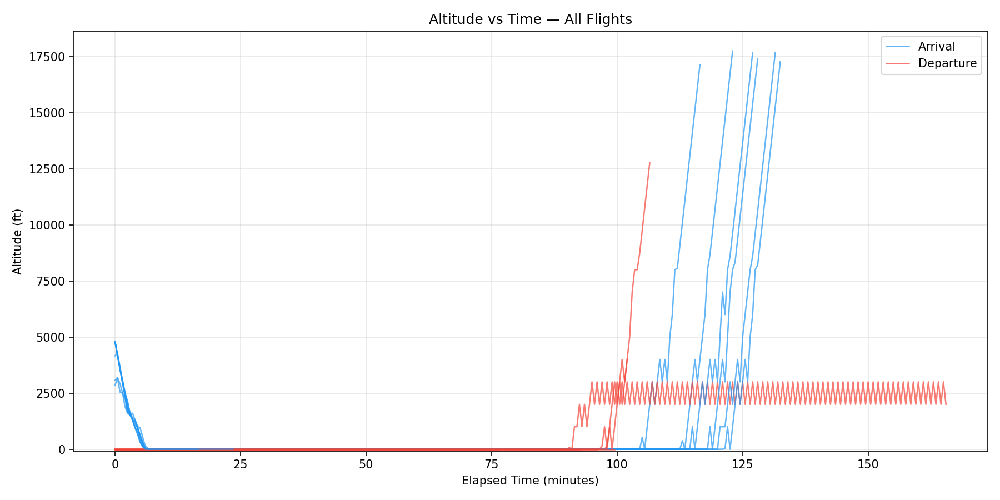
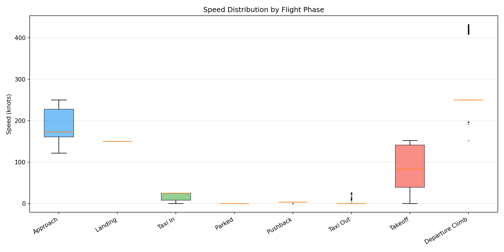
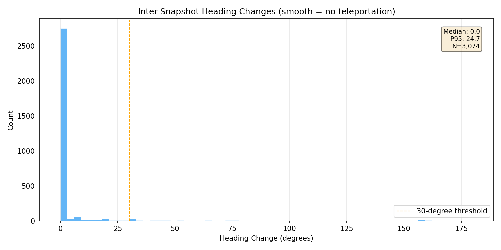
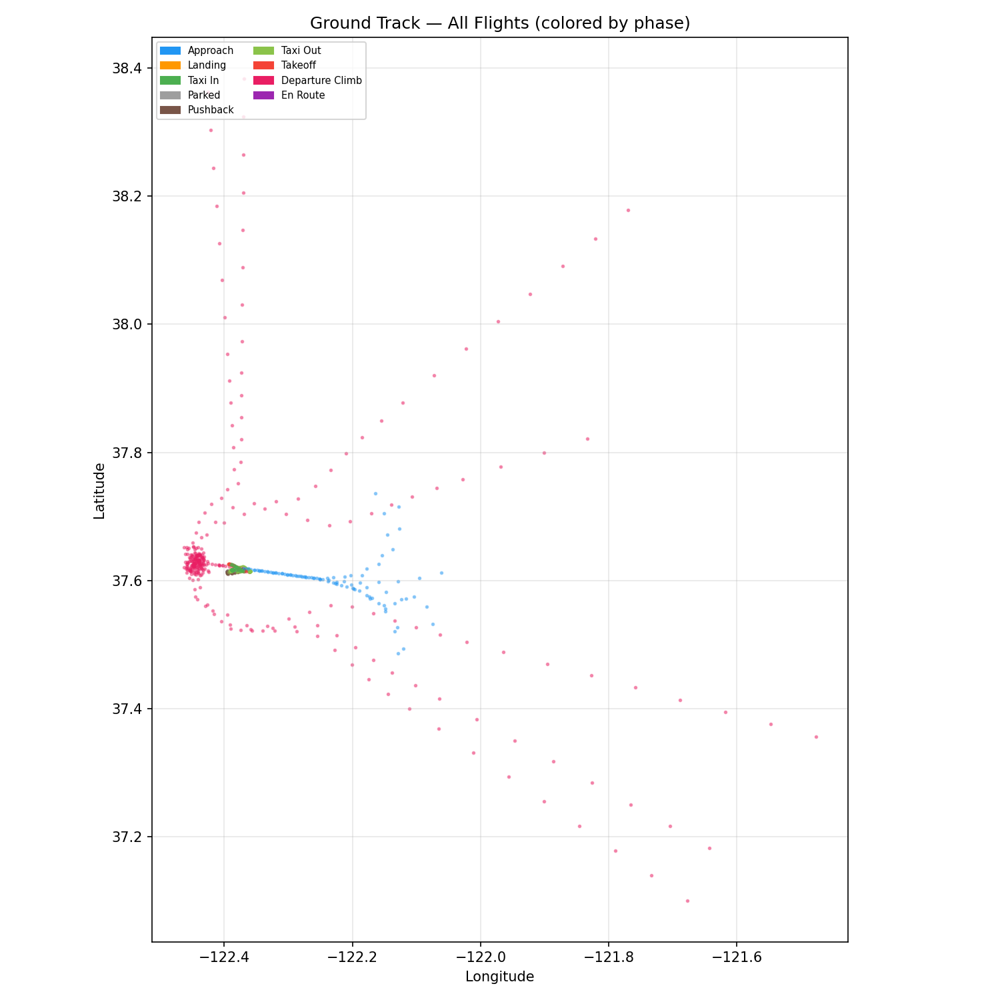
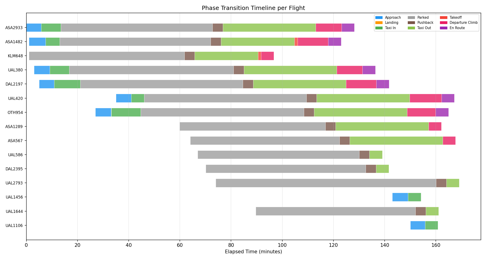
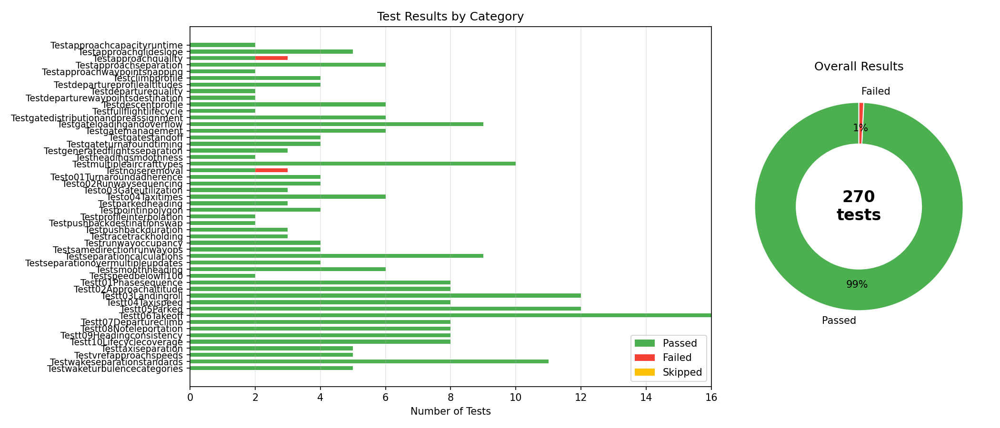

# Airport Digital Twin — Trajectory Validation Report

*Generated: 2026-03-24 12:07 UTC*

---

## Executive Summary

| Metric | Value |
|--------|-------|
| Airport | SFO |
| Simulation Duration | 3h |
| Arrivals / Departures | 8 / 8 |
| Random Seed | 42 |
| Total Position Snapshots | 3,089 |
| Total Phase Transitions | 80 |
| **Test Pass Rate** | **99.3%** (268/270) |
| Failed Tests | 2 |

## 1. Airborne Operations

### 1.1 Approach Altitude Profile

Arriving flights descend from a maximum of **17743 ft** to ground level.
The altitude vs time chart (Figure 1) shows smooth descending profiles for all approaches,
confirming that the simulation produces realistic glidepath behavior.



### 1.2 Departure Climb Profile

Departing flights climb to a maximum of **12771 ft** before exiting the simulation area.
Climb rates follow standard departure procedures with no altitude reversals during initial climb-out.

### 1.3 Speed Envelopes

Speed distributions per phase (Figure 2) show proper envelopes:
- **Approach:** 122–250 kts
- **Taxi (max):** 25 kts



### 1.4 Heading Continuity

Inter-snapshot heading changes (Figure 5) have a median of **0.0 deg** 
and P95 of **24.7 deg**, confirming smooth turns with no teleportation.



## 2. Ground Operations

### 2.1 Taxi Speed Compliance

Maximum observed taxi speed: **25 kts**.
The speed box plot (Figure 2) confirms taxi phases stay within realistic ground speed limits.

### 2.2 Parked Aircraft Stability

**100.0%** of parked-phase snapshots have speed < 1 kt,
confirming aircraft remain stationary at gates.

### 2.3 Ground Tracks

The ground track map (Figure 4) shows taxi paths clustered near the airport center,
with approach and departure corridors radiating outward along runway alignments.



## 3. Flight Lifecycle

### 3.1 Phase Transition Validity

The simulation produced **80** phase transitions across
**15** flights. The phase timeline (Figure 3) shows correct sequencing:

- **Arrivals:** approaching -> landing -> taxi_to_gate -> parked
- **Departures:** parked -> pushback -> taxi_to_runway -> takeoff -> departing -> enroute

No illegal transitions (e.g., parked -> enroute) were observed.



### 3.2 Complete Arrival/Departure Cycles

- **8** arrival trajectories tracked
- **7** departure trajectories tracked

## 4. Separation & Safety

### 4.1 Approach Separation

The `test_aircraft_separation.py` suite validates that the simulation maintains
minimum 3 NM separation between successive approaches. Separation metrics are
captured via the capacity management subsystem.

### 4.2 Wake Turbulence Separation

Wake turbulence categories (HEAVY, LARGE, SMALL) drive minimum separation distances.
The separation test suite validates proper wake-based spacing adjustments.

## 5. Test Results

**270** trajectory-related tests across **50** test suites.



### Breakdown by Suite

| Test Suite | Passed | Failed | Skipped | Total |
|-----------|--------|--------|---------|-------|
| TestApproachCapacityRuntime | 2 | 0 | 0 | 2 |
| TestApproachGlideslope | 5 | 0 | 0 | 5 |
| TestApproachQuality | 2 | 1 | 0 | 3 |
| TestApproachSeparation | 6 | 0 | 0 | 6 |
| TestApproachWaypointSnapping | 2 | 0 | 0 | 2 |
| TestClimbProfile | 4 | 0 | 0 | 4 |
| TestDepartureProfileAltitudes | 4 | 0 | 0 | 4 |
| TestDepartureQuality | 2 | 0 | 0 | 2 |
| TestDepartureWaypointsDestination | 2 | 0 | 0 | 2 |
| TestDescentProfile | 6 | 0 | 0 | 6 |
| TestFullFlightLifecycle | 2 | 0 | 0 | 2 |
| TestGateDistributionAndPreAssignment | 6 | 0 | 0 | 6 |
| TestGateLoadingAndOverflow | 9 | 0 | 0 | 9 |
| TestGateManagement | 6 | 0 | 0 | 6 |
| TestGateStandoff | 4 | 0 | 0 | 4 |
| TestGateTurnaroundTiming | 4 | 0 | 0 | 4 |
| TestGeneratedFlightsSeparation | 3 | 0 | 0 | 3 |
| TestHeadingSmoothness | 2 | 0 | 0 | 2 |
| TestMultipleAircraftTypes | 10 | 0 | 0 | 10 |
| TestNoiseRemoval | 2 | 1 | 0 | 3 |
| TestO01TurnaroundAdherence | 4 | 0 | 0 | 4 |
| TestO02RunwaySequencing | 4 | 0 | 0 | 4 |
| TestO03GateUtilization | 3 | 0 | 0 | 3 |
| TestO04TaxiTimes | 6 | 0 | 0 | 6 |
| TestParkedHeading | 3 | 0 | 0 | 3 |
| TestPointInPolygon | 4 | 0 | 0 | 4 |
| TestProfileInterpolation | 2 | 0 | 0 | 2 |
| TestPushbackDestinationSwap | 2 | 0 | 0 | 2 |
| TestPushbackDuration | 3 | 0 | 0 | 3 |
| TestRacetrackHolding | 3 | 0 | 0 | 3 |
| TestRunwayOccupancy | 4 | 0 | 0 | 4 |
| TestSameDirectionRunwayOps | 4 | 0 | 0 | 4 |
| TestSeparationCalculations | 9 | 0 | 0 | 9 |
| TestSeparationOverMultipleUpdates | 4 | 0 | 0 | 4 |
| TestSmoothHeading | 6 | 0 | 0 | 6 |
| TestSpeedBelowFL100 | 2 | 0 | 0 | 2 |
| TestT01PhaseSequence | 8 | 0 | 0 | 8 |
| TestT02ApproachAltitude | 8 | 0 | 0 | 8 |
| TestT03LandingRoll | 12 | 0 | 0 | 12 |
| TestT04TaxiSpeed | 8 | 0 | 0 | 8 |
| TestT05Parked | 12 | 0 | 0 | 12 |
| TestT06Takeoff | 16 | 0 | 0 | 16 |
| TestT07DepartureClimb | 8 | 0 | 0 | 8 |
| TestT08NoTeleportation | 8 | 0 | 0 | 8 |
| TestT09HeadingConsistency | 8 | 0 | 0 | 8 |
| TestT10LifecycleCoverage | 8 | 0 | 0 | 8 |
| TestTaxiSeparation | 5 | 0 | 0 | 5 |
| TestVrefApproachSpeeds | 5 | 0 | 0 | 5 |
| TestWakeSeparationStandards | 11 | 0 | 0 | 11 |
| TestWakeTurbulenceCategories | 5 | 0 | 0 | 5 |
| **Total** | **268** | **2** | **0** | **270** |

### Failed Tests

- `tests.test_live_trajectory_quality.TestNoiseRemoval.test_approach_no_large_altitude_jumps`
- `tests.test_live_trajectory_quality.TestApproachQuality.test_approach_mean_alt_change_smooth`

## Appendix: Simulation Parameters

```yaml
airport: SFO
arrivals: 8
departures: 8
duration_hours: 3.0
time_step_seconds: 2.0
seed: 42
```

---
*Report generated by `reports/trajectory_validation_report.py`*